# 老板逐项决定记录

> 记录日期：2026-08-28
> 记录方式：按稳定能力编号追加；不覆盖、不删改历史决定。
> 本次范围：只记录 9.1“历史候选分派地图”的最终决定。
> 当前状态：**决定已确认、实施未授权。**

本文件只保存老板已经明确确认的逐项去留与边界决定。它不是代码现状、业务状态、部署状态或施工授权的事实源；代码现状仍应回查能力注册表、调查底稿、当前源码、测试和运行证据。

---

## 2026-08-28｜9.1 历史候选分派地图

### 决定状态

- 稳定编号：`9.1`
- 决定对象：旧 M01—M12 候选分派地图及其产品调度逻辑
- 决定结果：产品界面与产品调度逻辑确定退役；历史档案保留；必要兼容读取在迁移完成前保留
- 当前执行状态：**尚未实施**
- 授权边界：**决定已确认、实施未授权。**本记录不授权修改代码、路由、数据、UI、能力注册表、运行副本、部署或迁移。

### 老板确认的完整决定

1. 旧 M01—M12 地图的产品界面与产品调度逻辑确定退役，不进入新的“全店经营工作台”，也不作为新的“全店能力地图”基础。

2. 旧派发、留言、失败和恢复历史只保留为可追溯、默认只读的历史档案。任何 Agent 都应能够通过稳定编号 `9.1` 发现它的来源、原位置、退役原因、依赖和迁移状态，但隔离区不保留可以继续运行旧主线的能力。

3. 9.1 当前不是纯孤儿。服务器仍依赖旧 active dispatch 检查等兼容能力，因此当前不能立即移动或删除。

4. 旧系统中真正有价值的“防止同一商品同时被两项工作处理”能力，未来应迁入正式 `SoftwareJob`、`revision`、`lease`／并发与幂等控制。迁移完成前，保留必要的兼容读取。

5. 未来实施顺序固定为：

   1. 停止新的旧派发、留言和恢复；
   2. 保存历史快照；
   3. 迁移防重复能力；
   4. 逐个拆除服务器当前调用；
   5. 验证新流程不依赖旧记录；
   6. 关闭旧接口和旧 UI；
   7. 旧运行代码退役；
   8. 隔离区只留下历史档案。

   以上顺序是未来施工边界，**不是本轮施工授权**。

6. 新的“全店能力地图”按照老板现有完整要求重新建设：从真实代码反推；展示模块、流程、施工与验证状态、稳定编号、输入输出、发起者与接收者、主人确认点、代码和测试证据以及真实健康颜色；保持只读，不能成为第二套业务真相。不得复用旧 M01—M12 产品逻辑作为建设基础。

7. 当前 9.10 静态14节点草稿是否复用其视觉外壳、以及如何接入49节点能力注册表，留待后续单项讨论。本次决定不提前拍板。

### 当前事实与决定边界

- 当前事实：9.1 不是纯孤儿；当前服务器仍读取旧地图并使用活动派发检查等兼容能力。
- 已确认去向：旧产品界面和旧产品调度逻辑退役；历史内容最终进入公开可发现、默认只读的档案隔离区。
- 暂时保留原因：必要兼容读取和防重复能力尚未完成迁移，当前直接移动或删除可能破坏仍存在的服务器依赖。
- 迁移状态：**未开始，本轮没有实施。**
- 新地图边界：新的“全店能力地图”必须基于真实代码与统一能力事实重新建设，不能继承旧 M01—M12 的产品调度语义。
- 9.10 边界：视觉外壳是否复用、49节点能力注册表如何接入，仍待后续讨论，不属于本决定。

### 来源、原位置与依赖线索

以下位置用于以后按稳定编号 `9.1` 追溯，不表示本轮对它们进行了修改：

- 调查底稿：`14项待归位能力与8组疑似重复能力调查底稿-2026-08-28.md` 的“9.1 历史候选分派地图”章节
- 旧地图领域代码：`selection-review-app/lib/workflow-map.mjs`
- 旧地图配置：`selection-review-app/data/workflow-map.json`
- 当前服务器兼容调用：`selection-review-app/server.mjs`
- 当前兼容 UI 入口：`selection-review-app/src/components/WorkflowMap.jsx`
- 相关测试：`selection-review-app/tests/workflow-map.test.mjs`
- 主要依赖关系：旧候选状态、旧 dispatch 数据、旧留言与恢复记录，以及服务器对活动派发的兼容检查

### 本轮变更声明

本轮只新增这份决定记录。没有修改或执行旧地图、旧派发、留言、失败恢复、防重复逻辑、服务器调用、接口、UI、能力注册表、业务数据、运行副本、部署或迁移。

---

## 2026-08-28｜9.2 旧 Codex 候选分派与协作路线

> 追加说明：文件顶部的“本次范围只记录9.1”是本文件初建时的历史记录，本次遵守只追加原则，不回头改写。以下为稳定编号 `9.2` 的后续决定记录。

### 决定状态

- 稳定编号：`9.2`
- 决定对象：旧“Codex候选分派与协作路线”、旧 `CodexDispatcher` 及其候选业务语义
- 决定结果：整套旧路线退役；历史记录只读保留；永久禁止进入正常 A→B→C1→C2→D→E 主线
- 当前执行状态：**尚未实施**
- 授权边界：**决定已确认、实施未授权。**本记录不授权修改代码、路由、配置、数据、UI、能力注册表、运行副本、部署或迁移。

### 老板确认的完整决定

1. 旧“Codex候选分派与协作路线”整体退役，永久禁止进入正常 A→B→C1→C2→D→E 主线。正常 SKU 不得派给 Codex 处理，不得依赖 Codex 提供业务结果或推进生命周期。

2. 历史 dispatch、turnId、失败、权限和结果记录只读保留，供追溯，不得恢复为新的业务入口。

3. 当前 `server.mjs` 中的旧候选派发、继续、领取、进展、完成、审批、恢复路由和显式自动投递开关，未来应在依赖审计和迁移验证后拆除或永久关闭。当前 9.2 仍非纯孤儿，不能立即删除。

4. 不把旧 `CodexDispatcher` 整套改造成新的异常维修系统，因为其中的候选、旧节点、旧负责人和业务结果语义过重，容易重新污染正常主线。

5. 旧代码中的底层通信能力——检查目标任务、创建一次回合、取得真实 turnId、识别权限、失败和结束——暂不认定为正式保留能力。未来只有真实 `ExceptionCase` 维修确有需要时，经过重新审查，才允许提取最小部分，建立独立的 `ExceptionCase` 维修桥。

6. 未来维修桥必须同时满足：已有持久化且脱敏的 `ExceptionCase`；主人针对精确案件作出维修授权；绑定 candidate、SKU、revision 和 job；只产生诊断、修复及回归证据；不得产生正常业务结果或推进阶段；完成后把控制权交还软件状态机。

7. 实施顺序以后单独规划。本轮只有决定记录，**实施未授权**。

### 与9.1的关系

- 9.1 是旧候选的 M01—M12 节点、负责人、活动派发检查、留言与恢复地图；9.2 是根据这些旧节点和负责人真正创建或继续 Codex 回合的执行路线。两者高度耦合，但职责不同。
- 9.1 已确定退役旧产品地图和调度逻辑；9.2 同步退役真正执行旧 Codex 候选分派的路线。两者都不得重新进入正常 A→E 主线。
- 两者的历史记录都只读保留，用于追溯；不得以“兼容”为名恢复新派发、新留言、新恢复或新的候选业务入口。
- 9.1 中有价值的防重复能力未来迁入正式 `SoftwareJob`、`revision`、`lease`／并发与幂等控制；9.2 不得以旧 Codex 任务忙闲、旧负责人或旧 turnId 代替这些正式控制。
- 未来拆除必须先完成依赖审计和迁移验证，不能因为已经确认退役就立即删除当前仍被服务器引用的代码。

### 未来最小ExceptionCase维修桥边界

未来是否需要维修桥，必须由真实技术维修需求和重新审查决定；本次不把任何旧通信代码预先认定为正式保留能力。

如果以后确认确有必要，最小维修桥只能满足以下边界：

| 边界 | 必须满足的条件 |
|---|---|
| 发起前提 | 系统已经持久化一条脱敏的 `ExceptionCase`，不能由普通候选或正常阶段直接发起 |
| 人类授权 | 主人针对精确案件作出维修授权；不得把历史派发授权、业务确认或通用开关当作维修授权 |
| 身份绑定 | 同时绑定 candidate、SKU、revision、SoftwareJob／job 和具体异常案件 |
| 可做的事 | 仅创建一次受控维修回合，取得真实 turnId，并记录权限、失败、结束、诊断、修复和回归证据 |
| 禁止的事 | 不得选择商品、提供正常业务结果、代替平台或AI网关执行、改变商业结论、推进 A→E 阶段或成为队列消费者 |
| 结束方式 | 维修完成后只把诊断、修复和回归证据交还软件状态机，由软件重新判断状态；维修桥自身不得推进生命周期 |
| 复用限制 | 只能重新审查并提取确有必要的最小底层通信部分，不能把旧 `CodexDispatcher` 整套搬入新系统 |

### 当前事实与决定边界

- 当前事实：9.2 不是纯孤儿；当前服务器仍保留旧候选派发、继续、领取、进展、完成、审批和恢复路由，并保留显式自动投递开关。
- 已确认去向：旧候选分派与协作路线整体退役，历史 dispatch、turnId、失败、权限和结果只读留档。
- 当前不能直接删除的原因：服务器依赖尚未逐项审计和迁移验证，直接删除可能破坏仍存在的兼容调用与历史追溯。
- 底层通信能力状态：**暂不认定为正式保留能力**；只有未来真实 `ExceptionCase` 维修确有需要并重新审查后，才可能提取最小部分。
- 迁移状态：**未开始，本轮没有实施。**

### 来源、原位置与依赖线索

以下位置用于以后按稳定编号 `9.2` 追溯，不表示本轮对它们进行了修改：

- 调查底稿：`14项待归位能力与8组疑似重复能力调查底稿-2026-08-28.md` 的“9.2 旧 Codex 分派与协作路线”章节
- 旧分派器：`selection-review-app/lib/codex-dispatcher.mjs`
- 当前服务器路由和显式投递开关：`selection-review-app/server.mjs`
- 正常生产 Codex 依赖门：`selection-review-app/lib/codex-independence.mjs`
- 旧前端调用入口：`selection-review-app/src/api.js`
- 相关测试：`selection-review-app/tests/codex-dispatcher.test.mjs`、`selection-review-app/tests/codex-independence.test.mjs`
- 主要历史依赖：9.1旧节点和负责人、旧候选状态、旧 dispatch 数据、route／threadId 及本机 Codex 任务服务

### 本轮变更声明

本轮只在现有决定记录末尾追加 9.2。没有覆盖或改写9.1及文件顶部的历史内容；没有修改或执行旧分派器、服务器路由、自动投递开关、ExceptionCase、业务状态、配置、数据、UI、能力注册表、运行副本、部署或迁移。

---

## 2026-08-28｜9.3 第2A模拟验收

> 追加说明：本章节是稳定编号 `9.3` 的后续决定记录，只追加在9.1和9.2之后，不回头改写既有内容。

### 决定状态

- 稳定编号：`9.3`
- 决定对象：“第2A模拟验收”的模拟 UI、API、固定数据与验收用途
- 正式归属：独立的“模拟、培训与验收工具区”
- 决定结果：不是孤儿，不退役；保持与真实业务隔离，不硬塞进 A、B 或 C1
- 当前执行状态：**尚未实施本决定要求的后续调整**
- 授权边界：**决定已确认、实施未授权。**本记录不授权修改代码、目录、接口、UI、测试、数据、能力注册表、运行副本或部署。

### 老板确认的完整决定

1. “第2A模拟验收”不是孤儿，也不退役；正式归入独立的“模拟、培训与验收工具区”，不硬塞进 A、B 或 C1。

2. 它的身份是使用固定模拟商品、费用、汇率、Schema和模拟主人操作，演示或验证 A→B→C1 局部规则的隔离实验台；不是说明书本身，也不是正常生产能力。

3. 永久禁止模拟结果写入真实候选或共享业务状态；禁止创建真实任务、访问 Ozon、WB、1688，触发付费或平台写入；禁止把模拟结果当成业务完成证据。

4. 页面未来必须醒目标明“全部为固定模拟数据，不代表真实商品、真实利润或真实平台状态”，并与正常工作区明显区分。

5. 模拟器应尽量直接复用正式领域规则，不复制第二套业务规则。老板规则或正式代码变化时，模拟 fixture 和验收必须同步更新并重新验证。

6. “全店能力地图”应将它标为“模拟能力／工程支撑”，不能因为模拟测试通过而把真实 A、B、C1 涂成已验证蓝色。

7. 当前已有模拟 UI、API和测试是否需要后续重构、普通员工是否可见、如何访问等，属于未来施工设计，本轮不提前实施。

8. **决定已确认、实施未授权。**

### 输入 → 处理 → 输出

| 环节 | 大白话说明 | 身份边界 |
|---|---|---|
| 输入 | 固定模拟商品、供应 SKU、费用、汇率、Schema，以及主人在模拟页面作出的确认或淘汰操作 | 全部是模拟材料，不是当前商品事实或平台证据 |
| 处理 | 在隔离环境中尽量调用正式领域规则，演示 A 确认、B 利润、C1交接、幂等和技术失败隔离 | 可以验证规则函数怎样表现，不能推进真实生命周期 |
| 输出 | 模拟的 A 结果、模拟 B 利润结果、模拟 C1交接或模拟停止原因 | 只能用于培训、演示和工程验收，不能写入真实候选、共享状态或业务完成统计 |

### 与A、B、C1的跨模块关系

- 与 A 的关系：用固定商品和模拟主人操作演示“确认供货、淘汰或因资料不足停住”，但不形成真实 `OwnerSupplyConfirmation`，也不改变真实候选。
- 与 B 的关系：使用固定费用、汇率和包装数据运行利润规则，但结果只是模拟利润，不能成为正式 `ProfitModel`、利润通过或采购／上架依据。
- 与 C1 的关系：可以演示 B 通过后创建一次模拟 C1交接，但不能创建真实 `C1ProductPlan`、真实关键词任务或真实上架资料。
- 跨模块定位：它横向覆盖 A→B→C1 的局部规则，却不属于其中任何一个正常业务阶段；正式归属始终是独立的模拟、培训与验收工具区。
- 证据边界：模拟器或模拟测试通过，只能证明这套固定输入下的规则行为，不能证明真实 A、B、C1 已接通、已部署或已完成业务验证。

### 永久隔离边界

| 隔离面 | 必须保持的边界 |
|---|---|
| 业务数据 | 对真实候选、共享业务状态和正式生命周期保持零写入 |
| 软件作业 | 不创建真实 `SoftwareJob`、Worker任务、AI任务或平台作业 |
| 外部访问 | 不访问 Ozon、WB、1688或其他真实业务平台 |
| 费用与写入 | 不触发付费调用、平台写入、生产授权或部署 |
| 页面表达 | 醒目标明“全部为固定模拟数据，不代表真实商品、真实利润或真实平台状态”，并与正常工作区明显区分 |
| 结果用途 | 只能用于模拟、培训、演示和工程验收，不得计入业务完成、真实健康或平台成功 |
| 能力地图 | 只标为“模拟能力／工程支撑”，不得借模拟结果提升真实 A、B、C1 的健康颜色 |

### 未来验收要求

后续若获施工授权，9.3至少应通过以下验收；本轮只记录，不执行：

1. 证明固定模拟输入与真实候选、共享状态和正式作业存储完全隔离。
2. 证明一次完整模拟产生零真实任务、零外部访问、零付费调用和零平台写入。
3. 证明页面在入口、标题、数据卡和结果处都清楚显示固定模拟身份，不能与正常工作区混淆。
4. 证明模拟器直接复用适用的正式领域规则，而不是复制一套独立的 A、B、C1业务规则。
5. 老板规则、正式领域代码或数据合同变化后，必须同步检查并更新对应 fixture，再重新运行模拟验收；未重新验证前不得继续显示已验证。
6. 模拟测试结果与真实能力健康状态分开统计，不能把模拟通过传播成真实 A、B、C1 蓝色状态。
7. 普通员工是否可见、入口位置、访问方式及是否需要重构，由未来产品和施工设计另行决定。

### 来源、原位置与依赖线索

以下位置用于以后按稳定编号 `9.3` 追溯，不表示本轮对它们进行了修改：

- 调查底稿：`14项待归位能力与8组疑似重复能力调查底稿-2026-08-28.md` 的“9.3 第2A模拟验收”章节
- 固定模拟数据与处理：`selection-review-app/lib/phase-2a-simulation.mjs`
- 当前模拟 API 路由：`selection-review-app/server.mjs`
- 当前模拟页面：`selection-review-app/src/components/Phase2ASimulation.jsx`
- 当前页面入口：`selection-review-app/src/App.jsx`
- 相关测试：`selection-review-app/tests/phase-2a-simulation.test.mjs`、`selection-review-app/tests/phase-2a-api-guards.test.mjs`
- 主要依赖：A确认、B利润、C1交接及失败隔离相关领域规则；输入为固定模拟证据

### 本轮变更声明

本轮只在现有决定记录末尾追加9.3。没有覆盖或改写9.1、9.2及文件顶部的历史内容；没有修改或执行模拟代码、目录、接口、UI、测试、数据、能力注册表、运行副本、服务或部署。

---

## 2026-08-28｜9.4 旧C1／FireTrain兼容代码

> 追加说明：本章节是稳定编号 `9.4` 的后续决定记录，只追加在9.1—9.3之后，不回头改写既有内容。`9.4-A`与`9.4-B`是本次决定用于拆开事实的两个身份标签，不表示本轮已经修改能力注册表或完成地图重新编号。

### 决定状态

- 稳定父编号：`9.4`
- 必须拆开的身份：`9.4-A FireTrain专用历史代码`、`9.4-B 通用C1→C2领域函数`
- 决定结果：禁止继续整包裁决；9.4-A进入历史兼容和退役路线；9.4-B保留为待交叉验收的通用候选能力
- 9.4-B最终结论：复用、被替代或最小拆取，尚未决定
- 当前执行状态：**尚未实施拆分、迁移、归位或退役**
- 授权边界：**决定已确认、实施未授权。**本记录不授权代码拆分、迁移、删除、路由、UI、测试、能力注册表、数据、运行副本或部署变更。

### 老板确认的完整决定

1. FireTrain只是历史候选 `CX-20260803-010`“豪华小火车”的内部 nickname，是曾用于单 SKU 试跑 A／B／C1／C2 和草稿级授权准备的专用实验路径，不是软件或框架。

2. FireTrain专用代码写死候选、SKU及历史数据形状；没有完成真实 Ozon D写入与E独立回读，也没有成为所有商品的通用主线。

3. FireTrain专用产品和路由能力进入历史兼容与退役路线；禁止正常 SKU 进入；保留必要历史追溯；待依赖审计和通用能力迁移完成后，再决定何时删除运行代码。

4. 通用C1→C2领域函数不能跟随FireTrain整包退役，正式标记为“C1／C2候选通用能力，待最新版老板思路与当前实现交叉验收”。

5. 通用函数业务上明确与C1／C2有关，但当前只有默认关闭的旧手工入口有条件调用，部分导出未找到正式服务调用。“通用”不等于已经归入当前主线。

6. 未来按导出函数逐项与正式C1事实、关键词、AI草稿，以及C2素材三区、编排和主人确认能力比较：符合最新规则且当前缺失的，归入正式模块；已被新模块完整替代的，旧函数退役；仅部分有价值的，最小拆取；旧手工输入可以绕过持久证据或 `SoftwareJob` 的部分，不得接入。

7. 正式归位前必须证明：输入来自冻结且可追溯的A／B／C1证据；不依靠旧手工注入；输出进入正式 repository 和状态机；符合 Codex Independence；具备当前规则测试和集成调用证据。

8. “全店能力地图”未来应把9.4-A与9.4-B拆成两个事实节点或明确分栏，不能继续用一个状态掩盖混合事实。

9. **决定已确认、实施未授权。**当前9.4-B最终是复用、替代还是部分拆取，留待“老板思路×代码”逐条对账后决定。

### 9.4-A｜FireTrain专用历史代码

#### 大白话身份

FireTrain不是一个软件框架，也不是一套可供所有商品复用的正式流程。它只是历史候选 `CX-20260803-010`“豪华小火车”的内部昵称。早期为了快速试跑这一个商品，代码把它的候选身份、SKU和旧数据形状直接写进专用路径里。

#### 输入 → 处理 → 输出

| 环节 | 实际内容 | 不能代表什么 |
|---|---|---|
| 输入 | 写死或强绑定的豪华小火车候选、SKU、旧主人事实、历史利润和素材形状 | 不能代表任意正常SKU的规范输入 |
| 处理 | 从旧扁平候选重建C1/C2资料，处理FireTrain特例，并形成试跑所需的历史对象 | 不能证明符合当前C1/C2合同或中央SoftwareJob边界 |
| 输出 | 旧C1计划、C2准备结果、历史审计和草稿级授权准备材料 | 不是正式D写入回执，不是E独立回读，也不是所有商品通用能力 |

#### 已确认去向与边界

- 身份：历史兼容、单SKU实验路径、退役候选运行代码。
- 正常主线资格：永久禁止正常SKU进入。
- 保留内容：必要的历史事实、来源、结果和追溯读取。
- 暂不能直接删除：仍须先完成依赖审计，并确认其中真正通用的能力已经迁移或被正式模块覆盖。
- 删除边界：只有在历史读取受保护、服务器依赖拆除、通用能力完成归位且回归验证通过后，才另行决定删除运行代码。

### 9.4-B｜通用C1→C2领域函数

#### 大白话身份

这部分代码尝试把“完成C1以后怎样进入C2”“C2素材和主人确认完成以后怎样形成确认卡”抽成可以服务不同商品的通用规则。它不像FireTrain那样只认一个商品，但当前“看起来通用”还不能证明它已经进入正式主线。

#### 输入 → 处理 → 输出

| 环节 | 当前设计意图 | 正式归位前的缺口 |
|---|---|---|
| 输入 | 规范商品机会、SKU生命周期包、Schema、关键词证据、竞品文字，以及C2最终素材和主人确认 | 必须证明全部来自冻结、可追溯的A／B／C1证据，不能靠旧手工注入 |
| 处理 | 校验来源与阶段，完成C1结果并进入C2；或锁定C2素材与确认卡 | 必须逐个导出函数对照当前C1事实／关键词／AI草稿与C2正式模块，排除重复和旧规则 |
| 输出 | 进入C2的SKU包、C2完成对象或最终商品确认卡候选 | 必须进入正式repository和软件状态机，并有真实集成调用，不能只在默认关闭路由或孤立导出中存在 |

#### 当前身份和待验收结论

- 身份：**C1／C2候选通用能力，待最新版老板思路与当前实现交叉验收。**
- 当前接线：只有默认关闭的旧手工入口可能条件调用其中一部分；另有导出尚未找到正式服务调用。
- 不能提前宣称：不能因为函数名称通用、测试文件存在或旧路由可开启，就称其已进入正式C1/C2主线。
- 未来可能结论：完整复用、被新模块替代、最小拆取部分价值，三种结果都必须由逐函数证据决定。
- 永久禁止：允许绕过冻结证据、持久repository、`SoftwareJob`或软件状态机的旧手工输入，不得接入正式主线。

### 大白话关系图

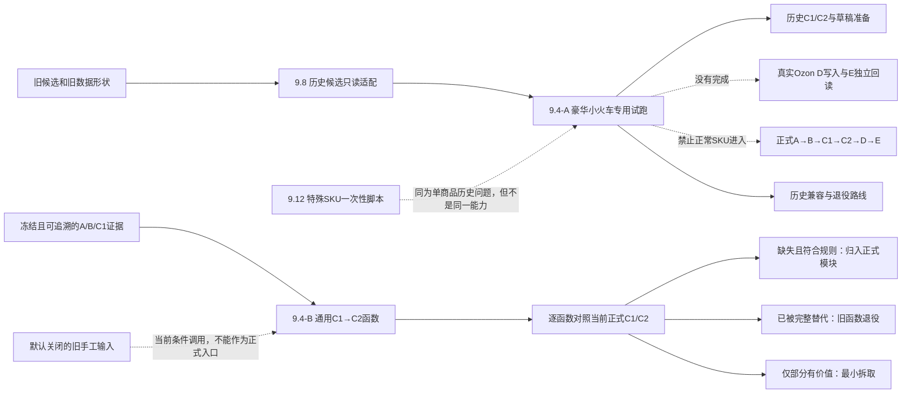
```mermaid
flowchart LR
    OldCandidate["旧候选和旧数据形状"] --> Adapter["9.8 历史候选只读适配"]
    Adapter --> FireTrain["9.4-A 豪华小火车专用试跑"]
    FireTrain --> OldResult["历史C1/C2与草稿准备"]
    FireTrain -. "没有完成" .-> RealDE["真实Ozon D写入与E独立回读"]
    FireTrain -. "禁止正常SKU进入" .-> Main["正式A→B→C1→C2→D→E"]
    FireTrain --> History["历史兼容与退役路线"]

    Frozen["冻结且可追溯的A/B/C1证据"] --> Generic["9.4-B 通用C1→C2函数"]
    Manual["默认关闭的旧手工输入"] -. "当前条件调用，不能作为正式入口" .-> Generic
    Generic --> Compare["逐函数对照当前正式C1/C2"]
    Compare --> Reuse["缺失且符合规则：归入正式模块"]
    Compare --> Replace["已被完整替代：旧函数退役"]
    Compare --> Extract["仅部分有价值：最小拆取"]

    Patch["9.12 特殊SKU一次性脚本"] -. "同为单商品历史问题，但不是同一能力" .-> FireTrain
```

### 与9.8、9.12及正式C1/C2的关系

| 相关能力 | 与9.4的真实关系 | 必须保持的边界 |
|---|---|---|
| 9.8 历史候选只读适配 | 9.4-A曾依靠它把旧扁平候选转换成较规范的输入；两者互补，不是同一能力 | 9.8只读适配不能把FireTrain升级成正式主线，也不能让旧数据绕过当前证据门 |
| 9.12 历史一次性数据脚本 | DD-H1等脚本和FireTrain都针对特殊SKU历史问题，但9.12直接修改旧数据，9.4-A负责专用C1/C2试跑；只是类型相似，并非同一实现 | 不得因为都与特殊SKU有关而合并，也不得用一次性脚本证明通用C1/C2能力 |
| 正式C1事实与关键词 | 9.4-B部分职责可能与当前事实、Schema、关键词证据和AI草稿模块重叠或互补 | 必须按导出函数逐项比较；不得复制第二套规则，不得使用无法追溯的手工文字替代正式证据 |
| 正式C2素材与编排 | 9.4-B可能包含进入C2、锁定素材和形成确认卡的通用规则 | 必须符合素材三区、正式编排、主人确认和repository边界；不得绕过当前C2状态机 |
| 全店能力地图 | 当前一个9.4状态会把“历史专用代码”和“通用候选函数”混在一起 | 未来必须拆成两个事实节点或明确分栏，分别显示证据、调用、健康和归位状态 |

### 9.4-B正式归位前的证明清单

未来只有在获得施工授权后，按导出函数逐项证明以下条件；本轮只记录：

1. 输入来自冻结且可追溯的A、B、C1证据，并绑定准确candidate、SKU、revision和目标分支。
2. 正常路径不依赖旧手工注入Schema、关键词、竞品文字或其他未持久化材料。
3. 输出写入正式repository，并由软件状态机依据明确结果推进；不能只返回进程内对象。
4. 正常SKU在Codex完全关闭时仍可完成对应步骤，符合Codex Independence。
5. 当前老板规则和数据合同有真实测试覆盖，错误、unknown和停止条件不会被默认成功掩盖。
6. 存在正式服务或SoftwareJob的集成调用证据，而不只是导出函数、测试文件或默认关闭路由。
7. 与当前正式C1/C2模块完成逐项重复性比较，明确选择复用、替代或最小拆取，并保留迁移和回归证据。

### 实施边界

- 本决定只把混合事实拆成两个身份进行记录，没有拆文件、改编号、改注册表或改变任何调用。
- 9.4-A进入退役路线，不等于现在可以删除；必须先保护历史、审计依赖并迁走通用价值。
- 9.4-B保留候选资格，不等于现在可以接入；必须先完成老板思路与代码逐函数对账和正式归位证明。
- 旧手工入口保持当前事实状态；本轮不打开、不关闭、不迁移，也不以其存在证明主线接通。
- 9.4-B最终选择属于后续对账决定，本轮不替老板拍板。

### 来源、原位置与依赖线索

以下位置用于以后按稳定编号 `9.4` 追溯，不表示本轮对它们进行了修改：

- 调查底稿：`14项待归位能力与8组疑似重复能力调查底稿-2026-08-28.md` 的“9.4 旧C1／FireTrain兼容代码”章节
- FireTrain专用准备：`selection-review-app/lib/real-c1-preparation.mjs`
- 通用C1→C2领域函数：`selection-review-app/lib/lifecycle-c-stage.mjs`
- 当前专用410路由、默认关闭手工入口及条件调用：`selection-review-app/server.mjs`
- 9.8相关适配：`selection-review-app/lib/legacy-candidate-adapter.mjs`
- 9.12相关特殊SKU脚本：`selection-review-app/scripts/` 下的DD-H1历史一次性脚本
- 相关测试：`selection-review-app/tests/real-c1-preparation.test.mjs`、`selection-review-app/tests/lifecycle-c-stage-generic-api.test.mjs`

### 本轮变更声明

本轮只在现有决定记录末尾追加9.4，并在文档中拆成9.4-A与9.4-B两个事实身份。没有覆盖或改写9.1—9.3；没有实施代码拆分、迁移、删除、路由、UI、测试、能力注册表、数据、运行副本、服务或部署变更。

---

## 2026-08-28｜9.5 分阶段构建与部署边界

> 追加说明：本章节是稳定编号 `9.5` 的后续决定记录，只追加在9.1—9.4之后，不回头改写既有内容。

### 决定状态

- 稳定编号：`9.5`
- 正式归属：“工程辅助与历史部署工具区”中的“部署运行／工程辅助”区域
- 业务阶段归属：不属于A→E任何业务模块
- 决定结果：七套旧阶段边界和打包工具冻结、隔离并保留历史；未来发布能力收敛为一条统一流水线
- 当前执行状态：**尚未冻结、隔离、迁移、统一或退役任何脚本**
- 授权边界：**老板决定已确认、实施未授权。**本记录不授权实施统一流水线、修改或删除脚本、迁移消费者、部署、运行服务、修改能力注册表、UI、数据、运行副本或访问外部平台。

### 老板确认的完整决定

1. 9.5不属于A→E业务模块，正式归入“工程辅助与历史部署工具区”。

2. 现有七套分阶段边界和打包工具，是历史发布中的“装箱清单和门卫”：校验阶段允许文件、意外混入和固定摘要漂移，生成本地阶段包与清单。它们只能证明打包边界检查结果，不能证明部署、启动、页面、业务闭环、回滚或真实运行成功。

3. 现有七套旧工具先冻结并隔离，不再作为未来新版本的常规发布方式；保留其历史清单、摘要和发布痕迹，供追溯与必要的历史回滚研究。

4. 在任何退役或删除之前，必须逐套查清当前是否仍有启动器、脚本、人工流程或其他真实消费者依赖其输出，并记录最后使用情况；没有证据不得直接删除。

5. 9.5与9.6的关系必须明确：9.5负责阶段检查、装箱和清单；9.6偏向把源码或构建产物复制到运行位置。目前没有充分证据证明9.6会正式消费9.5产物，因此不得把两者描述成已接通的发布流水线。

6. 未来正式方向是收敛为一条统一发布流水线，至少包含：唯一当前源码或明确revision；干净工作区或明确批准的变更集；相关测试与构建门；发布清单；明确部署授权；部署前备份；部署动作；部署后服务健康、UI、版本和必要数据回读；失败时可执行回退。不得长期保留七套平行发布体系。

7. 等统一发布流水线覆盖仍有价值的能力、真实消费者已迁移或确认不存在并完成验证后，旧阶段脚本才可以退役；运行代码可以退役，历史档案继续保留。

8. 摘要或哈希只定位为Level 1的意外漂移或意外损坏检测，不宣传为防恶意篡改机制，不额外引入没有必要的密码学或复杂安全机制。

9. “全店能力地图”把9.5显示在“部署运行／工程辅助”区域；它的状态只代表打包边界检查证据，绝不能代表A→E业务健康或已经上线。

10. **老板决定已确认、实施未授权。**本轮禁止实施统一流水线、修改或删除脚本、迁移消费者、部署、运行服务、修改能力注册表、UI、数据、运行副本，也不得访问外部平台。

### 现有七套工具的大白话身份

七套工具分别围绕A／B、C1、C1事实与关键词、C1关键词自动触发、K3关键词接入、C2以及C2 UI阶段建立边界。每套通常由“边界检查模块＋打包脚本＋相关测试”组成。

它们像七次历史搬家分别留下的“装箱单和门卫”：

- 装箱前检查这次允许带哪些文件；
- 发现不允许的文件、意外差异或固定摘要漂移时拒绝装箱；
- 检查通过时，把指定文件复制到本地阶段包并生成清单；
- 它们不负责取得部署授权、覆盖运行副本、启动服务、验证页面、回读版本或执行回退。

因此，“阶段包生成成功”最多表示装箱检查通过，不等于软件已经部署或业务已经可用。

### 输入 → 检查 → 输出

| 环节 | 实际内容 | 能证明什么 | 不能证明什么 |
|---|---|---|---|
| 输入 | 当前源码、阶段允许文件清单、旧运行副本基线和固定摘要 | 检查对象与预设阶段范围明确 | 不能证明输入就是唯一批准源码或工作区干净 |
| 检查 | 比较允许文件、意外混入、差异标记、字节数和固定摘要漂移 | 能发现本次装箱边界不符合预设 | 不能证明部署授权、运行兼容或业务正确 |
| 拒绝 | 发现越界或漂移后停止生成阶段包 | 能证明门卫阻止了这次装箱 | 不能自动修复、回滚或判断业务状态 |
| 通过输出 | 本地阶段包和manifest清单 | 能证明指定文件按这套旧规则完成装箱 | 不能证明9.6消费、运行副本已更新、服务启动、页面正常或A→E闭环 |

### 大白话关系图

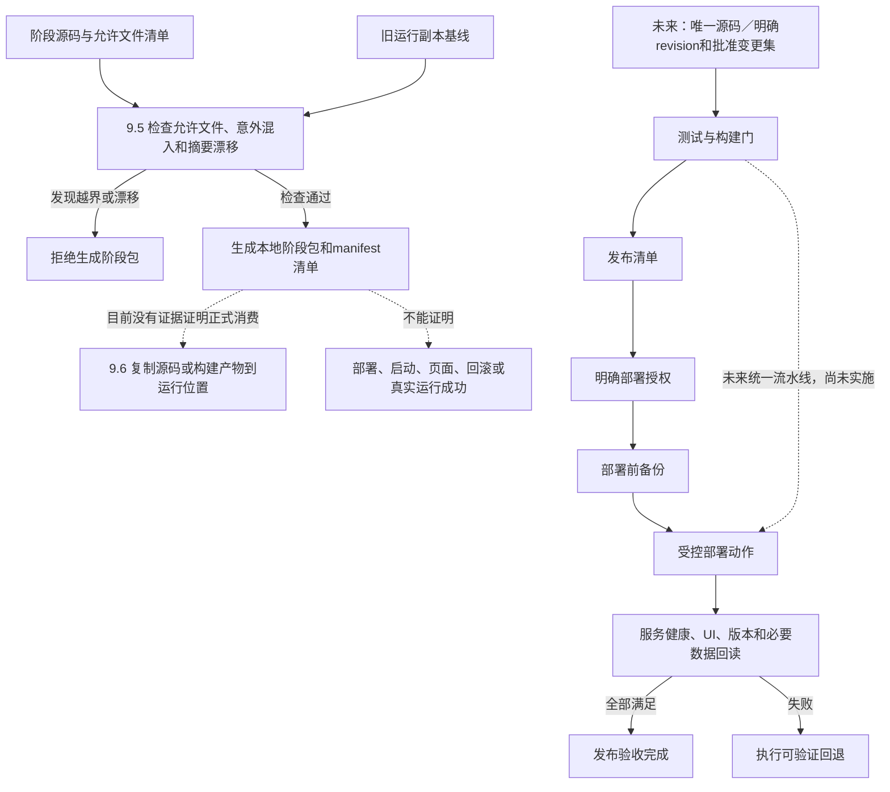
```mermaid
flowchart TD
    Source["阶段源码与允许文件清单"] --> Check["9.5 检查允许文件、意外混入和摘要漂移"]
    OldBase["旧运行副本基线"] --> Check
    Check -->|"发现越界或漂移"| Refuse["拒绝生成阶段包"]
    Check -->|"检查通过"| Package["生成本地阶段包和manifest清单"]
    Package -. "目前没有证据证明正式消费" .-> Copy["9.6 复制源码或构建产物到运行位置"]
    Package -. "不能证明" .-> Live["部署、启动、页面、回滚或真实运行成功"]

    Approved["未来：唯一源码／明确revision和批准变更集"] --> Gates["测试与构建门"]
    Gates --> Manifest["发布清单"]
    Manifest --> Authorization["明确部署授权"]
    Authorization --> Backup["部署前备份"]
    Backup --> Deploy["受控部署动作"]
    Deploy --> Readback["服务健康、UI、版本和必要数据回读"]
    Readback -->|"全部满足"| Success["发布验收完成"]
    Readback -->|"失败"| Rollback["执行可验证回退"]
    Gates -. "未来统一流水线，尚未实施" .-> Deploy
```

### 与9.6的关系

| 能力 | 当前能够说明的事实 | 当前不能说明的关系 |
|---|---|---|
| 9.5 | 检查阶段允许文件、生成本地阶段包和清单 | 不能证明产物被部署或启动 |
| 9.6 | 本机开发、启动运行副本，或在人工执行时复制源码／构建产物并重启 | 不能据此推定它读取9.5的阶段包和manifest |
| 两者之间 | 从工作顺序看可能是“先装箱、后搬运”的候选关系 | 当前没有充分调用、路径或运行证据证明它们已经接成正式发布流水线 |

在找到真实消费证据前，“9.5→9.6”只能画成未证明的候选关系，不能画成已经接通的实线。

### 七套旧工具冻结、审计与退役边界

1. 冻结现有脚本和历史清单的事实状态，不把它们继续扩展为新版本常规发布方式。
2. 逐套登记边界模块、打包脚本、输出目录、manifest、历史摘要和已知发布痕迹。
3. 逐套查找启动器、脚本、人工操作说明和其他真实消费者，并记录最后一次有证据的使用情况。
4. 不能因为package.json没有默认调用就断定无人使用；人工流程和外部启动器也必须纳入审计。
5. 仍有消费者时，先迁移消费者并验证新流水线产生等价且更完整的发布证据。
6. 未找到消费者时，也要保存查找范围和证据，不能以“没看见”为唯一删除理由。
7. 统一流水线覆盖仍有价值的边界检查、清单和漂移检测后，再验证部署授权、备份、回读与回退闭环。
8. 以上条件全部满足后，旧运行脚本才可另行授权退役；历史manifest、摘要、发布痕迹和决定记录继续保留。

### 未来统一发布流水线的最低验收

未来只有获得独立施工和部署授权后，统一流水线至少需要证明：

- 发布输入来自唯一当前源码或明确revision，并能识别未经批准的工作区变化；
- 相关测试和构建门真实通过，没有跳过、降级或隐藏error／warning；
- 发布清单准确列出本轮文件、版本、范围和排除项；
- 部署前存在可用备份，并且失败时能够按明确步骤回退；
- 部署动作绑定准确目标和明确部署授权，不把开发完成当成上线授权；
- 部署后独立回读服务健康、UI、运行版本和必要数据保护结果；
- 任何失败都停在明确层级，不能把打包成功、进程存在或页面可打开冒充业务完成；
- 旧七套工具的真实消费者已迁移或经证据确认不存在。

### Level 1摘要边界

- 固定摘要或哈希的唯一定位，是发现文件在搬运、保存或版本比较中发生的意外漂移或意外损坏。
- 它不防御拥有写权限的恶意修改者，不能被宣传为签名、防篡改或安全认证。
- 本场景不新增数字签名、HMAC、加密存储或复杂审计机制；除非未来出现新的、明确的安全威胁模型并重新授权。
- 摘要匹配只证明被比较的字节与预期一致，不能证明代码正确、部署成功、运行安全或业务闭环。

### 全店能力地图显示边界

- 所属区域：“部署运行／工程辅助”。
- 健康状态依据：只能来自阶段边界检查、打包清单完整性和相关工程验证。
- 禁止传播：9.5通过不能把A、B、C1、C2、D或E节点涂成已验证，也不能显示“已部署”或“已上线”。
- 关系显示：9.5到9.6必须标为“未证明消费／尚未接通”，直到出现真实调用和运行证据。
- 未来统一流水线只能显示为目标或尚未实现，不能因本决定已经确认就显示为已完成。

### 来源、原位置与依赖线索

以下位置用于以后按稳定编号 `9.5` 追溯，不表示本轮对它们进行了修改：

- 调查底稿：`14项待归位能力与8组疑似重复能力调查底稿-2026-08-28.md` 的“9.5 分阶段构建与部署边界”章节
- 七套边界模块：`selection-review-app/lib/phase3-ab-deployment-boundary.mjs`、`phase4-c1-deployment-boundary.mjs`、`phase4-c1-fact-keyword-deployment-boundary.mjs`、`phase4-c1-keyword-auto-trigger-deployment-boundary.mjs`、`phase4-k3-c1-deployment-boundary.mjs`、`phase5-c2-deployment-boundary.mjs`、`phase5b-c2-ui-deployment-boundary.mjs`
- 对应打包入口：`selection-review-app/scripts/build-phase3-ab-deploy-package.mjs`及相关`build-phase4-*`、`build-phase5-*`脚本
- 正式脚本入口核查：`selection-review-app/package.json`
- 相关验证：七个阶段边界测试文件
- 9.6相关本机部署工具：`selection-review-app/scripts/deploy-local-runtime.sh`、`selection-review-app/scripts/launch-server.sh`、`selection-review-app/scripts/dev.mjs`

### 本轮变更声明

本轮只在现有决定记录末尾追加9.5。没有覆盖或改写9.1—9.4，也没有修改调查底稿；没有实施统一发布流水线、修改或删除脚本、迁移消费者、部署、运行服务、修改能力注册表、UI、测试、数据、运行副本或访问外部平台。

---

## 2026-08-28｜9.6 本机启动与运行副本部署脚本

> 追加说明：本章节是稳定编号 `9.6` 的后续决定记录，只追加在9.1—9.5之后，不回头改写既有内容。`9.6-A`、`9.6-B`和`9.6-C`是本次决定用于拆开事实的身份标签，不表示本轮已经拆分代码或修改能力注册表编号。

### 决定状态

- 稳定父编号：`9.6`
- 必须拆开的身份：`9.6-A 本地开发启动`、`9.6-B 本机4317运行副本启动`、`9.6-C 本机运行副本覆盖部署`
- 拆分依据：职责边界、输入、输出、调用方、当前真实证据和未来架构均不同；危险程度只决定拆分后的授权与验收强度
- 业务阶段归属：整体不属于A→E任何业务模块
- 当前执行状态：**尚未拆分、冻结、迁移、启动、重启或部署任何脚本和服务**
- 授权边界：**老板决定已确认、实施未授权。**本记录不授权拆分或修改脚本、启动开发服务、启动或重启4317、覆盖运行副本、部署、迁移路径、修改LaunchAgent、能力注册表、UI、测试、数据或访问外部平台。

### 老板确认的完整决定

1. 9.6的拆分依据不是单看危险程度，而是职责边界、输入、输出、调用方、当前真实证据和新项目未来架构都不同；危险程度只决定拆分后的授权与验收强度。

2. 将混合的9.6拆成三个事实身份：

   - 9.6-A本地开发启动：`scripts/dev.mjs`加Vite，本地启动开发API和前端，只供工程开发预览；归入“本地开发工具”。
   - 9.6-B本机4317运行副本启动：`launch-server.sh`启动Application Support中的既有独立运行副本；归入“本机运行适配器”。中央运行建成前暂时保留，不得把它等同于当前主源码或多人中央运行。
   - 9.6-C本机运行副本覆盖部署：`deploy-local-runtime.sh`复制、删除或替换运行目录相关文件并重启LaunchAgent；归入“受控部署工具”。它具有高副作用，必须取得精确授权。

3. 9.6整体不属于A→E业务模块；A→E不得直接依赖或调用这些本机工程脚本推进阶段。“全店能力地图”只可以把它们显示在“部署运行／工程辅助”区域。

4. 9.6-A正常保留，作为开发预览入口；它成功只能证明开发环境启动，不能证明4317、中央运行或A→E业务健康。

5. 9.6-B暂时保留当前本机入口，但未来必须能够明确显示并回读其运行源码版本、环境开关、路径和端口，避免把旧副本误认为当前主源码。当前已知事实是主源码有地图API，而冻结4317副本曾对该API返回404，说明存在版本脱节；该事实继续保留。

6. 9.6-C先冻结为受控工具，不作为普通日常发布方式。未来任何一次使用都必须另行取得精确上线授权，并在执行前明确：目标运行副本；唯一来源revision或批准变更集；依赖与构建产物；允许覆盖范围；脏工作树和未跟踪文件保护；备份和可靠回退点。

7. 9.6-C部署动作成功不等于上线完成。执行后必须独立回读服务健康、页面或UI、运行版本、必要配置以及必要数据或业务行为。失败不得伪装成功，必须明确错误并按批准的回退方案处理。

8. 9.5与9.6当前没有形成已接通的发布流水线：9.5生成阶段包和manifest；9.6-C当前直接复制主源码、dist和依赖；没有证据证明9.6-C消费9.5产物。地图和记录必须使用虚线或“未接通”语义，不得画成完成链路。

9. 长期由9.5中确认的单一统一发布流水线接替9.6-C；中央多人运行落地后，再重新评估9.6-B本机副本是否退役。中央运行未实现、现有入口仍有真实依赖时，不得直接删除9.6-B。

10. **老板决定已确认、实施未授权。**本轮禁止拆分或修改脚本、启动开发服务、启动或重启4317、覆盖运行副本、部署、迁移路径、修改LaunchAgent、能力注册表、UI、测试、数据，也不得访问外部平台。

### 为什么必须按职责拆成三个身份

| 身份 | 它拿什么 | 它做什么 | 它交出什么 | 谁会调用 | 风险强度不是唯一差别 |
|---|---|---|---|---|---|
| 9.6-A 本地开发启动 | 当前主源码、开发配置和前端源码 | 同时启动本地开发API与Vite前端 | 开发预览页面和开发API | 工程开发者或开发命令 | 输入是主源码，输出是临时开发环境，不触碰既有4317副本 |
| 9.6-B 本机4317启动 | Application Support运行目录中的既有副本、Node、路径和端口 | 校验后启动该目录里的服务 | 运行在4317的本机独立副本 | LaunchAgent或人工启动入口 | 输入不是当前主源码，职责是启动既有副本，不负责更新它 |
| 9.6-C 受控覆盖部署 | 获批源码、依赖、schema、dist和目标运行目录 | 复制、删除或替换相关文件并重启LaunchAgent | 被覆盖、重启后的运行副本 | 只能由取得精确上线授权的受控部署动作调用 | 输入输出和副作用都跨越源码与运行目录，必须有备份、回退和部署后回读 |

危险程度决定9.6-C需要比9.6-A和9.6-B更严格的授权与验收，但三者之所以拆开，根本原因是工作职责和数据流本来就不同。

### 9.6-A｜本地开发启动

- 正式归属：本地开发工具。
- 主要代码：`selection-review-app/scripts/dev.mjs`和`selection-review-app/vite.config.js`。
- 输入：当前主源码、开发配置、前端源码和本地依赖。
- 处理：启动开发API与Vite前端，并提供工程预览所需的本地代理。
- 输出：开发进程、开发API和开发预览页面。
- 当前保留决定：正常保留，继续作为开发预览入口。
- 永久证据边界：启动成功只能说明开发环境启动；不能证明4317副本更新、中央运行存在、A→E接通或真实业务健康。
- 本轮状态：没有启动开发服务，也没有修改开发脚本或配置。

### 9.6-B｜本机4317运行副本启动

- 正式归属：本机运行适配器。
- 主要代码：`selection-review-app/scripts/launch-server.sh`。
- 输入：Application Support中的既有独立运行副本、对应Node运行时、路径、端口和环境开关。
- 处理：校验运行目录中的必要条件，然后启动该副本的服务。
- 输出：监听4317的本机独立运行副本。
- 当前保留决定：中央多人运行建成前暂时保留；不得因目标架构已确定就提前删除当前入口。
- 版本身份要求：未来必须明确显示并独立回读正在运行的源码版本、环境开关、绝对路径和端口，不能用页面存在或进程在运行推定它等于主源码。
- 已知版本脱节证据：当前主源码包含地图API；2026-08-27冻结证据中，4317运行副本对该API返回404。该事实说明两处至少在当时并非同一能力版本，不代表当前已自动修复。
- 中央运行边界：4317是单机本地适配器，不是多人中央运行，也不是中央业务事实源。
- 本轮状态：没有启动、重启、检查实时进程或改变4317。

### 9.6-C｜本机运行副本覆盖部署

- 正式归属：受控部署工具。
- 主要代码：`selection-review-app/scripts/deploy-local-runtime.sh`。
- 输入：精确获批的来源revision或变更集、依赖、schema、dist、允许覆盖清单、目标运行副本和上线授权。
- 处理：复制、删除或替换运行目录相关文件，并重启LaunchAgent。
- 输出：被覆盖并重新启动的本机运行副本；这个结果仍需部署后独立回读，不能直接称为上线完成。
- 当前决定：先冻结为受控工具，不作为普通日常发布方式。
- 未来替代方向：由9.5决定中的单一统一发布流水线接替；替代完成前不能假装已经迁移。
- 本轮状态：没有执行部署、复制、删除、重启、LaunchAgent修改或运行副本写入。

### 大白话关系图

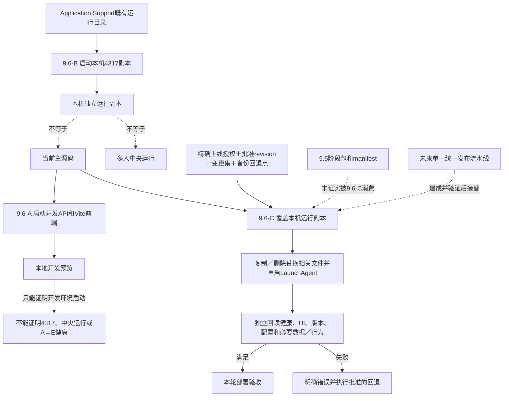
```mermaid
flowchart TD
    MainSource["当前主源码"] --> Dev["9.6-A 启动开发API和Vite前端"]
    Dev --> Preview["本地开发预览"]
    Preview -. "只能证明开发环境启动" .-> NotBusiness["不能证明4317、中央运行或A→E健康"]

    RuntimeDir["Application Support既有运行目录"] --> Launch["9.6-B 启动本机4317副本"]
    Launch --> Local4317["本机独立运行副本"]
    Local4317 -. "不等于" .-> MainSource
    Local4317 -. "不等于" .-> Central["多人中央运行"]

    MainSource --> Deploy["9.6-C 覆盖本机运行副本"]
    Authorization["精确上线授权＋批准revision／变更集＋备份回退点"] --> Deploy
    Deploy --> Replace["复制／删除替换相关文件并重启LaunchAgent"]
    Replace --> Readback["独立回读健康、UI、版本、配置和必要数据／行为"]
    Readback -->|"满足"| Accepted["本轮部署验收"]
    Readback -->|"失败"| Rollback["明确错误并执行批准的回退"]

    PhasePackage["9.5阶段包和manifest"] -. "未证实被9.6-C消费" .-> Deploy
    Unified["未来单一统一发布流水线"] -. "建成并验证后接替" .-> Deploy
```

### 9.6-C未来每次使用前的精确授权清单

未来如需使用9.6-C，必须针对当次部署重新确认以下内容；本轮只记录：

1. 精确目标运行副本，包括绝对路径、服务身份、端口和允许重启的LaunchAgent。
2. 唯一来源revision或老板明确批准的变更集；不能把整个脏工作区默认视为获批。
3. 本轮允许复制的源码、依赖、schema、dist和其他构建产物，以及明确排除项。
4. 对脏工作树、未跟踪文件、并行任务改动和运行副本现有文件的保护办法。
5. 部署前备份位置、备份完整性验证以及失败时可执行的可靠回退点。
6. 精确上线授权；开发完成、测试通过、打包成功或历史部署授权都不能代替本轮授权。

### 9.6-C部署后独立验收

部署脚本退出成功或LaunchAgent被重启，只能证明技术动作执行到了对应位置，不能证明上线完成。部署后至少需要独立回读：

- 服务是否真实健康，并且读取的是准确目标进程；
- 页面和关键UI是否来自本轮运行版本；
- 运行版本、源码基线、路径、端口和必要环境开关是否与授权一致；
- 共享数据和必要配置是否完整，没有被覆盖、丢失或错误迁移；
- 本轮预期的必要业务行为是否在不触发未授权外部动作的情况下通过；
- 任一失败是否保留明确错误层和证据，并按已批准方案执行回退。

以上验收也不能替代平台业务回读，不能把本机上线成功传播成A→E业务完成。

### 与9.5及中央运行的长期关系

| 关系 | 当前事实 | 长期方向 |
|---|---|---|
| 9.5→9.6-C | 9.5生成阶段包和manifest；9.6-C直接复制主源码、dist和依赖；尚无消费证据 | 只能显示虚线和“未接通”；未来由统一发布流水线收口 |
| 9.6-C→统一发布流水线 | 当前9.6-C是人工高副作用工具 | 统一流水线覆盖授权、备份、部署、回读和回退后接替9.6-C |
| 9.6-B→中央多人运行 | 当前4317仍是本机入口，中央运行尚未实现 | 中央运行落地并验证现有依赖迁移后，再重新决定9.6-B是否退役 |

### 全店能力地图显示边界

- 9.6-A、9.6-B、9.6-C均显示在“部署运行／工程辅助”区域，不进入A→E业务主线。
- 三个身份分别显示开发预览、本机启动和受控覆盖部署的独立状态，不能用一个颜色掩盖差异。
- 9.6-A成功不能传播为4317、中央运行或业务健康。
- 9.6-B运行不能显示为主源码已部署或中央运行已完成。
- 9.6-C动作成功不能显示为上线完成，必须等待独立部署后回读。
- 9.5到9.6-C使用虚线或“未证实消费／尚未接通”语义。
- 4317到中央运行必须明确标为“不等于／尚未迁移”。

### 来源、原位置与依赖线索

以下位置用于以后按稳定编号 `9.6` 追溯，不表示本轮对它们进行了修改：

- 调查底稿：`14项待归位能力与8组疑似重复能力调查底稿-2026-08-28.md` 的“9.6 本机启动与运行副本部署脚本”章节
- 本地开发启动：`selection-review-app/scripts/dev.mjs`
- 本地前端配置：`selection-review-app/vite.config.js`
- 本机4317启动：`selection-review-app/scripts/launch-server.sh`
- 本机运行副本覆盖部署：`selection-review-app/scripts/deploy-local-runtime.sh`
- 项目命令入口：`selection-review-app/package.json`
- 运行副本位置线索：`/Users/shuaizhang/Library/Application Support/今日选品评审台/`
- 版本脱节证据：2026-08-27冻结快照记录主源码存在地图API、4317副本请求该API返回404

### 本轮变更声明

本轮只在现有决定记录末尾追加9.6，并在文档中拆成9.6-A、9.6-B和9.6-C三个事实身份。没有覆盖或改写9.1—9.5，也没有修改调查底稿；没有拆分或修改脚本、启动开发服务、启动或重启4317、覆盖运行副本、部署、迁移路径、修改LaunchAgent、能力注册表、UI、测试、数据或访问外部平台。

---

## 2026-08-28｜9.7 Ozon D／E多套候选实现

> 追加说明：本章节是稳定编号 `9.7` 的后续决定记录，只追加在9.1—9.6之后，不回头改写既有内容。`9.7-A`至`9.7-E`是本次决定用于拆开职责事实的身份标签，不表示本轮已经拆分代码、修改能力注册表或选择正式实现。

### 决定状态

- 稳定父编号：`9.7`
- 必须拆开的身份：D领域规则候选、D素材传输层、Ozon写入适配器候选区、E领域比较规则候选、上架后经营分析候选
- 当前证据等级：已完成高层老板意图对照及代码事实／调用关系调查；**尚未完成逐规则、逐函数、逐字段、逐测试的完整交叉验收**
- 当前主适配器：**未选择**
- 正式Ozon写入主线：**缺失／未接通**
- 正式独立E平台只读provider：**缺失／未接通**
- 授权边界：**老板决定已确认、实施未授权。**本记录不授权修改、合并或删除候选代码，不授权选择`currentPrimary`、接入server路由、创建E provider、修改UI、能力注册表、测试或数据，也不授权访问真实Ozon、读取凭据、写商品／库存／价格、上传素材或执行任何平台动作。

### 老板确认的完整决定

1. 当前调查完成的是高层老板意图对照加代码事实和调用关系调查，不是“最新版老板思路每条规则×每个函数×每个字段×每项测试”的完整交叉验收。因此这些能力只是候选；不得说已经证明无法依赖，也不得说已经符合现行规则。

2. 9.7不是一项整体能力，按职责拆成五类身份归位：

   - 9.7-A：D领域规则候选——生产授权、`ProductionPlan`、写前检查、一次性执行意图、`unknown_outcome`、`ProductionRecord`等领域合同。
   - 9.7-B：D素材传输层——把最终素材变成平台可以读取的稳定地址；现有OSS只是一个实现，不永久写死为唯一媒介，也不能因为素材传输已经接通就声称D完成。
   - 9.7-C：Ozon平台写入适配器候选区——现有`ozon-seller-api-de-adapter`、`ozon-seller-api-production-adapter`、`draft-production-execution`等候选必须在相同合同下正面对比；当前不得指定正式主适配器，也不得接真实写入。
   - 9.7-D：E领域比较规则候选——严格比较`ProductionRecord`或`ExternalListingRecord`与平台观察，并生成`EVerificationRecord`；现有比较合同可以候选复用，但正式独立平台只读provider仍然缺失。
   - 9.7-E：上架后经营分析候选——`post-launch-observation`从D／E技术验收中拆出，单列到“经营分析候选区”；它是否属于本项目长期职责以后再议，人工输入的流量、加购和订单不得冒充E平台回读。

3. 9.7只描述Ozon官方API相关候选事实，不能反向决定未来D的全通道产品方向。最新版老板方向中的API主线、CSV备用、Seerfar辅助等，必须在后续规则交叉验收中单独映射；旧“纯API／一次人工媒体交接”策略不能因为已经写成代码就自动成为现行规则。

4. 14项待归位和8组重复能力讨论完成后，再启动一次单独授权的“最新版老板思路×代码×测试”交叉验收。每条现行规则必须有稳定编号，并映射预期输入、输出、副作用、主人门、错误语义、代码函数和测试证据；结论只能是完全符合、部分符合、冲突、缺失或过时，不得猜测。

5. 两套及相关Ozon写入候选必须在统一输入输出合同下比较：店铺、SKU、revision与授权绑定；一次执行、幂等和中央原子意图；`unknown_outcome`显式对账且禁止盲目重试；字段与素材范围；真实回执；E独立回读可接性；架构清晰度、重复程度和测试可信度。

6. 交叉验收后可以先选一个“暂定主适配器”作为施工候选，不能等真实写入后才第一次选择，也不能提前称为正式生产主线。其他候选中确有价值的底层函数可以最小吸收，但最终正式系统只允许一个清晰生产入口，不长期保留两个平行写店入口。

7. 正式E必须补建独立Ozon只读provider：D写完以后，使用新的只读客户端从平台真实读取属性、图片、价格、库存和状态。调用方提交观察值或D自己回送的数据，不得冒充独立E。

8. 正式主线确认门固定为：先只读检查真实店铺身份、权限、仓库和当前协议；再由老板精确授权一个店、一个SKU、允许字段和草稿／发布边界；D只执行一次并保存真实回执；新的只读客户端执行E独立回读并严格比对。只有完整通过以后，暂定主适配器才可以升级为正式主适配器。

9. “全店能力地图”必须分别画出D领域合同、素材传输、平台写入、E独立provider、E比较和经营观察。当前正式写入主线和E provider必须显示缺失或未接，不能因为代码或测试存在就显示为已上架或D／E闭环。

10. **老板决定已确认、实施未授权。**本轮仅追加决定；禁止修改、合并或删除候选代码；禁止选择`currentPrimary`；禁止接server路由、创建E provider、修改UI、能力注册表、测试或数据；禁止访问真实Ozon、读取凭据、写商品、库存或价格、上传素材或执行任何平台动作。

### 对现有调查结论和建议的修正

- 当前调查可以支持的结论：候选代码存在；部分模块有明确调用；部分模块只有测试或间接引用；正式Ozon写入路由和独立E provider仍缺少当前证据。
- 当前调查不能支持的结论：不能据此断言某个候选已经符合最新版全部规则，也不能断言它必然无法复用。
- 原调查建议把`currentPrimary`讨论放到取得真实写入与独立回读以后，时间点过晚。
- 修正后的两级选择门：先通过“最新版老板思路×代码×测试”交叉验收，选择一个**暂定主适配器**作为施工候选；再通过精确单店单SKU授权、一次D执行、真实回执和独立E回读，才能升级成**正式主适配器**。
- 本轮不启动交叉验收、不选择暂定主适配器，也不改变任何候选状态。

### 9.7-A｜D领域规则候选

#### 大白话身份

这部分不是负责“真的把商品写进Ozon”的网络客户端，而是规定写入之前和之后必须遵守什么：主人授权锁定哪些内容、生产计划如何形成、写前检查哪些身份和字段、外部请求发送前怎样保存一次性意图、结果不明时怎样停住，以及什么证据才够生成`ProductionRecord`。

#### 输入 → 处理 → 输出

| 输入 | 处理 | 输出 |
|---|---|---|
| 不可变生产授权、candidate、SKU、revision、店铺、字段、素材和允许范围 | 生成或校验ProductionPlan，执行写前门禁，保存一次性意图，分类明确失败与unknown_outcome | 可交给平台适配器的一次执行合同，或明确停止原因；成功后候选ProductionRecord合同 |

#### 当前决定边界

- 身份：D领域规则候选，不等于平台写入已经接通。
- 候选价值：可以在后续逐规则验收中与现行授权、幂等、错误和记录要求对照。
- 禁止提前宣称：类、函数或测试存在，不能证明中央原子意图、真实写入或正式ProductionRecord已经落地。

### 9.7-B｜D素材传输层

#### 大白话身份

它解决的是“主人确认的最终图片怎样变成Ozon服务器能够读取的稳定地址”。现有阿里云OSS只是这个职责的一种技术实现，不是D本身，也不是永久唯一媒介。

#### 输入 → 处理 → 输出

| 输入 | 处理 | 输出 |
|---|---|---|
| C2主人确认的finalUploads、准确素材版本和授权范围 | 校验素材身份并传输到平台可访问的稳定位置 | 可供D写入引用的稳定素材地址及传输证据 |

#### 当前决定边界

- 身份：D素材传输层；与商品字段写入、库存写入和E回读分开。
- OSS定位：当前候选实现之一，不写成永久唯一事实。
- 证据边界：素材传输成功只能证明素材地址准备完成，不能证明商品已创建、D完成或E验证通过。

### 9.7-C｜Ozon平台写入适配器候选区

#### 大白话身份

这里放的是几套真正可能向Ozon发出商品或库存请求的候选执行代码。它们职责有重叠，也可能各自保留有价值的底层函数，但目前没有经过同一把尺子的完整比较，更没有选出正式唯一入口。

#### 当前候选范围

- `ozon-seller-api-de-adapter.mjs`
- `ozon-seller-api-production-adapter.mjs`
- `draft-production-execution.mjs`及其相关执行组合

#### 统一比较合同

| 比较面 | 每套候选必须回答的问题 |
|---|---|
| 身份绑定 | 是否同时锁定准确店铺、SKU、candidate、revision和ProductionAuthorization |
| 一次执行 | 是否先保存中央原子执行意图，具备幂等，并保证同一授权只执行一次 |
| 结果未知 | 是否把unknown_outcome显式持久化、进入对账并禁止盲目重试 |
| 写入范围 | 是否严格限制允许字段、价格、库存、素材和草稿／发布边界 |
| 真实回执 | 是否保存Ozon真实请求身份、响应终态和可追溯的脱敏证据 |
| E可接性 | 是否能把平台身份交给新的独立只读客户端，而不是把D返回值冒充E观察 |
| 架构质量 | 是否职责单一、边界清楚、重复可收敛，不把领域规则塞进网络适配器 |
| 测试可信度 | 是否覆盖正常、明确失败、unknown_outcome、幂等、混店／错revision和权限边界，而不是只测模拟成功 |

#### 当前决定边界

- 当前不指定`currentPrimary`，不接真实写入。
- 交叉验收后只允许选择一个暂定主适配器进入施工；其他候选仅可最小吸收确有价值的底层函数。
- 最终正式系统只能保留一个清晰生产入口，不长期维护两个平行写店入口。

### 9.7-D｜E领域比较规则候选

#### 大白话身份

这部分负责把“系统声称写了什么”与“平台重新读出来是什么”逐项比较，判断商品身份、属性、图片、价格、库存和状态是否一致，并形成`EVerificationRecord`。它负责比较规则，不负责自己登录平台取数。

#### 输入 → 处理 → 输出

| 输入 | 处理 | 输出 |
|---|---|---|
| ProductionRecord或ExternalListingRecord，加上独立平台观察 | 严格核对商品身份、字段、素材、价格、库存、审核和状态 | EVerificationRecord、明确差异、waiting_platform或unknown_outcome边界 |

#### 当前决定边界

- 现有比较合同可以作为候选复用，但仍需逐规则、字段和测试验收。
- 当前正式独立平台只读provider缺失，所以比较合同存在不等于正式E已接通。
- 调用方提交观察值或D自己回送的数据不具备独立性，不能冒充E证据。

### 9.7-E｜上架后经营分析候选

#### 大白话身份

`post-launch-observation`根据访客、加购和订单等经营指标给出观察提示。它回答“商品上架后经营表现怎样”，不是回答“本轮D到底写成功没有、平台现在字段是否一致”。

#### 当前决定边界

- 正式归属：经营分析候选区，从D／E技术验收主链中拆出。
- 人工填写的流量、加购和订单可以形成经营分析输入，但不能成为E平台回读。
- 它是否属于本项目E完成后的长期职责，继续后置，不在本轮决定。
- 它的代码、UI或测试存在，不能证明平台指标由正式连接器采集，也不能证明D／E闭环。

### 大白话主链与决策关系图

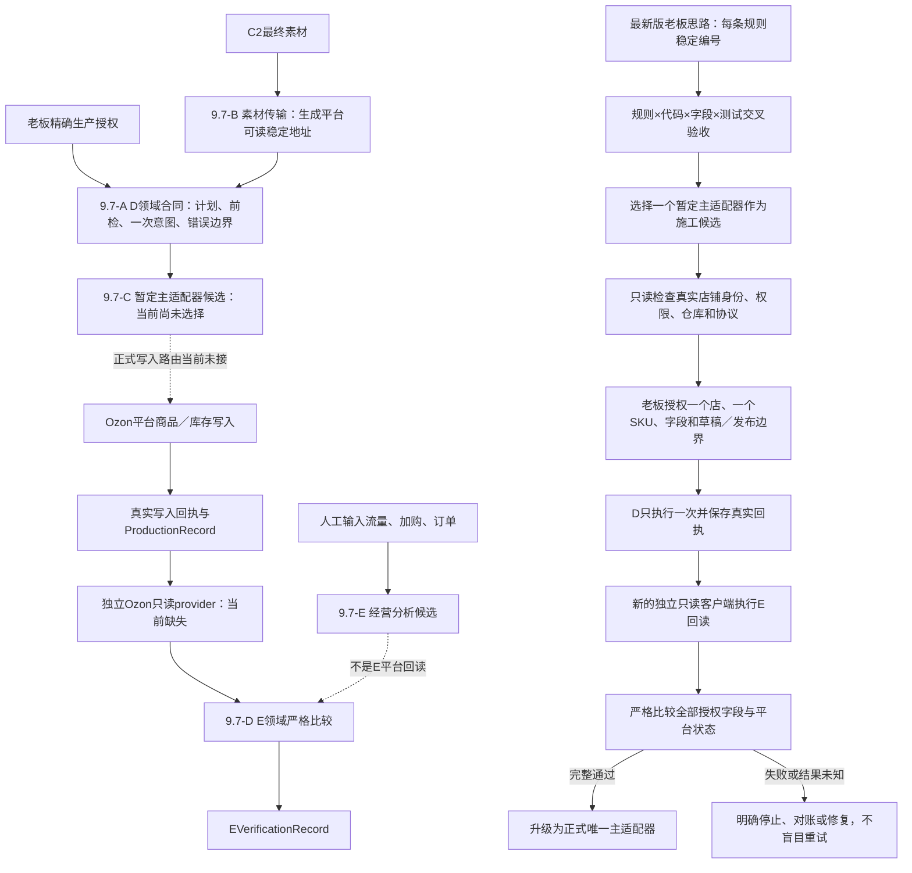
```mermaid
flowchart TD
    OwnerAuth["老板精确生产授权"] --> DContract["9.7-A D领域合同：计划、前检、一次意图、错误边界"]
    FinalAssets["C2最终素材"] --> AssetTransport["9.7-B 素材传输：生成平台可读稳定地址"]
    AssetTransport --> DContract
    DContract --> CandidateAdapter["9.7-C 暂定主适配器候选：当前尚未选择"]
    CandidateAdapter -. "正式写入路由当前未接" .-> PlatformWrite["Ozon平台商品／库存写入"]
    PlatformWrite --> RealReceipt["真实写入回执与ProductionRecord"]
    RealReceipt --> MissingProvider["独立Ozon只读provider：当前缺失"]
    MissingProvider --> ECompare["9.7-D E领域严格比较"]
    ECompare --> ERecord["EVerificationRecord"]

    HumanMetrics["人工输入流量、加购、订单"] --> Operations["9.7-E 经营分析候选"]
    Operations -. "不是E平台回读" .-> ECompare

    NumberedRules["最新版老板思路：每条规则稳定编号"] --> CrossCheck["规则×代码×字段×测试交叉验收"]
    CrossCheck --> Provisional["选择一个暂定主适配器作为施工候选"]
    Provisional --> ReadOnlyPrecheck["只读检查真实店铺身份、权限、仓库和协议"]
    ReadOnlyPrecheck --> OneSkuAuth["老板授权一个店、一个SKU、字段和草稿／发布边界"]
    OneSkuAuth --> OneWrite["D只执行一次并保存真实回执"]
    OneWrite --> NewReader["新的独立只读客户端执行E回读"]
    NewReader --> StrictCompare["严格比较全部授权字段与平台状态"]
    StrictCompare -->|"完整通过"| Formal["升级为正式唯一主适配器"]
    StrictCompare -->|"失败或结果未知"| Stop["明确停止、对账或修复，不盲目重试"]
```

### 后续“最新版老板思路×代码×测试”交叉验收合同

这项工作只能在14项待归位和8组重复能力讨论完成、并取得单独调查授权后启动。每条当前有效规则至少记录：

| 项目 | 必须记录的内容 |
|---|---|
| 规则身份 | 稳定规则编号、当前有效版本和适用范围 |
| 预期输入 | 平台、店铺、SKU、revision、授权、字段、素材、证据和前置状态 |
| 预期输出 | 领域对象、执行意图、真实回执、错误或E记录的严格形状 |
| 副作用 | 本地保存、付费调用、素材传输、平台写入、只读回读分别是什么 |
| 主人门 | 哪一步需要哪一种精确确认或授权，授权不得跨店、跨SKU或跨字段扩大 |
| 错误语义 | 明确失败、等待平台、unknown_outcome、权限不足和证据缺失如何区分 |
| 代码映射 | 对应文件、导出函数、调用路由、repository、连接器和状态机 |
| 测试映射 | 单元、集成、错误、幂等、权限和真实受控验收证据 |
| 最终结论 | 只能填写完全符合、部分符合、冲突、缺失或过时，并说明依据 |

API主线、CSV备用、Seerfar辅助和旧“纯API／一次人工媒体交接”策略必须分别进入这个对照表。代码先存在不等于规则已被老板确认；老板方向存在也不等于代码已经实现。

### 暂定主适配器到正式主适配器的升级门

1. 在统一合同下完成全部写入候选的正面对比，并通过架构、重复性和测试可信度审查。
2. 依据交叉验收选择一个暂定主适配器；记录暂定理由、未满足条件和其他候选的最小可吸收能力。
3. 只读核实准确Ozon店铺身份、账号权限、仓库能力和当前官方协议；任何失败都不得转成写入尝试。
4. 老板针对一个店、一个SKU、准确字段、素材、价格／库存和草稿／发布边界作出精确生产授权。
5. D先持久化一次性执行意图，再执行一次写入；保存真实请求身份、终态和脱敏回执。
6. 发生unknown_outcome时立即停止并进入对账，禁止再次点击或自动重试写入。
7. 使用新的、独立的Ozon只读客户端重新读取属性、图片、价格、库存和状态。
8. 9.7-D比较规则严格核对ProductionRecord、授权与独立平台观察，并形成EVerificationRecord。
9. 只有上述环节完整通过，暂定主适配器才升级为正式唯一主适配器；失败时保留暂定身份或退回候选区。

### 全店能力地图显示边界

- 分开显示：9.7-A D领域合同、9.7-B素材传输、9.7-C平台写入、独立E provider、9.7-D E比较、9.7-E经营观察。
- 当前9.7-C只能显示“多套候选／尚未选主／正式写入未接”。
- 独立E provider必须显示“缺失／尚未实现”，不能被调用方观察或D回执替代。
- 9.7-D比较规则存在，只能显示“比较合同候选”，不能显示E已接通。
- 9.7-B素材传输即使有调用证据，也不能把整个D涂成已完成。
- 9.7-E必须离开D／E技术验收主链，显示为经营分析候选。
- 代码存在、测试通过、授权对象存在、平台接受请求都不能单独显示“已上架”或“D／E闭环”。

### 来源、原位置与依赖线索

以下位置用于以后按稳定编号 `9.7` 追溯，不表示本轮对它们进行了修改：

- 调查底稿：`14项待归位能力与8组疑似重复能力调查底稿-2026-08-28.md` 的“9.7 Ozon D／E多套候选实现”章节
- D领域合同候选：`selection-review-app/lib/production-authorization.mjs`、`production-plan.mjs`、`d-e-software-closure.mjs`、`d-e-software-integration.mjs`
- D素材传输候选：`selection-review-app/lib/aliyun-oss-asset-transport.mjs`、`aliyun-oss-d-asset-integration.mjs`
- Ozon写入候选：`selection-review-app/lib/ozon-seller-api-de-adapter.mjs`、`ozon-seller-api-production-adapter.mjs`、`draft-production-execution.mjs`
- E比较候选：`selection-review-app/lib/e-stage-readback.mjs`及相关E验证合同
- 经营分析候选：`selection-review-app/lib/post-launch-observation.mjs`
- 当前准备度和相关路由：`selection-review-app/server.mjs`
- 当前经营观察UI：`selection-review-app/src/components/UserInspector.jsx`
- 相关测试：Ozon D／E适配器、草稿执行、D／E闭合、E回读和经营观察相关测试文件；本轮没有运行，也没有真实平台测试

### 本轮变更声明

本轮只在现有决定记录末尾追加9.7，并在文档中拆成9.7-A至9.7-E五个事实身份。没有覆盖或改写9.1—9.6，也没有修改调查底稿；没有修改、合并或删除候选代码，没有选择`currentPrimary`，没有接server路由、创建E provider、修改UI、能力注册表、测试或数据，也没有访问真实Ozon、读取凭据、写商品／库存／价格、上传素材或执行任何平台动作。

---

## 2026-08-28｜9.8 历史候选只读适配

> 追加说明：本章节是稳定编号 `9.8` 的后续决定记录，只追加在9.1—9.7之后，不回头改写既有内容。本决定正式取代此前“继续把旧候选送入新版A入口兼容桥”的初步调查建议。`9.8-A`和`9.8-B`是本次决定用于拆开读取展示与持久化行为的事实身份标签，不表示本轮已经拆分代码或修改能力注册表。

### 决定状态

- 稳定父编号：`9.8`
- 新产品身份：历史候选档案查看器／保守翻译器
- 必须拆开的身份：`9.8-A 纯读取／展示翻译`、`9.8-B Ozon销售快照后的兼容包持久化支路`
- 52条历史候选与新版主线关系：**永久解耦，不是待施工队列，不形成迁移欠账**
- 第一阶段验收对象：按最新版合同新建的一件试点商品，而不是52条历史记录的批量迁移
- 当前执行状态：**尚未迁移、重写、重新分类任何历史候选，也未解除9.8-B持久化支路**
- 授权边界：**老板决定已确认、实施未授权。**本记录不授权迁移、重写或重新分类实际52条数据，不授权修改9.8适配器、server持久化支路、UI、能力注册表、测试或生命周期数据，也不授权选择试点商品、启动A→E、访问外部平台或执行任何业务动作。

### 老板确认的完整决定

1. 52条历史候选与新版A→E主线永久解耦。它们不是新系统待完成队列，不是施工范围，不是项目验收门，也不形成迁移欠账。

2. 已淘汰的三十多条历史候选只读归档：保留原始记录、来源、当时判断与淘汰原因；不补资料、不重算、不迁移，也不允许重新进入A→E。

3. 其余卡在中间或未完成的旧候选统一标为“历史未完成候选”：它们有参考价值，但不继承旧A／B／C等阶段，不继承旧利润、授权或完成语义，不自动继续流程，也不要求批量迁移。

4. 9.8产品身份从“把旧候选送入新版A的兼容桥”降级并重新归位为“历史候选档案查看器／保守翻译器”。只有在查看历史时，才按需把可以确定的字段翻译成新版可读展示；unknown继续保持unknown，同时显示缺口和原始来源。

5. 9.8不得自动产生`OwnerSupplyConfirmation`、正式`ProfitModel`、新版生命周期通过状态或任何A→E推进。旧原文永远原样保留，不允许覆盖、补猜或自动改写。

6. 将9.8拆成两个事实身份：9.8-A纯读取和展示翻译可以作为历史档案能力保留；9.8-B当前Ozon销售快照路径把兼容包写入`lifecycleV11`的行为，不再属于未来产品规则，必须从新版主线解除。后续实施前先查清消费者和历史影响，再安全移除或隔离该持久化支路；本轮不得修改代码或数据。

7. 第一阶段项目验收改为：选择一件商品，按照最新版合同重新建立候选，从A、B、C1、C2、D到E完整执行；完成受控真实上架与新的只读连接独立E回读；保存可追溯状态、授权、回执和失败语义；业务闭环不依赖Codex人工搬运。这称为“A→E第一条最小真实闭环打通”。

8. 如果试点商品来自52条旧记录，只保留“来源于哪条历史记录”的追溯引用，并按照最新版合同创建新的候选身份和revision，从A重新开始；不得迁移或继承旧阶段、旧利润、旧授权和旧完成状态。

9. 一件商品通过只能证明第一条最小真实闭环，不能冒充批量生产就绪。后续批量前，需要用少量新商品和关键失败场景验证可重复性、不同字段、`unknown_outcome`、避免重复上架和独立E；仍不需要让52条旧记录全部参与测试。

10. 项目跑通以后，任何未淘汰旧候选只有三种处理：继续只读归档；按需查看历史；老板重新选中后，作为全新候选从A开始。默认不做批量迁移；只有另行证明业务价值并取得明确授权，才能提出单独迁移方案。

11. “全店能力地图”把9.8显示在“历史档案／兼容查看”层，不接入正式A主线。地图可以显示代码和UI依赖事实，但不能因此把A标为完成；当前52条不得显示成待施工队列。

12. **老板决定已确认、实施未授权。**本轮禁止迁移、重写或重新分类实际52条数据；禁止修改9.8适配器、server持久化支路、UI、能力注册表、测试或生命周期数据；禁止选择试点商品、启动A→E、访问外部平台或执行任何业务动作。

### 对此前调查建议的正式修正

此前调查建议把9.8短期保留为“旧候选进入新版A之前的兼容桥”，并把旧候选迁移或兼容期视为后续问题。老板本次决定正式取代该建议：

- 52条旧记录不进入新版A，不形成迁移任务或验收欠账。
- 9.8只保留历史查看和保守翻译职责，不承担旧候选转入新主线的职责。
- 任何旧商品未来重新被老板选中时，走的是“历史来源引用→全新候选身份／revision→从A重新开始”，不是旧候选迁移。
- 当前9.8-B持久化行为属于未来需要解除的旧支路，不因为当前代码和调用存在而继续成为产品规则。
- 本轮只记录决定，不修改现状。

### 52条历史候选的档案分流

| 历史类型 | 保存什么 | 永久禁止什么 | 未来允许什么 |
|---|---|---|---|
| 已淘汰历史候选 | 原始记录、来源、当时判断和淘汰原因 | 不补资料、不重算、不迁移、不重新进入A→E | 只读查看和追溯 |
| 历史未完成候选 | 原始记录、来源、当时已有材料、当时卡点和未完成事实 | 不继承旧阶段、利润、授权或完成语义；不自动继续；不要求批量迁移 | 只读归档、按需查看；老板重新选中后另建全新候选 |

“历史未完成”只说明旧工作当时没有完成，不表示现在还欠它一次施工，也不表示它在等待系统自动续跑。

### 9.8-A｜纯读取／展示翻译

#### 大白话身份

9.8-A像档案馆里的“翻译员”：主人打开一条旧记录时，它把能够确定的旧字段翻译成当前页面更容易理解的展示，同时把来源和缺口摆出来。它只帮助人看懂历史，不替历史补作业。

#### 输入 → 处理 → 输出

| 输入 | 处理 | 输出 |
|---|---|---|
| 一条原样保留的历史候选记录 | 只读取；保守映射可确定字段；unknown保持unknown；附带原始来源与缺口 | 新版可读的历史档案视图或只读预览 |

#### 永久边界

- 不覆盖、补猜、清洗或自动改写历史原文。
- 不创建`OwnerSupplyConfirmation`、正式`ProfitModel`、正式生命周期状态或`SoftwareJob`。
- 不把旧阶段、旧利润、旧授权、旧完成状态转换成新版有效结论。
- 不触发采集、付费、AI、平台写入、E回读或任何A→E推进。
- 代码或UI仍有调用，只能证明历史查看能力在用，不能证明A阶段完成。

### 9.8-B｜Ozon销售快照后的兼容包持久化支路

#### 大白话身份

当前某条Ozon销售快照成功路径会调用旧候选适配，把兼容机会包保存到`lifecycleV11`。这不是纯查看，而是对生命周期数据产生持久化写入，因此必须与9.8-A分开。

#### 当前决定边界

- 未来产品资格：不再属于新版主线规则，必须解除。
- 当前状态：代码和调用事实仍存在；本轮没有关闭、删除或改变。
- 实施前门禁：先查清谁读取已保存的兼容包、历史数据是否依赖它、解除后页面和服务有什么影响。
- 实施方式：消费者和历史影响明确后，再通过单独施工安全移除或隔离持久化支路，并保留必要历史读取。
- 禁止做法：不能为了快速清理直接删除数据、覆盖旧记录、让unknown变成空值或把支路关闭冒充迁移完成。

### 大白话关系图

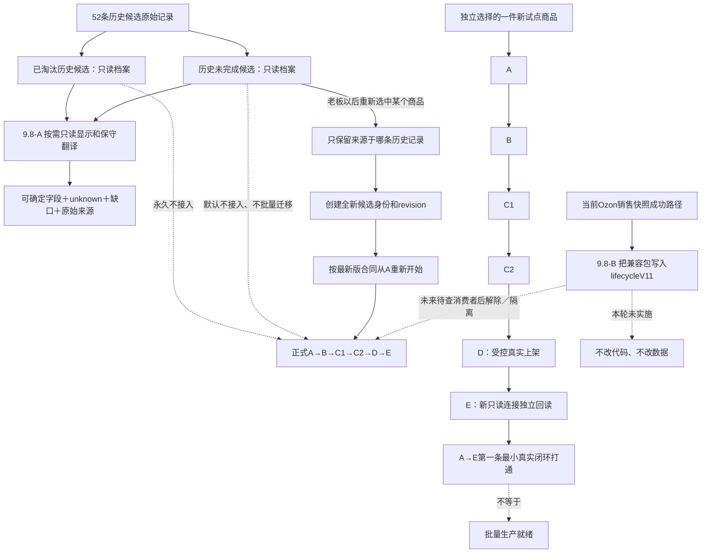
```mermaid
flowchart TD
    History52["52条历史候选原始记录"] --> Eliminated["已淘汰历史候选：只读档案"]
    History52 --> Incomplete["历史未完成候选：只读档案"]
    Eliminated -. "永久不接入" .-> Main["正式A→B→C1→C2→D→E"]
    Incomplete -. "默认不接入、不批量迁移" .-> Main

    Eliminated --> Viewer["9.8-A 按需只读显示和保守翻译"]
    Incomplete --> Viewer
    Viewer --> ArchiveView["可确定字段＋unknown＋缺口＋原始来源"]

    Incomplete -->|"老板以后重新选中某个商品"| Trace["只保留来源于哪条历史记录"]
    Trace --> NewIdentity["创建全新候选身份和revision"]
    NewIdentity --> NewA["按最新版合同从A重新开始"]
    NewA --> Main

    NewPilot["独立选择的一件新试点商品"] --> A["A"]
    A --> B["B"]
    B --> C1["C1"]
    C1 --> C2["C2"]
    C2 --> D["D：受控真实上架"]
    D --> E["E：新只读连接独立回读"]
    E --> FirstLoop["A→E第一条最小真实闭环打通"]
    FirstLoop -. "不等于" .-> Batch["批量生产就绪"]

    SalesSnapshot["当前Ozon销售快照成功路径"] --> Persist["9.8-B 把兼容包写入lifecycleV11"]
    Persist -. "未来待查消费者后解除／隔离" .-> Main
    Persist -. "本轮未实施" .-> Stop["不改代码、不改数据"]
```

### A→E第一条最小真实闭环的验收含义

第一阶段不再以迁移52条历史候选为目标，而是用一件按最新版合同建立的新候选证明完整链路：

1. 建立全新candidate身份、revision和可追溯输入；如果来源于旧档案，只保存来源引用。
2. A完成市场与供货方案，并取得准确主人确认。
3. B使用冻结证据和完整成本形成正式利润结果。
4. C1形成事实、Schema、关键词与SEO草稿；C2形成最终素材和生产前确认。
5. 主人针对一个准确店铺、SKU、字段和范围作出生产授权。
6. D按一次性意图受控执行真实上架，保存真实回执和明确错误语义。
7. 新的独立只读连接从平台重新读取，E严格比较并形成可追溯验证记录。
8. 正常闭环在Codex完全退出时仍能完成，不依赖人工从聊天搬运业务结果。

只有以上全部通过，才称为“A→E第一条最小真实闭环打通”。它不表示系统已经能批量处理所有商品。

### 从第一条闭环到批量前的验证边界

在宣称批量生产就绪前，还要使用少量**新候选**和关键失败场景验证：

- 相同流程能否重复执行，而不是只适配一个特殊商品；
- 不同字段、素材、价格、库存和平台状态是否遵守同一合同；
- 明确失败、权限不足、等待平台和`unknown_outcome`是否正确停止；
- 重复点击、网络重发或恢复操作是否会造成重复上架；
- E是否始终由独立只读连接获取平台事实；
- 状态、授权、回执和错误证据是否持久保存且可追溯。

这组验证不要求52条旧记录全部参与，也不能通过批量迁移旧候选来代替。

### 项目跑通后旧候选的允许处理

未淘汰旧候选只有三种默认处理：

1. 继续只读归档；
2. 按需查看历史；
3. 老板重新选中后，创建全新候选并从A开始。

默认没有批量迁移。只有另行证明具体业务价值、明确迁移范围和风险，并取得老板单独授权以后，才能提出独立迁移方案；该方案不属于当前第一阶段验收。

### 全店能力地图显示边界

- 9.8显示在“历史档案／兼容查看”层，不接入正式A主线。
- 52条旧记录不显示成“待施工”“待完成”或项目迁移队列。
- 9.8-A显示为只读历史查看和保守翻译；其代码或UI依赖不能提升A阶段健康状态。
- 9.8-B单独显示为“当前存在的历史持久化支路／未来待解除／本轮未实施”。
- 老板重新选择旧商品时，线路必须先经过“历史来源引用→全新候选身份和revision”，再进入A；不能从旧阶段直接续跑。
- 独立新试点候选的A→E最小真实闭环与历史档案线路完全分开。
- 一件商品闭环通过只能显示“第一条最小真实闭环”，不能显示“批量生产就绪”。

### 来源、原位置与依赖线索

以下位置用于以后按稳定编号 `9.8` 追溯，不表示本轮对它们进行了修改：

- 调查底稿：`14项待归位能力与8组疑似重复能力调查底稿-2026-08-28.md` 的“9.8 历史候选只读适配”章节
- 历史候选保守适配：`selection-review-app/lib/legacy-candidate-adapter.mjs`
- 只读入口预览：`selection-review-app/lib/real-lifecycle-entry-preview.mjs`
- 当前候选投影及Ozon销售快照后的持久化支路：`selection-review-app/server.mjs`
- 当前历史预览UI：`selection-review-app/src/components/CandidateDetail.jsx`
- 相关测试：`selection-review-app/tests/legacy-candidate-adapter.test.mjs`、`real-lifecycle-entry-preview.test.mjs`及Ozon销售快照相关测试；本轮没有运行
- 当前历史候选数量与分类：本决定以现有52条历史记录为范围；本轮没有重新读取、迁移或重新分类实际数据

### 本轮变更声明

本轮只在现有决定记录末尾追加9.8，并在文档中拆成9.8-A与9.8-B两个事实身份。没有覆盖或改写9.1—9.7，也没有修改调查底稿；没有迁移、重写或重新分类实际52条数据，没有修改9.8适配器、server持久化支路、UI、能力注册表、测试或生命周期数据，没有选择试点商品、启动A→E、访问外部平台或执行任何业务动作。

---

## 2026-08-28｜9.9 旧扁平业务状态与人工上架回读

> 追加说明：本章节是稳定编号 `9.9` 的后续决定记录，只追加在9.1—9.8之后，不回头改写既有内容。`9.9-A`至`9.9-D`是本次决定用于拆开函数职责的事实身份标签，不表示本轮已经拆函数或修改能力注册表。

### 决定状态

- 稳定父编号：`9.9`
- 必须拆开的身份：通用状态／队列／展示／校验逻辑、历史人工上架记录、历史人工／调用方回读记录、上架后经营分析候选
- 整文件去向：**不得整文件退役或粗暴删除**
- 历史人工D／E语义：只读历史记录，不迁移、不升级、不形成迁移欠账
- 全项目新增规则：真实API资产和Level 2凭据引用边界先保护、登记，未经替代验证与明确授权不得删除
- 当前执行状态：**尚未关闭入口、拆函数、迁移消费者、修改历史记录或登记／验证任何真实凭据**
- 授权边界：**老板决定已确认、实施未授权。**本记录不授权读取、显示或验证任何密钥，不授权访问Ozon、WB、Seerfar或其他外部平台，不授权调用API，也不授权修改`workflow.mjs`、server、UI、能力注册表、测试、配置、历史记录或生命周期数据，关闭入口、拆函数或迁移消费者。

### 老板确认的完整决定

1. 9.9不得整文件退役。本次归位决定拆成四个事实身份；其中9.9-A、9.9-B和9.9-C直接对应`workflow.mjs`内的不同职责，9.9-D属于同一次9.9归位决定，但实际实现位于独立的上架后经营观察模块：

   - 9.9-A：当前仍被server和UI依赖的通用状态、队列、展示和校验逻辑；暂时保留，未来在“最新版老板思路×代码×测试”交叉验收后逐函数搬到正确模块，不整文件粗暴删除。
   - 9.9-B：人工填写平台商品ID、链接和确认时间并在本地标记已上架；归入“历史人工上架记录区”。既有记录原样只读保留，未来新写入口退役；永远不能作为正式D平台写入证据。
   - 9.9-C：调用方提交并声称来自`seller_api`或`portal`的观察值；归入“历史人工／调用方回读记录区”。既有记录原样只读保留，未来新写入口退役；永远不能作为正式E独立平台回读证据。这里保留老板决定中的`portal`说法；当前代码对应的来源字面值是`seller_portal`。
   - 9.9-D：人工提供访客、加购和订单并做阈值观察；移出D／E，归入“上架后经营分析候选区”，是否长期保留以后再议。

2. 历史人工上架和回读记录不迁移，不升级成新版D／E成功状态，也不形成迁移欠账。它们只能证明“当时有人这样记录”，不能证明平台真实发生。

3. 新版D必须由正式平台连接器真实写入并保存真实回执；新版E必须使用新的独立只读连接从平台读取后严格比较。人工输入、调用方自报或D自身回送的数据都不得冒充E。

4. 未来关闭9.9-B和9.9-C新写入口之前，先查清当前API／UI消费者和历史展示影响；本轮不关闭、不改数据。“全店能力地图”把9.9-B／9.9-C接到历史支路而不是正式D／E；9.9-A按照实际函数归属显示；9.9-D单独显示为经营分析候选。

5. 所有已发现的真实API相关资产先完整保留并逐项登记：API客户端或适配器；读取和写入端点；接口合同或schema；权限、店铺和仓库配置线索；错误与回执处理；相关测试；凭据引用。完成最新版老板思路交叉验收、证明替代方案并取得明确迁移或退役授权以前，任何人不得随意删除。

6. 必须区分“真实API能力”和“人工声明来自API”。只有软件使用平台凭据向真实平台发出请求并保存真实响应，才算API读取或写入；人工或调用方提交带`seller_api`或`portal`标签的数据，不能据此升级成真实平台证据。当前代码对应的后台来源字面值是`seller_portal`，但名称更准确也不会改变它仍是调用方声明的事实。

7. API Key、Token和Secret本身继续留在原有安全存放位置，不移动、不复制、不轮换、不删除。本决定记录、调查报告、源码、测试、聊天和日志中禁止写入、回显或复制真实密钥值；只允许登记平台和店铺、读取或写入用途、凭据引用方式或存放类别、当前是否经过验证，不记录秘密内容。

8. “保留API和Key”不构成使用授权。本轮及以后任何真实平台读取、权限探测、凭据验证或写入，仍须遵守对应只读或写入授权边界；优先只读验证；真实写入必须另行精确授权店铺、SKU、字段和一次执行范围。

9. 拆分9.9或任何旧模块时，如果发现真实API代码、端点合同、测试、凭据引用或平台连接线索，必须从人工支路中单独登记和保护，不能跟随人工上架或伪回读一起退役。以后即使出现唯一新适配器，也只能在覆盖能力、迁移消费者并验证完成后，另行提出退役旧实现。

10. 安全等级按真实威胁校准：本条保护的是Level 2凭据边界，以及避免密钥泄露和未授权使用；不新增没有必要的哈希、签名、加密副本或复杂审计体系；继续使用现有安全秘密存储，禁止把“备份”误解为明文复制。

11. **老板决定已确认、实施未授权。**本轮只追加决定；禁止读取、显示或验证任何密钥；禁止访问Ozon、WB、Seerfar或其他外部平台；禁止调用API；禁止修改`workflow.mjs`、server、UI、能力注册表、测试、配置、历史记录或生命周期数据；禁止关闭入口、拆函数或迁移消费者。

### 代码位置校正（不改变老板决定）

- 9.9-A、9.9-B和9.9-C与`workflow.mjs`的拆分直接相关。
- 9.9-D属于同一次9.9归位决定，但当前经营指标判断的实现位于独立文件`selection-review-app/lib/post-launch-observation.mjs`，不是`workflow.mjs`中的函数。未来地图应按这个真实代码位置画线，不能误画成从`workflow.mjs`拆出的函数。
- 当前新版`/lifecycle/e-readback`路由同样接收调用方提交的`verifiedObservation`。现有证据只能说明“E比对与保存合同已经存在”；在独立平台只读provider接通并产生真实平台响应以前，不能把它显示为正式E独立回读完成。

### 9.9-A｜通用状态、队列、展示和校验逻辑

#### 大白话身份

`workflow.mjs`里有一批当前服务和页面仍在使用的通用函数，例如整理本地状态、队列、展示字段和校验输入。它们不能因为与旧人工上架代码同处一个文件，就被整包当成历史废代码删除。

#### 当前决定边界

- 当前状态：仍有server或UI调用，暂时保留。
- 未来处理：在“最新版老板思路×代码×测试”交叉验收后，按导出函数逐项确认真正职责、调用方和规则符合度，再搬到对应领域、服务、展示或校验模块。
- 禁止做法：不能整文件复制成新模块，也不能为了清理9.9-B／C而把仍有调用的通用函数一起删除。
- 地图表达：每个通用函数以后按真实归属显示；在逐函数验收前，不能用一个9.9-A状态概括所有函数健康。

### 9.9-B｜历史人工上架记录

#### 大白话身份

这条旧路径允许人填写平台商品ID、链接和确认时间，然后把本地候选标成“已上架”。它证明的是“当时有人提交了这份记录”，不是软件真的向平台写入成功。

#### 输入 → 处理 → 输出

| 输入 | 处理 | 输出 |
|---|---|---|
| 人工填写的平台、商品ID、链接和确认时间 | 校验输入形状并写入本地旧候选状态 | 一条历史人工上架记录和本地显示状态 |

#### 当前决定边界

- 既有记录原样、只读保留，不迁移、不升级成新版D成功，也不形成迁移欠账。
- 未来新写入口退役，但实施前必须查清当前API／UI消费者和历史展示影响。
- 永久不能作为`ProductionRecord`、平台写入回执或正式D成功证据。
- 本轮不关闭入口、不修改记录、不改变UI。

### 9.9-C｜历史人工／调用方回读记录

#### 大白话身份

这条旧路径接收调用方提交的属性或状态，并允许调用方把来源写成`seller_api`或`seller_portal`（老板决定中简称`portal`）。标签只是一段声明；如果软件没有自己使用平台凭据发出真实只读请求并保存平台响应，它就不是独立E回读。

#### 输入 → 处理 → 输出

| 输入 | 处理 | 输出 |
|---|---|---|
| 调用方提交的平台观察、状态、时间和来源标签 | 校验数据形状并保存到本地旧记录 | 一条历史人工／调用方回读记录 |

#### 当前决定边界

- 既有记录原样、只读保留，不迁移、不升级成新版E成功，也不形成迁移欠账。
- 未来新写入口退役，但实施前必须查清当前API／UI消费者和历史展示影响。
- `seller_api`、`seller_portal`或其他来源标签不能把调用方自报升级成真实平台证据。
- 新版E必须由新的独立只读连接真实访问平台，保存响应并严格比较。
- 当前新版E回读路由虽然可以接收`verifiedObservation`并生成比对记录，但观察值仍由调用方提交；这只能说明E比对和保存合同存在，不能说明独立平台读取provider已经接通。
- 本轮不关闭入口、不修改记录、不读取平台。

### 9.9-D｜上架后经营分析候选

#### 大白话身份

老板决定把这类访客、加购和订单视为人工提供的旧经营指标，旧逻辑按阈值给出经营观察。当前源码只证实UI读取`candidate.postLaunchMetrics`并交给独立的`post-launch-observation.mjs`判断，尚未证实这些指标的正式采集来源。因此在取得真实连接器证据以前，它们按人工／本地记录处理。它回答“商品经营表现怎样”，不回答“本轮D是否写成功”或“E是否从平台独立回读一致”。

#### 当前决定边界

- 正式归属：上架后经营分析候选区，移出D／E技术验收主链。
- 人工经营指标不能作为D／E证据，也不能证明指标来自平台API。
- 是否作为本项目长期职责继续保留，维持后置决定。
- 本轮不改UI、函数或数据。

### 历史记录与正式D／E的永久边界

| 路线 | 它能证明什么 | 它永远不能证明什么 |
|---|---|---|
| 9.9-B人工上架 | 当时有人填写并保存了商品ID、链接和时间 | 正式连接器执行过写入、平台接受成功或产生真实ProductionRecord |
| 9.9-C调用方回读 | 当时有人或某个调用方提交了观察值和来源标签 | 新独立客户端访问过平台、平台真实返回这些值或形成正式EVerificationRecord |
| 9.9-D经营观察 | 来源尚未由正式连接器证明的流量、加购和订单经过阈值判断 | D成功、E独立回读或平台经营指标由正式连接器采集 |
| 新版D | 正式平台连接器按授权执行一次并保存真实平台回执 | 不能单独证明E独立回读一致 |
| 新版E | 新的独立只读连接真实访问平台，并与D记录严格比较 | 不能由人工输入、调用方自报或D返回值代替 |

### 全项目级API资产保护规则

本节适用于全项目，不只适用于9.9。目标是防止在清理人工旧支路时，把真正有价值的API客户端、端点合同、测试或凭据引用一起误删；同时避免以“保护”为名复制或暴露秘密。

#### 必须保护和登记的API资产

| 资产类型 | 只登记什么 | 不能登记什么 |
|---|---|---|
| API客户端／适配器 | 平台、职责、输入输出、当前调用方和实现位置 | 真实Key、Token、Secret、Cookie或完整Header |
| 读取／写入端点 | 用途、读写性质、目标资源、请求与响应合同 | 带秘密的完整请求、真实凭据值或未脱敏原始响应 |
| 接口合同／schema | 字段、版本、错误和回执形状 | 通过示例偷偷写入真实账户秘密 |
| 权限／店铺／仓库线索 | 稳定身份引用、能力要求、配置类别和证据缺口 | 密码、验证码、完整账号令牌或凭据正文 |
| 错误与回执处理 | 明确失败、权限不足、限流、unknown_outcome和脱敏证据规则 | 吞异常、默认成功或含密钥日志 |
| 相关测试 | 覆盖的合同、失败路径、幂等与权限边界 | 真实生产密钥、真实写入默认开启或明文fixture |
| 凭据引用 | 平台／店铺、读写用途、引用方式或安全存放类别、是否经验证 | 真实秘密值、可还原秘密的片段或明文备份 |

#### 保留、迁移和退役门

1. 先登记发现位置、职责、调用方、合同、测试和凭据引用，不读取秘密正文。
2. 完成最新版老板思路与API资产的规则交叉验收，区分真实API能力、人工声明、历史兼容和重复候选。
3. 证明替代实现覆盖相同能力、错误语义、权限边界和必要测试。
4. 迁移真实消费者，并验证没有丢失读取、写入、回执、错误或独立回读能力。
5. 取得针对准确旧实现的迁移或退役授权后，才可以提出删除运行代码；历史登记继续保留。

在以上条件完成前，任何旧模块里发现的真实API代码、端点、合同、测试或凭据引用，都必须从人工支路中单独保护，不能随人工上架或伪回读一起退役。

#### 真实API能力与人工声明的判定门

只有同时具备以下证据，才可以把一次动作称为真实API读取或写入：

1. 软件使用正确平台和店铺的安全凭据引用，通过正式客户端向真实平台发出请求；
2. 请求的读取／写入性质、目标对象、授权范围和revision明确；
3. 保存平台真实响应、请求身份或终态，并形成脱敏、可追溯证据；
4. 错误、权限失败、限流和unknown_outcome没有被改写成成功。

人工表单、调用方提交、测试fixture或本地记录即使带有`seller_api`、`seller_portal`、`api`等标签，也只能证明“有人这样声明”，不能证明真实平台请求发生。

#### API凭据与授权边界

- Key、Token和Secret继续留在原有安全存放位置；本轮不读取、不显示、不验证、不移动、不复制、不轮换、不删除。
- 文档、报告、源码、测试、聊天和日志只保存凭据引用方式或安全存放类别，永远不保存真实秘密值。
- “保留API资产”“保留凭据引用”或“凭据存在”都不构成平台使用授权。
- 真实只读检查、权限探测或凭据验证仍需对应只读授权；不得因为动作不写平台就自动执行。
- 真实写入必须另行精确授权平台、店铺、SKU、字段、素材和一次执行范围。
- 本规则属于Level 2凭据边界保护，防御的是秘密泄露和未授权使用；不新增无必要的哈希、签名、加密副本或复杂审计系统。
- “备份凭据”不能解释成明文复制；继续使用现有安全秘密存储及其受控恢复方式。

### 大白话关系图

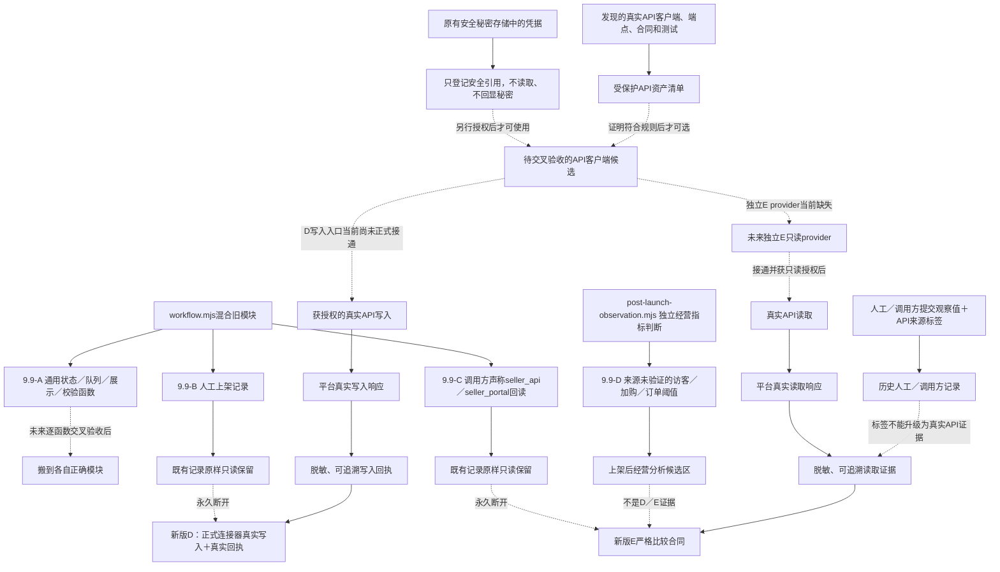
```mermaid
flowchart TD
    Workflow["workflow.mjs混合旧模块"] --> Common["9.9-A 通用状态／队列／展示／校验函数"]
    Common -. "未来逐函数交叉验收后" .-> Modules["搬到各自正确模块"]

    Workflow --> ManualListing["9.9-B 人工上架记录"]
    ManualListing --> ListingArchive["既有记录原样只读保留"]
    ListingArchive -. "永久断开" .-> FormalD["新版D：正式连接器真实写入＋真实回执"]

    Workflow --> ClaimedReadback["9.9-C 调用方声称seller_api／seller_portal回读"]
    ClaimedReadback --> ReadbackArchive["既有记录原样只读保留"]
    ReadbackArchive -. "永久断开" .-> ECompare["新版E严格比较合同"]

    PostLaunch["post-launch-observation.mjs 独立经营指标判断"] --> Metrics["9.9-D 来源未验证的访客／加购／订单阈值"]
    Metrics --> Operations["上架后经营分析候选区"]
    Operations -. "不是D／E证据" .-> ECompare

    ApiCode["发现的真实API客户端、端点、合同和测试"] --> Register["受保护API资产清单"]
    Credential["原有安全秘密存储中的凭据"] --> Reference["只登记安全引用，不读取、不回显秘密"]
    Reference -. "另行授权后才可使用" .-> CandidateClient["待交叉验收的API客户端候选"]
    Register -. "证明符合规则后才可选" .-> CandidateClient

    CandidateClient -. "D写入入口当前尚未正式接通" .-> RealWrite["获授权的真实API写入"]
    RealWrite --> WriteResponse["平台真实写入响应"]
    WriteResponse --> WriteEvidence["脱敏、可追溯写入回执"]
    WriteEvidence --> FormalD

    CandidateClient -. "独立E provider当前缺失" .-> FutureProvider["未来独立E只读provider"]
    FutureProvider -. "接通并获只读授权后" .-> RealRead["真实API读取"]
    RealRead --> ReadResponse["平台真实读取响应"]
    ReadResponse --> ReadEvidence["脱敏、可追溯读取证据"]
    ReadEvidence --> ECompare

    HumanSubmit["人工／调用方提交观察值＋API来源标签"] --> Historical["历史人工／调用方记录"]
    Historical -. "标签不能升级为真实API证据" .-> ReadEvidence
```

### 全店能力地图显示边界

- 9.9-A按照逐函数真实归属显示，在验收前不能用一个总颜色概括全部通用函数。
- 9.9-B和9.9-C进入历史只读支路，与正式D和E使用断线或明确“不能证明”关系。
- 9.9-D显示在上架后经营分析候选区，不进入D／E技术验收主链。
- 真实API资产清单属于工程和连接器事实层，不是业务状态，也不能因为资产存在就把D／E涂成已验证。
- 凭据只显示“引用类别／是否有当前验证证据”，禁止显示秘密值。
- 真实API请求→平台响应→脱敏证据，与人工提交→历史记录必须画成两条不同线路。

### 来源、原位置与依赖线索

以下位置用于以后按稳定编号 `9.9` 追溯，不表示本轮对它们进行了修改，也不包含任何秘密值：

- 调查底稿：`14项待归位能力与8组疑似重复能力调查底稿-2026-08-28.md` 的“9.9 旧扁平业务状态与人工上架回读”章节
- 旧混合模块：`selection-review-app/lib/workflow.mjs`
- 当前旧API调用入口：`selection-review-app/src/api.js`
- 当前服务端相关路由：`selection-review-app/server.mjs`
- 当前历史上架／回读／经营观察UI：`selection-review-app/src/components/UserInspector.jsx`
- 上架后经营分析候选实现：`selection-review-app/lib/post-launch-observation.mjs`
- 相关测试：`selection-review-app/tests/workflow.test.mjs`、`selection-review-app/tests/post-launch-observation.test.mjs`及相关路由测试；本轮没有运行
- 全项目API资产规则适用范围：项目中所有真实API客户端、适配器、端点、schema、错误／回执处理、测试和凭据引用；本轮没有扫描秘密存放位置或验证凭据

### 本轮变更声明

本轮只在现有决定记录末尾追加9.9及“全项目级API资产保护规则”。没有覆盖或改写9.1—9.8，也没有修改调查底稿；没有读取、显示或验证任何密钥，没有访问Ozon、WB、Seerfar或其他外部平台，没有调用API，没有修改`workflow.mjs`、server、UI、能力注册表、测试、配置、历史记录或生命周期数据，也没有关闭入口、拆函数或迁移消费者。

## 2026-08-28｜9.10 当前14节点能力地图草稿

> 追加说明：本章节是稳定编号`9.10`的老板最终决定，只追加在9.1—9.9之后，不回头改写既有决定或调查底稿。它明确修正此前“保留现有页面外壳、只替换数据源”的调查建议；修正调查建议不等于已经修改旧地图或开始新地图施工。

### 决定状态

- 旧草稿身份：**历史UI原型／参考档案**
- 未来产品基座：**不采用旧14节点静态定义、旧页面布局、旧卡片风格或旧交互方式**
- 新地图位置：同一个“全店经营工作台”内，未来替换旧入口，不另建第二个网站
- 新地图事实基础：49节点能力总账，以及14项待归位、8组重复比较和真实代码／测试／运行证据
- 新地图行为边界：只读展示，不派工、不接线、不推进A→E、不修改任何业务状态或能力事实
- 当前源码与运行副本：主源码有旧页面和API；冻结4317运行副本曾对该API返回404，只能证明版本存在差异
- 授权边界：**老板决定已确认、实施未授权。**本记录不授权设计施工、修改或删除旧地图、改49节点总账、启动服务、部署4317或改动任何业务数据。

### 老板确认的完整决定

1. 明确撤回此前“保留现有14节点页面外壳、只替换数据源”的初步建议。该建议依赖“现有布局、UI和交互基本可接受”的前提；老板已经明确对旧地图及其UI、交互均非常不满意，因此前提不成立。

2. 当前9.10的14节点地图草稿整体降级为“历史UI原型／参考档案”，不是未来“全店能力地图”的产品基座。现有静态14节点、页面布局、卡片风格和交互方式不再继续扩展，不能因为已有代码投入就强行复用。

3. 新“全店能力地图”必须在同一个“全店经营工作台”内重新设计和实现；不另建第二个网站，也不形成第二份业务真相。新地图未来替换旧入口，而不是和旧地图长期并存。

4. 新地图先建立唯一、统一、只读的数据／投影合同，以49节点能力总账为能力事实基础，并能表达14项待归位能力、8组疑似重复能力、真实代码／测试／运行证据，以及历史、目标和当前状态边界；不得继续维护一套独立的静态健康结论。

5. 新UI按照老板已经确定的“思维导图＋workflow结合”目标重新设计。它必须能表达模块关系、施工状态、每个节点使用的能力、谁发起、输入和输出交给谁、是否需要主人确认，以及代码和验收证据；目标能力不得冒充已经完成。

6. 新地图只读展示，不派工、不自动接线、不修改A→E状态、不修改代码、能力注册表或运行副本，也不是部署或施工控制台。

7. 允许复用的只有经过逐项证明仍然合适、并且与旧视觉和错误数据体系无关的通用基础能力，例如工作台导航入口、通用请求能力或没有产品语义的基础组件。复用不是目标；禁止为了提高复用率保留老板不满意的UI，或额外制造兼容层。

8. 新地图完成设计、数据合同、测试和主人验收以后，才可以在另行授权下替换旧入口并退役旧草稿。届时保留必要的历史截图、设计和来源追溯，但不保留两套可运行地图长期并存。

9. 当前主源码存在9.10页面和API，而冻结4317运行副本曾对地图API返回404，这项事实继续如实记录。它只说明源码与运行副本存在差异，不构成部署授权，也不要求把旧草稿补进4317。

10. 这是对原调查建议的明确修正：不是“保留页面外壳换数据源”，而是“旧页面整体退为历史原型；新地图在同一工作台重新设计；只自然复用经证明合适的非视觉基础能力”。

11. **老板决定已确认、实施未授权。**本轮禁止修改或删除旧地图代码、静态注册表、API、UI、路由、兼容别名、49节点能力总账、测试、运行副本或数据；禁止开始设计施工、部署4317或启动服务。

### 大白话说明

旧9.10像一张为了快速说明问题画出的“样板楼层图”：它确实有页面、有接口，也能展示14张静态能力卡，但卡片内容和健康判断来自它自己维护的一份静态定义。后来项目形成了更完整的49节点能力总账，也登记了14项待归位能力和8组重复比较。旧图既没有读取这些事实，也不是老板满意的展示方式，所以不能继续拿旧页面当房架，只换里面的数据。

未来的新地图要在原“全店经营工作台”里重新做。它不是第二个网站，也不是第二套商品状态或业务状态。它只把统一能力事实层投影成人能看懂的地图：什么已经有代码、什么已经接通、什么还没验证、什么只是历史或模拟、哪些能力互相依赖，以及哪里必须由主人确认。地图可以帮助看懂和验收，但不能在页面上把一条未接的线点成已接通。

### 旧原型与未来新地图的边界

| 对比 | 旧9.10草稿 | 未来新“全店能力地图” |
|---|---|---|
| 产品身份 | 历史UI原型／参考档案 | 全店经营工作台内的只读能力事实与诊断视图 |
| 数据来源 | 独立静态14节点定义 | 唯一统一的能力事实与只读投影合同 |
| 覆盖范围 | 14个静态节点和少量运行开关 | 49节点能力总账、14项待归位、8组重复比较及代码／测试／运行证据 |
| 状态表达 | 独立维护静态健康结论 | 明确区分历史、当前、目标、未接通、未验证和真实失败 |
| 视觉与交互 | 老板不满意，不再扩展 | 按“思维导图＋workflow结合”重新设计 |
| 对业务状态的权限 | 页面原则上只读 | 永久只读；不得修改A→E或成为第二套业务真相 |
| 迁移方式 | 现在保留，不补部署 | 新图经设计、合同、测试和主人验收后，另行授权替换旧入口 |

### 可以自然复用与明确不复用

- 可以候选复用：同一工作台里的导航入口、通用请求封装、没有旧地图产品语义的基础组件。每一项都要先证明仍适合新合同和新设计。
- 明确不作为基座：独立14节点静态定义、旧布局、旧卡片风格、旧交互方式和独立健康判断。
- 不新增兼容负担：不为了表面复用率保留两套地图，也不建立一层长期适配旧静态定义的兼容体系。
- 不提前退役：旧代码只有在新地图完成测试、主人验收并取得替换授权后，才进入退役步骤。

### 大白话关系图

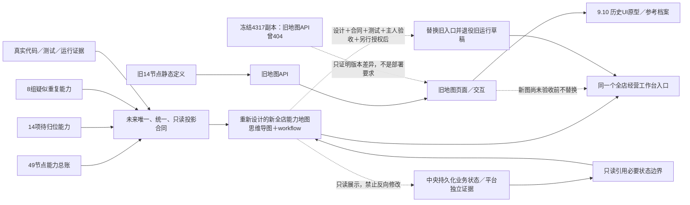
```mermaid
flowchart LR
    Static14["旧14节点静态定义"] --> OldApi["旧地图API"]
    OldApi --> OldUi["旧地图页面／交互"]
    OldUi --> Archive["9.10 历史UI原型／参考档案"]

    Registry49["49节点能力总账"] --> Projection["未来唯一、统一、只读投影合同"]
    Unplaced14["14项待归位能力"] --> Projection
    Duplicate8["8组疑似重复能力"] --> Projection
    Evidence["真实代码／测试／运行证据"] --> Projection
    Projection --> NewMap["重新设计的新全店能力地图<br/>思维导图＋workflow"]
    NewMap --> Workbench["同一个全店经营工作台入口"]

    BusinessTruth["中央持久化业务状态／平台独立证据"] --> ReadOnlyView["只读引用必要状态边界"]
    ReadOnlyView --> NewMap
    NewMap -. "只读展示，禁止反向修改" .-> BusinessTruth

    OldUi -. "新图尚未验收前不替换" .-> Workbench
    NewMap -. "设计＋合同＋测试＋主人验收＋另行授权后" .-> Replace["替换旧入口并退役旧运行草稿"]
    Replace --> Workbench

    Runtime4317["冻结4317副本：旧地图API曾404"] -. "只证明版本差异，不是部署要求" .-> OldUi
```

### 当前证据与后续验收门

- 当前主源码：`selection-review-app/lib/three-store-map.mjs`保存独立14节点静态定义；`selection-review-app/server.mjs`存在旧地图API；`selection-review-app/src/components/ThreeStoreMap.jsx`实现旧页面；`selection-review-app/src/App.jsx`提供工作台入口。
- 统一能力事实基础：`selection-review-app/lib/capability-registry.mjs`登记49节点、14项待归位能力和8组重复比较；本轮不修改、不刷新其状态。
- 兼容线索：`selection-review-app/src/components/WorkflowMap.jsx`是现有兼容别名；本轮不删除、不改名。
- 运行差异：冻结快照记录4317运行副本对旧地图API曾返回404。本轮没有启动或访问4317，也没有重新验证该运行状态。
- 未来替换门：新数据／投影合同完成、UI重新设计完成、相关测试通过、主人亲自验收、取得精确替换授权。缺少任一项都不替换旧入口。
- 测试边界：旧地图测试文件存在，但本轮没有运行；测试存在或曾经通过，都不能证明新地图已经设计、实现、部署或验收。

### 全店能力地图的永久只读边界

- 地图展示能力事实和诊断证据，不保存候选、SKU、利润、授权、平台回执或E回读的第二份业务状态。
- 地图中的拖动、展开、缩放或布局变化以后也只能改变视图，不能改变能力编号、真实依赖或接线状态。
- 目标架构、未来节点或设计愿望必须明确标为目标或未实现，不能显示成当前已完成。
- 地图不能触发派工、平台读取、平台写入、部署、代码修改、状态迁移或旧能力退役。

### 本轮变更声明

本轮只在现有决定记录末尾追加稳定编号9.10的老板决定，并对9.9新增章节中的代码位置和E独立读取图示做了事实校正。没有覆盖或改写9.1—9.8，也没有修改调查底稿；没有修改或删除旧地图代码、静态注册表、API、UI、路由、兼容别名、49节点能力总账、测试、运行副本或数据；没有开始新地图设计施工，没有启动服务，没有部署4317，也没有访问任何外部平台。

## 2026-08-28｜9.11 server 2.mjs历史服务原型

> 追加说明：本章节是稳定编号`9.11`的老板最终决定，只追加在9.1—9.10之后，不回头改写既有决定或调查底稿。这里记录“禁止运行和未来如何审计”的边界，不表示本轮已经移动、删除、拆分、归档或执行这份旧服务。

### 决定状态

- 正式身份：**禁止运行的历史服务原型／高孤立度退役候选**
- 主线资格：不属于A→E，不属于当前“全店经营工作台”后端，也不属于未来中央运行
- 当前仓库调用：正式启动链只指向`server.mjs`；未发现`server 2.mjs`的正常调用方
- 未知边界：仓库不能证明外部人工、旧shell或LaunchAgent从未直接运行它
- 误启动风险：普通模式默认监听4317，也可以由`SELECTION_REVIEW_PORT`指定其他端口；`--api-only`模式固定监听4318。误启动可能争用端口，并直接读写旧`data/candidates.json`
- 永久决定：禁止重新接回正式启动链、页面、部署、4317、新版A→E或中央运行
- 当前授权：**老板决定已确认、实施未授权。**本记录不授权运行、导入、移动、改名、删除、审计外部系统或修改任何代码、配置、数据和运行副本。

### 老板确认的完整决定

1. 9.11的`server 2.mjs`正式归位为“禁止运行的历史服务原型／高孤立度退役候选”，不属于A→E、当前“全店经营工作台”后端或未来中央运行。

2. 当前正式启动链只指向`server.mjs`；package的`start`、`dev`、`launch-server.sh`和`deploy-local-runtime.sh`均不调用`server 2.mjs`，仓库当前没有发现正常调用方。但仓库不能证明外部人工、旧shell或LaunchAgent从未直接运行过，所以不得武断称为安全孤儿。

3. 明确禁止把`server 2.mjs`重新接入启动链、页面、部署、4317或新版A→E，也不允许它成为第二个可写后台。即使其中存在有价值的API，也不能因此恢复整台旧服务器。

4. 完整历史源码、来源线索、旧API路由、数据读写语义和差异证据先保留，不得随意删除；发现的真实API资产继续遵守全项目API资产保护规则。

5. 后续只有取得单独授权后，才可以先核查外部手工使用记录、LaunchAgent和shell引用，再制作`server 2.mjs`与正式`server.mjs`逐路由、输入、输出、副作用、鉴权、数据格式和消费者差异表。

6. 已被正式`server.mjs`覆盖的路由只保留历史档案；如果发现仍有独特业务或API价值，应当提取需求和合同，在正确的新模块中最小、可测试地实现。禁止复制旧服务器，也禁止制造兼容性的第二套体系。

7. 文件当前仍然可执行，会直接读写旧`candidates.json`；普通模式默认监听4317，也可以由`SELECTION_REVIEW_PORT`指定其他端口，`--api-only`模式固定监听4318。“全店能力地图”必须显示“历史服务原型／禁止运行／误启动会争用端口并修改数据”，不能把它显示成无害文件或现役后端。

8. 如果发现凭据引用，只登记平台、用途和安全引用方式；真实Key或Token继续留在原有安全位置，不读取、不复制，也不写进决定文档、源码或日志。“保留凭据引用”不等于授权使用。

9. 最终是否把这份可执行文件移出活跃源码位置，或者只留下不可执行档案，必须等外部消费者核查和独特能力提取完成后，再通过单独的实施授权处理；历史档案继续保留。老板不需要再次决定是否把旧服务器接回，因为“接回”已经被明确、永久否决。

10. **老板决定已确认、实施未授权。**本轮禁止运行或动态导入`server 2.mjs`；禁止移动、改名或删除文件；禁止检查或读取秘密；禁止监听端口；禁止修改启动链、LaunchAgent、`server.mjs`、UI、能力注册表、测试、数据或运行副本；禁止访问外部平台。

### 大白话说明：仓库角落的旧收银机

可以把`server 2.mjs`理解成仓库角落里一台旧收银机。现在商店正常营业使用的是正式`server.mjs`，现有开机按钮、开发启动、本机4317启动和覆盖部署也都只接正式服务器。旧收银机没有接在正常电路上，但它仍然能被人单独插电：一旦有人直接运行，普通模式默认会尝试占用4317，也可能按环境配置占用其他端口，`--api-only`模式则占用4318；同时它能够修改旧候选账本`candidates.json`。

所以它不是现役后台，也不是可以放心忽略的普通文件。正确做法是明确贴上“禁止运行”，保留整台机器和旧账路由供以后对照；等另行授权后，再查有没有人仍在暗中使用它、哪些按钮已由新收银机覆盖、哪些功能确实独有。独有价值只能把“需求和接口合同”拆出来，在正式系统的正确模块中重新实现，不能把整台旧收银机重新接回营业线路。

### 当前静态证据

| 事实层 | 当前证据 | 不能据此声称 |
|---|---|---|
| 文件存在 | `selection-review-app/server 2.mjs`仍在活跃源码目录，顶层可创建HTTP服务 | 不能声称它是现役后端或安全文件 |
| 正式启动链 | `package.json`、`scripts/dev.mjs`、`scripts/launch-server.sh`和`scripts/deploy-local-runtime.sh`均只指向`server.mjs` | 不能证明外部人工或旧系统从未运行9.11 |
| 仓库调用关系 | 排除登记和文档后，未发现正常代码调用`server 2.mjs` | 不能武断称为“纯孤儿”或直接删除 |
| 本地副作用 | 静态代码读取和写入旧`data/candidates.json`；普通模式读取`SELECTION_REVIEW_PORT`并默认4317，`--api-only`时固定4318 | 不能通过“未接启动链”把副作用降级成无害 |
| 业务覆盖 | 只含少量早期API和旧数据语义，不具备当前完整A→E或中央运行边界 | 不能把旧路由存在当成正式能力已接通 |
| 真实执行 | 本轮没有运行、动态导入、监听端口或读取运行日志 | 不能声称当前正在使用，也不能声称从未被使用 |

### 永久禁止与未来审计边界

- 永久禁止：接回正式启动链、接入页面、部署到4317、接入新版A→E、成为第二个可写后台或未来中央服务。
- 当前保留：完整源码、旧路由、数据读写语义、来源线索和差异证据；保留只为追溯与比较。
- 未来另行授权后才做：核查外部shell／LaunchAgent／人工运行记录，制作逐路由差异表，确认独特能力和真实消费者。
- 差异审计结果只有两种去向：已经覆盖的进入历史档案；确有独特价值的只提取需求与合同，在正式模块中最小重建。
- 接回旧服务器不再是未来选项；需要另行决定和授权的只是如何安全保存档案、提取独特能力以及何时移出活跃源码位置。

### 大白话关系图

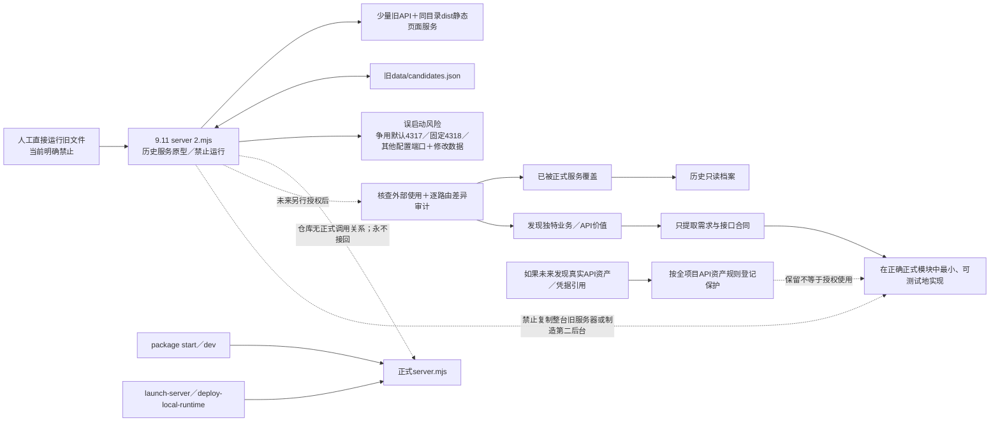
```mermaid
flowchart LR
    Manual["人工直接运行旧文件<br/>当前明确禁止"] --> OldServer["9.11 server 2.mjs<br/>历史服务原型／禁止运行"]
    OldServer --> OldApi["少量旧API＋同目录dist静态页面服务"]
    OldServer <--> OldData["旧data/candidates.json"]
    OldServer --> Risk["误启动风险<br/>争用默认4317／固定4318／其他配置端口＋修改数据"]

    Start["package start／dev"] --> Current["正式server.mjs"]
    Runtime["launch-server／deploy-local-runtime"] --> Current
    OldServer -. "仓库无正式调用关系；永不接回" .-> Current

    OldServer -. "未来另行授权后" .-> Audit["核查外部使用＋逐路由差异审计"]
    Audit --> Covered["已被正式服务覆盖"]
    Covered --> Archive["历史只读档案"]
    Audit --> Unique["发现独特业务／API价值"]
    Unique --> Contract["只提取需求与接口合同"]
    Contract --> NewModule["在正确正式模块中最小、可测试地实现"]
    OldServer -. "禁止复制整台旧服务器或制造第二后台" .-> NewModule

    ApiAsset["如果未来发现真实API资产／凭据引用"] --> Protected["按全项目API资产规则登记保护"]
    Protected -. "保留不等于授权使用" .-> NewModule
```

### 来源、原位置与依赖线索

- 历史服务原型：`selection-review-app/server 2.mjs`
- 当前正式服务：`selection-review-app/server.mjs`
- 正式启动命令：`selection-review-app/package.json`
- 开发启动：`selection-review-app/scripts/dev.mjs`
- 本机运行副本启动：`selection-review-app/scripts/launch-server.sh`
- 本机运行副本覆盖部署：`selection-review-app/scripts/deploy-local-runtime.sh`
- 旧数据文件语义：`selection-review-app/data/candidates.json`
- 能力登记位置：`selection-review-app/lib/capability-registry.mjs`中的稳定编号9.11；本轮没有修改登记状态
- 调查依据：`14项待归位能力与8组疑似重复能力调查底稿-2026-08-28.md`的9.11章节；本轮没有修改调查底稿

### 后续实施停止条件

未来审计或归档施工中，只要外部消费者仍未查清、独特路由仍未完成合同提取、真实API资产仍未完成保护登记，或者缺少针对准确文件和目标位置的实施授权，就必须停止移动、删除或变更文件。无论审计结果如何，都不得把旧服务器接回正式运行链。

### 本轮变更声明

本轮只在现有决定记录末尾追加稳定编号9.11的老板决定。没有覆盖或改写9.1—9.10，没有修改调查底稿；没有运行或动态导入`server 2.mjs`，没有监听端口，没有移动、改名或删除文件，没有读取秘密，没有修改启动链、LaunchAgent、`server.mjs`、UI、能力注册表、测试、数据或运行副本，也没有访问任何外部平台。

## 2026-08-28｜9.12 十二个历史一次性数据变更脚本

> 追加说明：本章节是稳定编号`9.12`的老板最终决定，只追加在9.1—9.11之后，不回头改写既有决定或调查底稿。“历史封存／禁止运行”是已经确认的能力身份和使用禁令；本轮没有移动文件、改变执行权限或建立物理隔离，源码当前仍可能被人手工执行。

### 决定状态

- 正式身份：**禁止运行的历史数据变更档案组**
- 组内数量：12个历史一次性脚本，全部保留源码和独立子条目
- 主线资格：不属于A→E、日常业务能力、正式迁移系统或工作台按钮
- 运行资格：全部退出可执行工具身份，永久禁止拿旧脚本直接修改当前数据
- 与9.8关系：52条历史候选永久与新版A→E解耦，9.12不得批量迁移、续跑、激活或补写这些记录
- 历史证据：内嵌旧SKU、revision、规则、费率、价格、URL、路径和旧Codex语义只能解释历史，不能升级成当前事实
- 当前授权：**老板决定已确认、实施未授权。**本记录不授权运行、导入、备份、迁移、读写或重新分类任何候选数据，也不授权修改脚本及其调用环境。

### 老板确认的完整决定

1. 9.12的12个历史一次性数据变更脚本整体归位为“禁止运行的历史数据变更档案组”，不属于A→E、日常业务能力、正式迁移系统或工作台按钮。

2. 12个脚本的完整源码全部保留，作为旧候选数据为什么可能形成当前状态的历史证据，并遵守全项目代码和API资产保留原则。本轮不删除、不移动、不改名。由于真实运行时间和回执都是`unknown`，源码只能证明“当时设计过怎样的修改”，不能单独证明当前数据一定由这些脚本造成。

3. 全部12个脚本退出可执行工具身份：不得接入UI、package命令、server、调度器、部署或正常运行链，未来也不得拿旧脚本直接修改当前数据。这里的“退出”是已经确认的使用禁令；本轮没有改变文件权限，旧脚本在物理上仍可能被手工执行，所以必须继续显示误运行风险。

4. 每个脚本未来只读登记目标候选或SKU、固定revision、内嵌日期、旧规则、旧费率、价格、URL、修改字段、备份方式、旧Codex或派工语义、已知副作用，以及是否存在真实运行证据。最后运行时间没有证据时必须保持`unknown`，不能猜测；脚本里写入的`lastModifiedBy=codex`等历史字段也不能证明真实执行者。

5. 根据已经确认的9.8规则，52条历史候选永久与新版A→E解耦。因此不得用9.12脚本批量迁移、续跑、重新激活或补写这些历史候选；淘汰项只读归档，未完成项以后若被老板重新选中，必须按最新版合同创建新候选并从新版A重新开始。

6. 含固定旧规则、费率、汇率、`codex_processing`、旧`queueUserDispatch`、固定SKU、固定revision或旧本机路径的脚本，不得视为可复用的现行业务规则，也不得把其中的历史业务结论提取成当前事实。

7. 老板不需要逐个决定12个脚本的去留，默认全部历史封存。原调查报告中“逐项再由主人决定归档或退役”的建议明确修正为：工程只负责只读登记历史事实；如果以后出现新的真实迁移需求，再提出单独方案和授权。

8. 未来新的受控迁移必须针对当时真实需求和当前Schema重新设计，不能复活旧脚本。最低边界包括：明确目标；只读dry-run和差异预览；精确批准范围；可恢复备份；当前Schema校验；幂等和重复执行保护；原子提交或明确的部分失败语义；修改后独立回读；明确回退；真实测试。

9. “全店能力地图”将9.12显示为“历史数据变更工具组／禁止运行”，12项子条目都可以只读查询，但不接A→E、UI执行或正常迁移线路。没有调用方不等于没有危险，人工误运行仍可能修改共享数据。

10. **老板决定已确认、实施未授权。**本轮禁止运行或动态导入12个脚本；禁止读取、写入、备份、迁移或重新分类任何候选数据；禁止修改脚本、server、UI、package、能力注册表、测试、路径或权限；禁止访问外部平台。

### 大白话说明：十二张旧手写修正单／作废老印章

这12个脚本像十二张针对某一天、某个商品或某批旧数据写的“手工修正单”。有的写死了DD-H1，有的写死一批候选和revision，有的带着2026年8月4日当时的费率和判断，还有的会把旧商品重新改成`codex_processing`并送回旧派工路线。它们记录了旧账为什么可能变成今天这样，所以原件要保留。

但这些修正单不是今天还能继续盖的公章。旧规则、旧价格、旧Schema和旧派工语义已经不能代表现在；有些脚本没有完整备份，有些会改一整批甚至遍历整个候选池。把它们接进页面或重新运行，等于拿作废老印章直接改现在的账。因此12项统一封存、统一禁止运行，老板不需要逐个再决定去留。

以后如果真的出现新的数据迁移需求，要根据当时的真实数据和当前Schema重新制作一套受控迁移：先看差异，再精确授权，再备份和执行，最后独立回读；失败时能明确停止或回退。不能把旧脚本改个名字就重新拿来用。

### 十二项历史子条目

下表只登记已经静态核实的历史身份和风险，不表示脚本已经运行过，也不表示已经完成每项最终运行记录审计。

| 子条目 | 历史目标和旧语义 | 已知数据副作用／风险 | 真实运行证据 |
|---|---|---|---|
| `accept-dd-h1-wb-test-risk.mjs` | 固定DD-H1与revision 6→7，记录接受旧WB测试风险 | 改旧候选、写旧handoff；生成备份 | `unknown` |
| `apply-2026-08-04-needs-audit.mjs` | 固定日期和8个重点候选的旧审计处理 | 除重点项外还会遍历候选池并改国内运费字段；无备份，只有临时文件替换 | `unknown` |
| `apply-2026-08-04-triage.mjs` | 固定14个旧`codex_processing`候选和DD-H1旧交接 | 写死当时外部尝试与判断；无备份，只有临时文件替换；静态代码未见为这些修改递增对应`dataRevision` | `unknown` |
| `apply-immediate-dispatch.mjs` | 处理所有旧`codex_processing + queued`候选 | 调用旧`queueUserDispatch`，可能重启旧Codex派工语义；有备份和原文比较 | `unknown` |
| `backfill-direction-ceilings.mjs` | 固定20个方向候选，写入用于推导采购上限的旧假设材料 | 使用旧佣金和方向假设；没有直接保存统一的最终采购上限；无备份 | `unknown` |
| `mark-dd-h1-ozon-only.mjs` | 固定DD-H1与revision 4→5，改为当轮只测Ozon | 直接改平台范围；无备份 | `unknown` |
| `migrate-electrical-rule.mjs` | 按旧电器规则重新打开匹配的淘汰候选 | 可改回`codex_processing/queued`并清除旧淘汰结论；有备份 | `unknown` |
| `migrate-processing-source-gaps.mjs` | 固定10个缺货源的旧处理中候选 | 改为待人工补资料并写旧Codex续跑语义；有备份 | `unknown` |
| `migrate-v2.mjs` | 固定旧候选集合，从旧文件结构迁到v2 | 全量重写状态、processing、revision和meta；有v1备份 | `unknown` |
| `normalize-processing-states.mjs` | 对指定旧v2候选文件归一化派发状态 | 调用旧workflow逻辑并替换目标文件；有备份 | `unknown` |
| `pause-dd-h1-listing-tests.mjs` | 固定DD-H1与revision 7→8，记录暂停旧上架测试 | 写暂停交接、评论和历史；有备份 | `unknown` |
| `update-dd-h1-wb-evidence-gap.mjs` | 固定DD-H1与revision 5→6，写旧WB条件测算 | 写死旧汇率、佣金、价格、URL和本机路径并覆盖旧评估；有备份 | `unknown` |

### 共同事实与差异边界

- 共同事实：当前仓库没有发现package、server、UI、调度器或其他正常脚本调用这12项；这不等于历史上从未被人工运行。
- 目标文件并不统一：部分写死项目数据路径，部分读取环境变量，部分要求命令行文件路径，还有脚本依赖执行时工作目录。
- 备份并不统一：静态核对显示8项会生成某种备份；`apply-2026-08-04-needs-audit.mjs`、`apply-2026-08-04-triage.mjs`、`backfill-direction-ceilings.mjs`和`mark-dd-h1-ozon-only.mjs`没有备份，只有临时文件替换。
- 临时文件替换或原子改名只能减少半文件风险，不能证明幂等、revision安全、当前Schema兼容、业务正确或可以完整回滚。
- “当前仓库无调用方”“源码仍存在”“某脚本有备份”“调查时语法可解析”都不能证明它是安全、现役、已验证或可重跑的迁移能力。

### 与9.8历史候选档案的永久边界

- 9.8负责按需只读查看和保守翻译历史候选，`unknown`必须保持`unknown`。
- 9.12是旧数据修改脚本，永久不能用于整理、补齐、迁移、重新激活或续跑9.8对应的52条历史候选。
- 老板以后重新选中某件旧商品时，只保留历史来源引用，按最新版合同创建新候选和新revision，从A重新开始。
- 52条旧记录不是待迁移队列，不因为9.12源码存在形成迁移欠账。

### 未来全新受控迁移流程

未来只有出现新的、明确的数据迁移需求并取得单独规划授权时，才设计新的迁移能力。最低顺序如下：

1. 锁定准确目标数据、当前Schema、revision和转换合同。
2. 只读执行dry-run，生成逐项差异预览和预计副作用，不写数据。
3. 主人针对精确目标、字段、范围和revision授权一次迁移。
4. 创建可恢复、可核对且与目标一致的备份或恢复点。
5. 再次校验当前Schema、revision和批准范围没有漂移。
6. 通过幂等和重复执行保护执行一次；保证原子提交，或显式记录部分失败边界并停止。
7. 使用独立读取确认实际修改结果与批准差异一致。
8. 验证失败时按预先批准的方式回退，并保存明确失败证据。

这条未来流程是迁移安全边界，不是本轮施工授权，也不表示项目现在已经拥有正式迁移系统。

### 大白话关系图

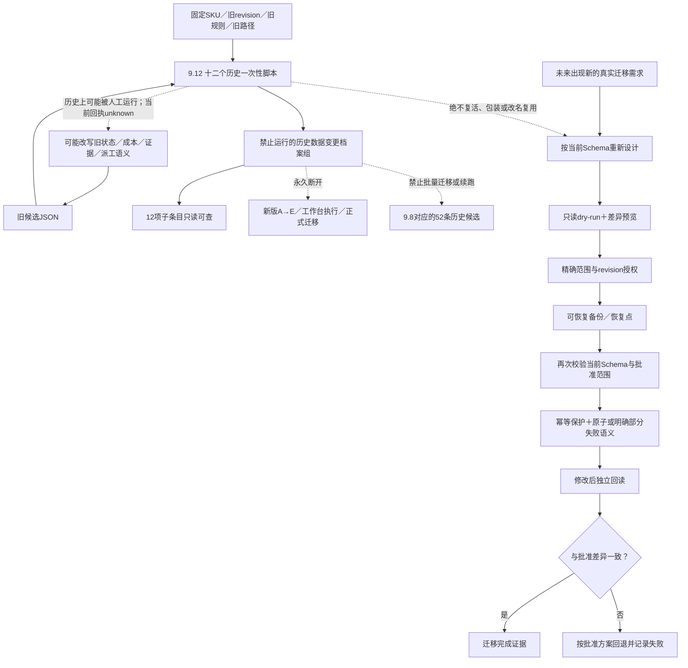
```mermaid
flowchart TD
    Fixed["固定SKU／旧revision／旧规则／旧路径"] --> OldScripts["9.12 十二个历史一次性脚本"]
    OldJson["旧候选JSON"] --> OldScripts
    OldScripts -. "历史上可能被人工运行；当前回执unknown" .-> Rewrite["可能改写旧状态／成本／证据／派工语义"]
    Rewrite --> OldJson

    OldScripts --> Archive["禁止运行的历史数据变更档案组"]
    Archive --> Children["12项子条目只读可查"]
    Archive -. "永久断开" .-> Main["新版A→E／工作台执行／正式迁移"]
    Archive -. "禁止批量迁移或续跑" .-> Legacy52["9.8对应的52条历史候选"]

    Need["未来出现新的真实迁移需求"] --> Design["按当前Schema重新设计"]
    Design --> DryRun["只读dry-run＋差异预览"]
    DryRun --> Approval["精确范围与revision授权"]
    Approval --> Backup["可恢复备份／恢复点"]
    Backup --> Validate["再次校验当前Schema与批准范围"]
    Validate --> Execute["幂等保护＋原子或明确部分失败语义"]
    Execute --> Readback["修改后独立回读"]
    Readback --> Result{"与批准差异一致？"}
    Result -->|是| Done["迁移完成证据"]
    Result -->|否| Rollback["按批准方案回退并记录失败"]

    OldScripts -. "绝不复活、包装或改名复用" .-> Design
```

### 来源、原位置与依赖线索

- 12项源码位置：`selection-review-app/scripts/`
- 能力登记位置：`selection-review-app/lib/capability-registry.mjs`中的稳定编号9.12；本轮没有修改登记状态
- 历史候选档案边界：本文件稳定编号9.8决定
- 调查依据：`14项待归位能力与8组疑似重复能力调查底稿-2026-08-28.md`的9.12章节；本轮没有修改调查底稿
- 当前正常调用关系：静态搜索没有发现package、server、UI、调度器或其他正常脚本调用；本轮没有执行任何脚本验证

### 本轮变更声明

本轮只在现有决定记录末尾追加稳定编号9.12的老板决定。没有覆盖或改写9.1—9.11，没有修改调查底稿；没有运行或动态导入任何一个历史脚本，没有读取、写入、备份、迁移或重新分类任何候选数据，没有修改脚本、server、UI、package、能力注册表、测试、路径、权限或运行副本，也没有访问任何外部平台。

## 2026-08-28｜9.13 Ozon五端点只读能力探针

> 追加说明：本章节是稳定编号`9.13`的老板最终决定，只追加在9.1—9.12之后，不回头改写既有决定或调查底稿。它记录的是一件仍待归位的工程诊断候选工具，不表示当前已接通Ozon真实接口、已取得诊断授权或已拥有正式E独立回读。

### 决定状态

- 正式身份：**Ozon接口工程诊断与写前只读检查候选工具**
- 业务身份：有排障价值，但没有独立业务节点价值；不属于A、B、C1、C2、正式D或正式E
- 当前调用：只有专属mock测试导入；未发现server、UI、正式脚本或A→E运行入口调用
- 当前外部证据：没有真实`requestJson`、凭据引用、平台请求回执或独立E记录
- 当前验证：存在1个专属mock测试文件，其中有3个测试用例；本轮没有运行，只能登记“测试代码存在”
- 正常流程关系：正常A→B→C1→C2→D→E永远不自动触发9.13
- 当前授权：**老板决定已确认、实施未授权。**本记录不授权运行探针、读取或验证凭据、调用Ozon API、创建provider、接入路由或执行任何D／E动作。

### 老板确认的完整决定

1. 9.13正式归位为“Ozon接口工程诊断与写前只读检查候选工具”。它有排障价值但没有独立业务节点价值，不属于A、B、C1、C2，也不是正式D写入或E独立回读业务节点。

2. 当前真实状态必须保留：只有mock测试调用，没有server、UI或正式脚本调用；当前A→E不会触发；没有真实`requestJson`、凭据或外部读取回执。因此不能显示成已接通、已验证或正式E。

3. 它的价值只限于按照固定顺序探测属性、商品信息、价格、库存和导入失败状态五类只读端点，帮助工程人员缩小故障层。五步全部成功时返回受限诊断摘要；第一处传输、响应形状或身份错误时立即fail-fast，抛出固定`failureLayer`错误，不返回成功摘要。老板要求未来诊断能识别店铺身份错误；当前代码只检查`store`非空，并核对部分商品端点之间的商品身份，尚未从平台响应独立验证店铺身份。

4. 五项都通过，也只能证明这些只读端点在该次受限诊断中基本可访问，不能证明写权限、商品上架、图片／价格／库存写入、具体SKU结果或E验收成功。当前只有mock测试，甚至不能据此声称真实Ozon端点已经可访问。

5. 9.13不接入每个商品的正常A→E流程，不给普通用户或老板提供“验证／已通过”按钮，也不自动按每个SKU运行，以避免额外调用、无SKU／job／revision绑定和错误完成语义。

6. 未来可能的触发场景只限另行授权的工程诊断：新Ozon店首次连接前；凭据、权限、仓库或协议变化后；正式连接器故障排查；第一次受控D→E试验前的最小只读前检。保留代码不等于授权真实读取。

7. 正式E必须绑定具体job、SKU、revision和授权，使用新的独立只读provider读取平台真实状态，并生成`EVerificationRecord`。9.13的诊断摘要永远不能冒充E记录，也不能替代D回执或指定商品的平台观察。

8. 当前不优先施工9.13。等正式Ozon只读provider合同和9.7暂定主适配器明确以后，由工程比较并提交三种去向的证据和建议：并入provider自检；保留为独立工程诊断工具；被正式provider完整替代后进入历史档案。最终归位由主人确认，工程不得自动接入或退役；现在不扩展成第二套连接体系。

9. 继续遵守全项目API资产保护规则：源代码、端点意图、测试和凭据引用线索保留；真实Key或Token继续留在原安全位置，不读取、不复制、不记录。任何真实平台诊断仍须主人明确授予只读权限，锁定精确店铺、账号或凭据身份引用、最小对象范围、revision、单次诊断作业、允许端点、请求数量、有效期和排除项，并具备超时、取消和明确结果边界。

10. “全店能力地图”将9.13显示在“工程诊断／待归位”辅助区，与正式D／E主链只使用辅助或虚线关系连接。状态只能反映代码和mock测试事实，不能代表Ozon真实接口或业务闭环健康。

11. **老板决定已确认、实施未授权。**本轮禁止修改或接入探针、server、UI、能力注册表或测试；禁止创建触发器或provider；禁止读取或验证凭据；禁止调用Ozon API、访问外部平台或执行任何D／E动作。

### 大白话说明：工具箱里的验电笔

9.13像工具箱里的一支验电笔。维修人员把一条明确的只读请求线路接给它以后，它会依次碰五个位置：属性、商品信息、价格、库存和导入失败状态。前一个位置正常才继续下一个；遇到第一处传输失败、返回形状不对或商品身份不一致，就立即停下并告诉工程人员“大概断在哪一层”。

验电笔亮了，只能说明这个位置在这次检查中有基本信号，不能证明整台机器能正常生产。五个端点都通过，也不等于有写权限，不等于商品已经上架，更不等于某个SKU的图片、价格和库存正确。当前这支验电笔甚至只在mock测试中接过假线路，没有接过真实Ozon请求器，所以不能显示成真实接口已经验证。

正式E像拿着明确工单去核对指定商品：必须知道准确店铺、SKU、revision、job和授权，从平台独立读取真实状态，再和D记录逐项比较并保存正式结果。9.13只给一份工程诊断摘要，永远不能代替这张正式E验收单。

### 当前代码实际能做与不能做

| 事实层 | 当前代码事实 | 不能据此声称 |
|---|---|---|
| 输入 | 接收非空`store`、外部注入的`requestJson`和合法`checkedAt` | 没有绑定正式授权、candidate、SKU、job或revision |
| 探测顺序 | 属性→商品信息→价格→库存→`STATE_FAILED`导入失败状态 | 不能证明端点已经通过真实Ozon验证 |
| 样本选择 | 属性请求限制一条结果，并要求响应中恰好有一条商品；再用该唯一样本检查后续端点 | 没有按老板指定SKU取样，也不能保证正式业务所需的最小对象范围 |
| 只读意图 | 每次向注入请求器传入`write:false` | 注入请求器可以忽略参数；没有真实请求器和平台回执时，不能证明外部请求真实只读 |
| 失败处理 | 首处传输、形状、身份、币种或字段错误立即停止；不自动重试 | 不能把失败、空数组或解析异常改写成端点可用或`true_empty` |
| 输出 | 冻结的步骤摘要、`writeAllowed:false`、`platformWrites:0`和本地摘要引用 | 不是平台回执、正式观察DTO、`ProductionRecord`或`EVerificationRecord` |
| 当前调用 | 只有专属mock测试导入；能力注册表只是登记 | 不能声称server、UI、运行副本或A→E已经接通 |

### 五端点诊断顺序

| 顺序 | 大白话检查 | 当前端点意图 |
|---|---|---|
| 1 | 能否读到一个基本商品身份和属性形状 | `/v4/product/info/attributes` |
| 2 | 该样本的商品信息、状态和错误字段是否存在 | `/v3/product/info/list` |
| 3 | 该样本价格是否存在且币种形状符合当前检查 | `/v5/product/info/prices` |
| 4 | 该样本库存字段是否存在 | `/v4/product/info/stocks` |
| 5 | 导入失败状态端点能否返回预期列表形状 | `/v3/product/list`，筛选`STATE_FAILED` |

属性端点建立样本身份；商品信息、价格和库存步骤会做不同程度的商品身份核对；最后的`STATE_FAILED`步骤只校验响应列表形状，不核对列表内的具体目标商品。任一步失败都立即停止、不继续消耗后续请求，并抛出固定失败层错误；只有五步全部成功才返回摘要。成功摘要刻意不输出样本商品身份，但本地摘要引用仍不是平台业务回执。

### 未来真实工程诊断的授权边界

如果以后确实需要真实诊断，必须另外建立一次受控工程动作，至少满足：

1. 主人明确授权一次Ozon只读诊断，并锁定准确店铺、账号或凭据身份引用、单次诊断作业、revision、允许端点、最小对象范围、允许请求数量、适用阶段、有效期和排除项。
2. 使用经过审查的只读请求器和安全凭据引用，不把Key、Token、Cookie、完整Header或原始秘密错误写进结果。
3. 不再用“未绑定目标SKU的单条样本”代表正式对象；写前检查应锁定最小安全样本，正式E必须锁定准确SKU和平台商品身份。
4. 每一步具备超时和取消；权限失败、限流、网络错误、解析失败、空结果和真实零结果分别记录。
5. 禁止自动重试、自动换路径或静默降级；首错后安全停止。
6. 只保存脱敏、有限、可追溯的工程诊断证据，不创建或推进任何A→E业务结果。

这些是未来诊断安全门，不是本轮授权，也不表示当前代码已经具备全部边界。

### 大白话关系图

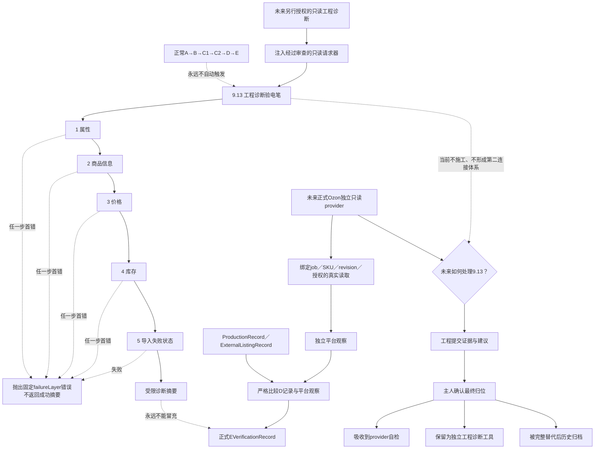
```mermaid
flowchart TD
    Main["正常A→B→C1→C2→D→E"] -. "永远不自动触发" .-> Probe["9.13 工程诊断验电笔"]

    Auth["未来另行授权的只读工程诊断"] --> Requester["注入经过审查的只读请求器"]
    Requester --> Probe
    Probe --> Attr["1 属性"]
    Attr --> Info["2 商品信息"]
    Info --> Price["3 价格"]
    Price --> Stock["4 库存"]
    Stock --> Failed["5 导入失败状态"]

    Attr -. "任一步首错" .-> Stop["抛出固定failureLayer错误<br/>不返回成功摘要"]
    Info -. "任一步首错" .-> Stop
    Price -. "任一步首错" .-> Stop
    Stock -. "任一步首错" .-> Stop
    Failed -. "失败" .-> Stop
    Failed --> Summary["受限诊断摘要"]
    Summary -. "永远不能冒充" .-> ERecord["正式EVerificationRecord"]
    FormalProvider["未来正式Ozon独立只读provider"] --> TargetRead["绑定job／SKU／revision／授权的真实读取"]
    TargetRead --> Observation["独立平台观察"]
    DRecord["ProductionRecord／ExternalListingRecord"] --> ECompare["严格比较D记录与平台观察"]
    Observation --> ECompare
    ECompare --> ERecord

    FormalProvider --> Choice{"未来如何处理9.13？"}
    Choice --> Review["工程提交证据与建议"]
    Review --> Owner["主人确认最终归位"]
    Owner --> Merge["吸收到provider自检"]
    Owner --> Keep["保留为独立工程诊断工具"]
    Owner --> Replace["被完整替代后历史归档"]
    Probe -. "当前不施工、不形成第二连接体系" .-> Choice
```

### 来源、原位置与依赖线索

- 探针源码：`selection-review-app/lib/ozon-de-readonly-capability-probe.mjs`
- 专属mock测试：`selection-review-app/tests/ozon-de-readonly-capability-probe.test.mjs`；本轮没有运行
- 正式D／E适配器候选合同对照：`selection-review-app/lib/ozon-seller-api-de-adapter.mjs`
- 能力登记位置：`selection-review-app/lib/capability-registry.mjs`中的稳定编号9.13；本轮没有修改登记状态
- 调查依据：`14项待归位能力与8组疑似重复能力调查底稿-2026-08-28.md`的9.13章节；本轮没有修改调查底稿
- 当前调用关系：除专属测试导入和能力登记外，静态搜索没有发现server、UI或正式脚本调用；本轮没有真实`requestJson`、凭据或外部读取

### 本轮变更声明

本轮只在现有决定记录末尾追加稳定编号9.13的老板决定。没有覆盖或改写9.1—9.12，没有修改调查底稿；没有运行探针或测试，没有修改或接入探针、server、UI、能力注册表、测试、配置或运行副本，没有创建触发器或provider，没有读取或验证凭据，没有调用Ozon API、访问外部平台或执行任何D／E动作。

## 2026-08-28｜9.14 另一套B领域计算候选

> 追加说明：本章节是稳定编号`9.14`的老板最终决定，只追加在9.1—9.13之后，不回头改写既有决定、调查底稿或能力注册表。这里纠正“9.14能够创建C1计划和交接”的旧范围高估，但本轮不修改登记内容、代码、测试或调用关系。

### 决定状态

- 当前已连接候选：`real-a-b-c1-flow.mjs`，由系统证据编排直接调用，server正式A确认路由经该编排间接到达，但尚未按最新版老板思路完成最终验收
- 9.14正式身份：**另一套B领域计算候选／对照实验台**
- 9.14当前调用：只有`single-sku-b-flow.test.mjs`导入；未发现server、UI或正式脚本调用
- 9.14真实能力：创建`SkuLifecyclePackage`、运行B利润计算、追加`ProfitModel`版本、缺证据时fail-fast
- 9.14明确没有：持久化、C1ProductPlan、C1 handoff、负责人切换、server或UI入口
- 最终收敛：交叉验收后只能保留一个正式B核心、一个生产入口和一个B→C1交接责任点
- 当前授权：**老板决定已确认、实施未授权。**本记录不授权运行差异测试、修改利润规则、选择主实现、接线、合并或退役任何候选。

### 老板确认的完整决定

1. 仓库存在两套与B有关的实现，但不是两套同等完整、都可以正式运行的B。当前接入更完整的是`real-a-b-c1-flow.mjs`；9.14的`product-lifecycle-b-flow.mjs`是测试可达、正式运行链隔离的B领域候选。

2. `real-a-b-c1-flow.mjs`当前由`real-a-b-evidence-orchestration.mjs`直接调用；server正式A确认路由通过该编排间接到达。它额外覆盖主人供应确认、可供持久化的完整结果结构、`C1ProductPlan`和handoff；领域函数本身不直接持久化，当前由server在原子数据变更中保存。它仍须按照最新版老板思路重新验收，不能因为已经接入就称为最终正确或B已经完成。

3. 9.14实际只能`createSkuLifecyclePackage`、`runBProfitModel`、追加profit版本，并在缺少必要证据时fail-fast、停在B。它不持久化、不接server或UI、不创建`C1ProductPlan`、不创建handoff，也不切换负责人。旧登记中“9.14能够C1交接”的描述属于范围高估；禁止画9.14→C1实线。

4. 9.14正式归入“另一套B领域计算候选／对照实验台”。代码和测试保留，不接回主线，不形成第二个生产B入口，现在也不退役。

5. 14项待归位和8组疑似重复能力讨论完成以后，9.14纳入单独授权的“最新版老板思路×代码×字段×测试”交叉验收。比较必须拆成三项：SKU生命周期包创建；B利润计算；C1计划和交接。不能把三项混成一个简单胜负结论。

6. 两套实现必须使用完全相同、可追溯的`OpportunityPackage`、主人确认SKU、销售价格选择、成本、采购、物流、佣金、包装证据、汇率证据和利润阈值输入进行差异测试。不得用不同fixture制造结论。

7. 比较维度至少包括：数值结果与舍入；完整成本项；证据新鲜度与来源；缺失或冲突输入的fail-fast；利润门槛及passed／rejected语义；SKU、revision和identity绑定；利润版本、幂等和重复执行；上游不可变性；持久化边界；C1唯一交接。

8. 比较完成后只保留一个正式B核心和唯一生产入口。当前接入主线的一侧只能称为“现有已连接候选”，不能提前称为最终`currentPrimary`。9.14中经证明更正确且符合最新版规则的领域函数，可以最小吸收到正式架构；禁止复制形成平行利润体系或兼容层。工程和A／B领域验收提供证据，最终主实现选择由主人确认。

9. 一套正式B必须在证据不足或冲突时明确停在B，不能用默认值、旧费率或估算掩盖缺口。B只消费已经冻结、可追溯且适用键一致的输入，不因联网、外部调用或其他副作用偷偷改变A证据。

10. “全店能力地图”分别显示现有已连接B候选和9.14测试候选，如实标注调用方、测试和C1交接差异。在交叉验收以前，不得显示两套都已经完成，也不得把9.14画成C1交接能力。

11. **老板决定已确认、实施未授权。**本轮禁止运行差异测试；禁止修改、合并或删除任一B实现；禁止调整利润公式、门槛、费率、汇率或舍入；禁止接入server或UI、创建C1交接、修改能力注册表、测试或数据；禁止访问外部平台。

### 大白话说明：一套当前已连接，一套实验室计算器

这两套代码不是两条同样完整的生产流水线。`real-a-b-c1-flow.mjs`像当前已经接到工作台后面的流水线候选：主人确认供货后，它会创建当前实现中的`SkuLifecyclePackage`候选对象并组织B利润；B通过时还会准备C1计划和唯一交接，server负责把完整结果原子保存。但“已经接上”只说明当前代码会走这里，不代表它已经完全符合最新版规则，更不代表真实B已经验收完成。

9.14的`product-lifecycle-b-flow.mjs`更像实验室里的一台利润计算器。它能拿规范A证据和主人确认SKU创建一个SKU包，再用费用和汇率计算ProfitModel；证据不够就报错停在B。它没有接工作台，没有保存结果，也不会把商品交给C1。因此不能把“实验室算出了利润”说成“第二条完整B→C1流水线”。

以后比较时，两边必须拿完全相同的一篮子输入，分别看SKU包怎样创建、利润怎样算、B通过后C1怎样只交接一次。不能给一边用完整证据、另一边用旧fixture，再宣布谁更好。最后只留一个正式B核心和一个生产入口；9.14中真正更好的小零件可以最小吸收，但不能保留两台平行计算器长期给出不同利润。

### 两套实现的当前事实对照

| 对比 | 现有已连接候选`real-a-b-c1-flow.mjs` | 9.14候选`product-lifecycle-b-flow.mjs` |
|---|---|---|
| 当前调用 | `real-a-b-evidence-orchestration.mjs`直接调用，server正式A确认路由经该编排间接到达 | 只有`single-sku-b-flow.test.mjs`导入 |
| 对外入口 | 当前主源码中的评审台A确认流程可以到达；本轮没有验证4317运行副本 | 无server、UI或正式脚本入口 |
| SKU生命周期 | 由主人确认结果创建当前实现中的`SkuLifecyclePackage`候选对象 | 导出`createSkuLifecyclePackage`创建B阶段SKU包 |
| B利润 | 调用当前`runSkuProfitModel`并返回ProfitModel | 导出`runBProfitModel`并追加profit版本 |
| B不通过 | 留在B，不创建C1计划或handoff | 返回rejected并留在B |
| C1计划 | B通过后调用`createC1ProductPlan` | 没有；`c1ProductPlan`保持`null` |
| C1交接 | B通过后创建唯一`c1Handoff`并切换唯一负责人语义 | 没有handoff，不切换负责人 |
| 持久化 | 领域函数本身不写文件；server负责原子保存结果结构 | 纯函数，不持久化，也没有运行调用方保存 |
| 外部副作用 | 领域闭环自身零平台写入；系统证据准备由上层编排管理 | 纯领域计算，不访问平台、AI或凭据 |
| 已知待验收偏差 | 当前server仍允许主人接受估算佣金；若利润模型通过，会保存该接受记录并创建C1。这与本决定要求的“正式B必须取得有效佣金后才能通过并进入C1”不一致，属于待交叉验收的真实冲突 | 不接server；没有这条运行行为，但也未证明其利润规则符合最新版要求 |
| 当前结论 | 已连接候选，尚未按最新版规则最终验收 | 测试候选，正式运行链隔离 |

### 旧登记范围高估纠正

当前能力登记中至少有以下范围需要在未来另行授权的登记更新中纠正；本轮只记录事实，不修改注册表：

1. 9.14不能称为“另一套B利润与C1交接流程”，准确身份是“另一套B领域计算候选”。
2. 9.14输出只有SKU包、ProfitModel和B结论，没有C1交接对象。
3. 疑似重复组不能写成“两套都能计算B并产生C1交接”；真实重叠只到SKU包和B利润。
4. 正式`3.6 B→C1原子交接`的关联文件或测试即使列出9.14，也不能据此把9.14当成C1实现证据。

地图在注册表正式校正以前，也必须以当前源码事实为准，把9.14→C1显示为明确断开，而不是根据旧登记画实线。

### 后续同输入差异验收

未来交叉验收必须建立同一份只读比较输入包，至少锁定：

- 同一个`OpportunityPackage`及revision；
- 同一个主人确认供应SKU和供应身份；
- 同一个销售快照和价格选择；
- 同一套采购成本、国内费用、国际物流、平台佣金、包装、其他应计成本证据；
- 同一个汇率证据、利润门槛配置及版本；
- 同一个计算时间、平台、店铺、类目、模式和线路适用键；
- 同一个幂等输入身份和预期重复执行场景。

在完全相同的输入下，分开验收三件事：

1. **SKU包创建**：身份、revision、主人确认、包装和冻结证据是否完整一致。
2. **B利润计算**：公式、成本项、舍入、阈值、证据适用性、失败语义、版本追加和重复执行是否一致。
3. **C1计划与交接**：只有正式B通过才创建；同一原子提交只创建一次；9.14当前没有这项能力，不能用空对象或测试替代。

每项结论只能是完全符合、部分符合、冲突、缺失或过时。比较测试尚未运行，当前不能指定最终主实现。

### 大白话关系图

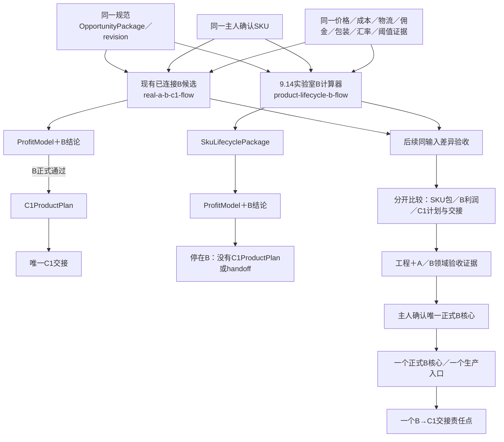
```mermaid
flowchart TD
    Opportunity["同一规范OpportunityPackage／revision"] --> Connected["现有已连接B候选<br/>real-a-b-c1-flow"]
    ConfirmedSku["同一主人确认SKU"] --> Connected
    Evidence["同一价格／成本／物流／佣金／包装／汇率／阈值证据"] --> Connected

    Opportunity --> Lab["9.14实验室B计算器<br/>product-lifecycle-b-flow"]
    ConfirmedSku --> Lab
    Evidence --> Lab

    Connected --> ConnectedProfit["ProfitModel＋B结论"]
    ConnectedProfit -->|B正式通过| C1Plan["C1ProductPlan"]
    C1Plan --> Handoff["唯一C1交接"]

    Lab --> LabSku["SkuLifecyclePackage"]
    LabSku --> LabProfit["ProfitModel＋B结论"]
    LabProfit --> StopAtB["停在B：没有C1ProductPlan或handoff"]

    Connected --> Compare["后续同输入差异验收"]
    Lab --> Compare
    Compare --> Three["分开比较：SKU包／B利润／C1计划与交接"]
    Three --> EvidenceResult["工程＋A／B领域验收证据"]
    EvidenceResult --> Owner["主人确认唯一正式B核心"]
    Owner --> Core["一个正式B核心／一个生产入口"]
    Core --> UniqueHandoff["一个B→C1交接责任点"]
```

### 正式B的停止边界

- 当前已连接候选尚未完全满足本节边界：server仍存在“主人接受估算佣金后，利润通过即可创建C1”的路径。本轮只登记冲突，不修改代码、规则或数据。
- 必要成本、佣金、物流、包装、汇率、门槛或身份缺失、失效、冲突或适用键不一致时，明确停在B。
- 条件测算或估算佣金不能形成正式passed，也不能创建C1。
- 禁止用空值、默认值、旧费率、旧汇率、宽泛fallback或自动换来源掩盖缺口。
- B领域计算只消费冻结输入；需要准备证据时由上层受控编排另建作业，不能让B函数自己联网改变A证据。
- 相同输入、revision和配置版本的重复执行必须幂等，不能新增第二个ProfitModel或第二个C1交接。

### 来源、原位置与依赖线索

- 9.14候选：`selection-review-app/lib/product-lifecycle-b-flow.mjs`
- 9.14专属测试：`selection-review-app/tests/single-sku-b-flow.test.mjs`；本轮没有运行
- 现有已连接候选：`selection-review-app/lib/real-a-b-c1-flow.mjs`
- 当前系统证据编排：`selection-review-app/lib/real-a-b-evidence-orchestration.mjs`
- 当前server入口与原子保存：`selection-review-app/server.mjs`
- 能力登记位置：`selection-review-app/lib/capability-registry.mjs`中的稳定编号9.14、3.6和相关重复组；本轮没有修改登记状态
- 调查依据：`14项待归位能力与8组疑似重复能力调查底稿-2026-08-28.md`的9.14章节；本轮没有修改调查底稿

### 本轮变更声明

本轮只在现有决定记录末尾追加稳定编号9.14的老板决定。没有覆盖或改写9.1—9.13，没有修改调查底稿；没有运行差异测试或其他测试，没有修改、合并或删除任一B实现，没有调整利润公式、门槛、费率、汇率或舍入，没有接入server或UI，没有创建C1交接，没有修改能力注册表、测试、数据或运行副本，也没有访问任何外部平台。

---

## 2026-08-28｜10.1 Ozon D／E候选实现比较组

> 追加说明：本章节是稳定编号`10.1`的老板最终决定，只追加在9.1—9.14之后，不回头改写既有决定、调查底稿或能力注册表。它把10.1与已经确认的9.7、9.13收敛成同一套职责边界，不新增产品方向问题，也不表示本轮已经选择、拆分、接通或验证任何候选。

### 决定状态

- 比较组身份：Ozon D／E候选实现的职责分层与收敛记录，不是一个业务节点，也不是一条已经完成的生产线
- 七个成员：三个互补岗位，加四个需要拆清重叠范围的候选
- 当前`currentPrimary`：**`null`，没有选择主实现**
- 当前正式Ozon D写入入口：**缺失／未接通**
- 当前正式独立Ozon E只读provider：**缺失／未接通**
- 当前可达事实：生产策略被`production-plan.mjs`调用；OSS素材传输有server接缝；E比较合同有server记录入口，但观察值仍由调用方提交
- 当前验证边界：相关源码和测试文件存在；本轮没有运行测试，也没有真实平台写入或独立E回读证据
- 当前授权：**老板决定已确认、实施未授权。**本记录不授权修改七个成员、选择`currentPrimary`、创建provider、接入路由、读取凭据、运行测试或执行任何Ozon动作。

### 老板确认的完整决定

1. 七个成员不是七套完整上架系统。它们必须按岗位分层：`ozon-production-strategy.mjs`是上游路线计划；`aliyun-oss-d-asset-integration.mjs`是D前素材传输；`e-stage-readback.mjs`是E结果比较合同。三者互补，不参与Ozon写入主适配器二选一。

2. 真正需要收敛的是四个重叠或交叉候选：`d-e-software-closure.mjs`领域总合同、`ozon-seller-api-production-adapter.mjs`商品导入候选、`ozon-seller-api-de-adapter.mjs`写入／库存／回读组合候选，以及`draft-production-execution.mjs`最小草稿执行候选。

3. 最终目标边界固定为：一个领域生产总管负责授权、计划、revision、一次性意图、attempt、`unknown_outcome`和`ProductionRecord`；一个唯一Ozon D写入适配器负责平台协议和经授权字段；一个独立Ozon E只读provider使用新的只读客户端重新读取平台；一个E比较合同生成`EVerificationRecord`。禁止长期保留平行生产线。

4. `d-e-software-closure.mjs`保留为领域总管候选，但Ozon端点、凭据、网络客户端和平台私有响应不得进入领域层。当前server只通过`d-e-software-integration.mjs`生成只读准备度；完整执行函数主要由测试到达，因此不能称为完整生产能力，更不能提前称为最终领域总管。

5. 两个Seller API adapter按照9.7已经确定的统一合同，使用完全相同的输入做正面对比，最终只保留一个唯一平台写入入口。`ozon-seller-api-de-adapter.mjs`中混在一起的E读取职责必须与D写入拆开；正式E不得使用同一个写入客户端的内存结果、D返回值或调用方自报数据冒充独立回读。

6. `draft-production-execution.mjs`不长期保留为第二套状态机或第二条生产线。它体现的“最小授权范围、单次草稿、没有授权不扩展、写后必须独立核验”等安全原则，可以在交叉验收后最小吸收到正式D用例；它当前的产品范围和旧常量不能自动扩大为库存、激活、发布或广告能力。

7. 旧候选代码中的“库存100”不能成为正式D默认写入值。第一次真实试验究竟是草稿还是发布、是否写库存、写什么价格、允许哪些字段以及使用哪家店，必须等平台能力完成只读核验以后，由老板针对一个准确店铺、一个SKU、revision和一次执行另行精确授权；这些运行时决定当前继续后置。

8. 三个互补岗位可以按照真实调用事实继续保留：路线策略有`production-plan.mjs`调用；OSS素材传输有server的受控接缝；E比较合同可以保存比较结果。但这些事实分别只能证明“计划规则被使用”“素材地址准备有入口”“比较和保存合同存在”，不能证明真实D写入、独立E回读或D→E闭环已经完成。

9. 10.1不新增老板架构问题，直接复用9.7已经确认的两级选主门：先完成单独授权的“最新版老板思路×代码×字段×测试”交叉验收，由老板确认一个暂定组合；再经过单店单SKU、一次受控真实D写入、真实回执、独立E新请求和严格比较，才升级为正式主线。`currentPrimary`当前继续保持`null`，不因本决定自动填写。

10. “全店能力地图”必须按岗位分别画出：路线策略→领域总管；素材传输辅助D；唯一D适配器候选；当前缺失的独立E provider；E比较。不能把七个成员画成七套完成系统，不能把调用方提交的观察值画成E已经接通，也不能把9.13工程诊断摘要画成正式E记录。

11. **老板决定已确认、实施未授权。**本轮禁止修改、合并、拆分或删除七个成员；禁止选择`currentPrimary`、接server或UI、创建E provider、运行差异测试或平台测试；禁止读取或验证凭据、调用Ozon、写商品、价格或库存，以及执行任何D／E动作。

### 大白话说明：七个岗位不是七家工厂

这七份代码像一座还没有正式投产的工厂里，摆着路线规划员、素材搬运员、生产总管候选、两台候选写入机器、一份草稿安全操作法和一名验收对照员。它们都围绕“上架”出现，所以只看名字很容易误以为有七家工厂在竞争。实际不是这样。

路线规划员只决定准备走哪条路线，不会向Ozon发请求；素材搬运员只把主人确认的图片变成平台能够读取的稳定地址，不会创建商品；验收对照员只会拿两份结果逐项比较，自己不会登录平台取数。这三个岗位和写入机器是上下游或辅助关系，不应该被拿去参加“谁是唯一Ozon写入适配器”的比赛。

真正需要收口的是中间四项。领域总管候选规定一次生产怎样取得授权、怎样保存意图、结果不明时怎样停住；两个Seller API候选都碰到了Ozon商品导入，其中组合候选还混入库存和回读；草稿执行候选又包含一套单次执行和写后核验规则。未来不是从四个文件中粗暴挑一个整包照搬，而是先把岗位边界固定，再比较同一岗位的实现，最后只留下一个领域总管责任点和一个Ozon写入入口。

正式E还缺一名真正去平台重新取数的“独立验收员”。现有`e-stage-readback.mjs`只是对照表和判定规则；server虽然能接收观察值并保存E记录，但观察值目前由调用方提交。9.13则是维修时使用的只读验电笔，不是这名正式验收员，也不能替代它。

### 七个成员按岗位归位

| 成员 | 大白话岗位 | 当前真实调用或能力 | 不能据此声称 |
|---|---|---|---|
| `ozon-production-strategy.mjs` | 上游路线计划 | `production-plan.mjs`直接创建并校验策略对象 | 不访问Ozon，不上传、不写商品、不回读；当前策略内容仍须按最新版规则验收 |
| `aliyun-oss-d-asset-integration.mjs` | D前素材传输 | server有受控素材传输路由；先保存意图，再执行一次，结果可为已验证或`unknown_outcome` | 只产生稳定素材地址且`platformWrites=0`，不代表商品写入或D完成；OSS也不是永久唯一媒介 |
| `e-stage-readback.mjs` | E结果比较与记录合同候选 | server的E路由可以接收观察值并保存结果；系统创建路径当前只做有限身份校验 | 不访问平台；当前观察由调用方提交，严格字段比较仍在未接server的closure候选路径中，不能称独立E provider或真实回读 |
| `d-e-software-closure.mjs` | 领域生产总管候选 | 可以准备D请求、开始attempt、分类`unknown_outcome`、接受注入执行器和回读器；server当前只通过集成视图显示准备度 | 自己不持久化、不拥有真实客户端；完整执行主要测试可达，不是正式生产主线 |
| `ozon-seller-api-production-adapter.mjs` | Ozon D适配器候选一 | 请求构造函数被领域候选复用；完整factory主要由测试调用 | 当前不写库存；依赖进程内`Map`保存刚提交的上下文，不能作为中央运行或独立E证据 |
| `ozon-seller-api-de-adapter.mjs` | Ozon D适配器候选二＋混合回读候选 | 能检查能力、解析稳定素材地址，并在注入客户端后组合商品导入、任务查询、库存和五端点回读；领域候选当前只复用其素材地址解析 | 完整factory未接server；写入和回读混在同一对象；只读探针与它只是端点重叠，没有调用关系 |
| `draft-production-execution.mjs` | 单SKU草稿执行与安全原则候选 | 接受注入的创建器和回读器，校验授权／计划并生成ProductionRecord形状；领域候选只复用其记录版本和校验函数 | 完整执行器未接server；不能把旧库存、模式或发布范围直接升级为正式规则，也不能保留为第二生产入口 |

相关测试文件存在，只证明这些候选可以被静态或模拟测试覆盖；本轮没有运行测试。当前没有一份真实平台回执，可以证明上述任何Seller API执行器已经接入正式店铺并完成独立E。

### 当前“库存100”的代码事实分布

- `production-plan.mjs`当前生成并校验`stock=100`。
- `d-e-software-closure.mjs`当前把请求、ProductionRecord和E预期库存锁成100。
- `ozon-seller-api-de-adapter.mjs`候选会在组合执行中向库存端点写100。
- `draft-production-execution.mjs`只在`draft_only`模式写100；`create_and_moderate`模式明确不写库存。
- `ozon-seller-api-production-adapter.mjs`当前明确记录`inventoryIncluded=false`和`inventoryModified=false`，不负责库存写入。
- OSS素材传输路径明确`platformWrites=0`，与库存写入无关。

这些只是当前代码分布，不是一致的正式库存规则，更不代表真实Ozon已经写入100。根据本次决定，未来正式D不得从任何旧候选继承默认库存写入；实际库存必须进入准确生产授权。

### 四个重叠候选怎样收敛

#### 1. 领域总管候选

`d-e-software-closure.mjs`可以保留授权、计划、revision、一次性执行意图、attempt、幂等、明确失败、`unknown_outcome`和`ProductionRecord`等领域思想，但必须逐项验收。领域总管未来只依赖抽象的D写入端口和E读取端口，不直接知道Ozon URL、Header、Key、Token、Cookie或私有响应形状。

当前实现仍直接引用两个adapter的部分函数、草稿记录校验和E比较函数，并且把D执行与即时回读绑在同一个执行函数里。因此它现在只是候选，不是已经边界清楚的最终总管。

更重要的是，当前`executeDSoftwareAttempt`在D写入以后立即调用回读；回读失败或不一致时会把整个attempt收口成`unknown_outcome`，成功回读以后才生成`ProductionRecord`。未来必须按已经确认的事实线拆开：D是否成功由真实D回执决定；如果D已经明确成功而E读取失败，必须保留D事实，只把E标成失败、等待或未知，不能把已经确定的D结果一起抹成未知。这是后续工程交叉验收项，不是新的老板问题。

#### 2. 唯一Ozon D写入适配器

两个Seller API候选必须在完全相同的店铺、SKU、revision、`ProductionAuthorization`、`ProductionPlan`、字段、素材、价格、库存范围、幂等身份和模拟客户端下比较：

- 平台请求是否严格限制在授权字段；
- 是否保存真实请求身份、终态和脱敏回执；
- 明确失败与`unknown_outcome`是否分开；
- 请求可能已经发出时是否禁止盲目重试；
- 是否可以在服务重启后依据中央状态继续判断，而不是依赖进程内`Map`；
- 是否把平台协议留在adapter内，而不污染领域层；
- 是否能够把准确平台商品身份交给独立E作业。

交叉验收以后，由老板确认一个暂定D适配器。其他候选中真正更正确的底层转换或错误归一化函数可以最小吸收，但最终只有一个正式写入入口，不建立兼容性第二生产线。

#### 3. 草稿执行安全原则

可以候选吸收的是：绑定准确店铺、SKU、revision和授权；单SKU、单次执行；只写授权字段；输入冻结；无授权不发布、不激活、不扩展广告；失败不自动重试；真实回执脱敏保存；写后由独立E重新读取。

不能直接吸收的是：固定库存100、旧`publishScope`字面值、旧端点或协议、进程内状态、把即时回读并入D成功条件，以及任何旧代码对“唯一入口”的自我声明。它们必须由当前规则、当前平台合同和本次精确授权重新决定。

#### 4. 独立E provider与E比较

正式E必须在另行取得仍有效的Ozon只读回读授权后建立独立只读作业。该作业绑定准确店铺、账号或凭据身份引用、SKU、平台商品身份、revision、原D job、允许端点、请求数量、有效期和E读取授权记录；D生产授权不得自动扩大为E读取授权。新的只读客户端再向Ozon重新发出最小请求，把响应归一化为脱敏平台观察DTO，交给E比较合同生成`EVerificationRecord`。

当前`e-stage-readback.mjs`的server入口还不是完整严格比较：系统创建路径只显式核对有限的商品和供应SKU身份，再校验观察DTO形状；价格、库存、图片数量、状态等严格比较逻辑目前位于未接server的`d-e-software-closure.mjs`候选路径中。因此`e-stage-readback.mjs`现在只能称“E比较与记录合同候选”，未来仍须逐字段收敛，不能因为server能够保存记录就显示为正式E已经完成。

同一个写入客户端的内存结果、D返回值、调用方提交的`verifiedObservation`、9.13诊断摘要或“平台接受了请求”，都不能代替独立E。9.13以后可以作为另行授权的工程诊断或provider自检候选，但它不进入每个SKU的正常E，也不成为10.1的第八个生产成员。

### 两级选主门保持不变

#### 第一级：只选暂定组合

在14项待归位和8组重复能力讨论完成以后，另行授权执行“最新版老板思路×代码×字段×测试”交叉验收。结论按岗位产生：领域总管候选是否可复用；两个Seller API候选哪一个适合作为暂定D适配器；独立E provider需要新建还是最小抽取；E比较合同哪些部分符合当前规则。

10.1本质不是七个文件只选一个胜者，因此不能把某一个文件路径填进组级`currentPrimary`，再假装整条D／E已经选完。未来若能力注册表需要表达岗位级结果，应在另行授权下按角色记录；当前`currentPrimary`继续保持`null`。最终接入、保留、拆取或退役决定仍由老板确认。

#### 第二级：真实单店单SKU升级门

只有以下步骤全部完成，暂定组合才能升级成正式主线：

1. 只读核实准确Ozon店铺身份、权限、仓库能力和当前平台协议。
2. 老板针对一个店、一个SKU、revision、允许字段、素材、价格、库存以及草稿／发布边界作出精确授权。
3. 领域总管先中央持久化一次性执行意图，再由唯一D适配器执行一次。
4. 保存真实平台请求身份、明确终态、脱敏回执和`ProductionRecord`；发生`unknown_outcome`立即停止并先对账。
5. 在E只读回读授权仍有效，而且店铺、账号或凭据身份引用、SKU和revision一致时，新的独立只读客户端重新访问平台，获取准确商品观察；不能复用D内存结果。
6. E比较合同严格比较平台观察、D记录和授权，并持久化`EVerificationRecord`。
7. 全部通过以后，才确认正式主线；一件商品通过仍只代表第一条最小真实闭环，不代表批量生产就绪。

每一级授权都只覆盖自己的动作，不自动包含下一步。保留API代码或凭据引用不构成使用授权；真实Key、Token和Cookie继续留在原安全位置，本轮不读取、不复制、不验证。

### 大白话关系图

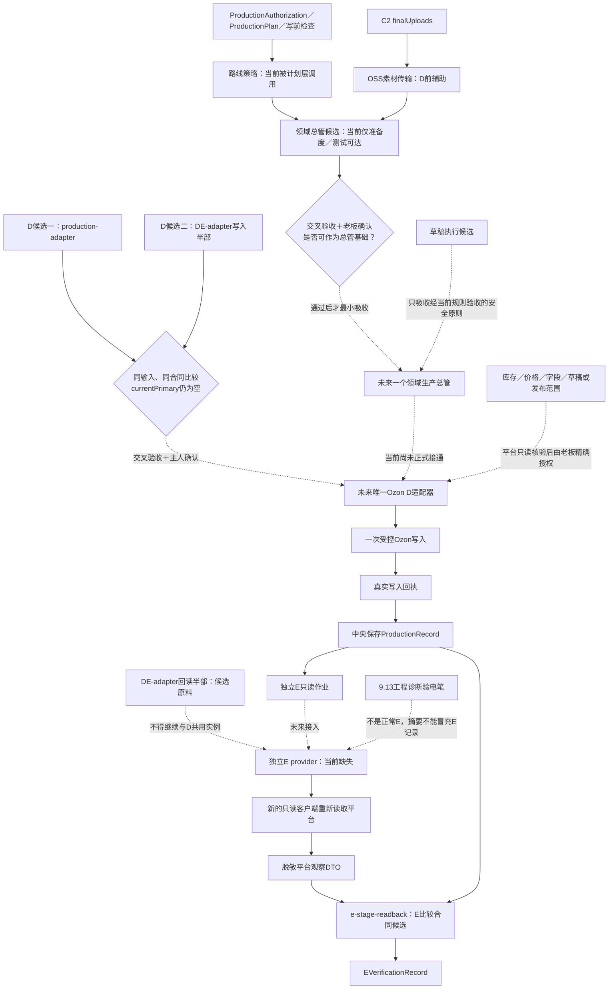
```mermaid
flowchart TD
    Auth["ProductionAuthorization／ProductionPlan／写前检查"] --> Strategy["路线策略：当前被计划层调用"]
    FinalAssets["C2 finalUploads"] --> Transport["OSS素材传输：D前辅助"]
    Strategy --> DomainCandidate["领域总管候选：当前仅准备度／测试可达"]
    Transport --> DomainCandidate

    DomainCandidate --> DomainReview{"交叉验收＋老板确认<br/>是否可作为总管基础？"}
    DomainReview -. "通过后才最小吸收" .-> FutureDomain["未来一个领域生产总管"]
    Draft["草稿执行候选"] -. "只吸收经当前规则验收的安全原则" .-> FutureDomain

    ProdAdapter["D候选一：production-adapter"] --> AdapterCompare{"同输入、同合同比较<br/>currentPrimary仍为空"}
    DEWrite["D候选二：DE-adapter写入半部"] --> AdapterCompare
    AdapterCompare -. "交叉验收＋主人确认" .-> OneD["未来唯一Ozon D适配器"]
    FutureDomain -. "当前尚未正式接通" .-> OneD
    OneD --> OzonWrite["一次受控Ozon写入"]
    OzonWrite --> Receipt["真实写入回执"]
    Receipt --> ProductionRecord["中央保存ProductionRecord"]

    ProductionRecord --> EJob["独立E只读作业"]
    DERead["DE-adapter回读半部：候选原料"] -. "不得继续与D共用实例" .-> MissingProvider["独立E provider：当前缺失"]
    EJob -. "未来接入" .-> MissingProvider
    MissingProvider --> FreshRead["新的只读客户端重新读取平台"]
    FreshRead --> Observation["脱敏平台观察DTO"]
    Observation --> ECompare["e-stage-readback：E比较合同候选"]
    ProductionRecord --> ECompare
    ECompare --> ERecord["EVerificationRecord"]

    Probe["9.13工程诊断验电笔"] -. "不是正常E，摘要不能冒充E记录" .-> MissingProvider
    RuntimeScope["库存／价格／字段／草稿或发布范围"] -. "平台只读核验后由老板精确授权" .-> OneD
```

### 全店能力地图显示边界

- 把路线策略、素材传输、领域总管、D适配器、独立E provider和E比较画成不同岗位，不能给10.1整体涂一个“已完成”颜色。
- 三个互补岗位分别显示自己的当前调用证据；任何一个岗位可达都不能把D或E整体标蓝。
- 两个Seller API适配器显示“待同合同比较／尚未选主／正式路由未接”。
- `draft-production-execution.mjs`显示为“安全原则和用例候选”，不得画成第二正式生产入口。
- 独立E provider显示“缺失／尚未接通”；调用方观察、D返回和9.13摘要均不得连成正式E实线。
- 线路健康必须分别显示：素材传输有server接缝；领域执行未接；平台写入未接；独立E读取未接；E比较合同可达但缺真实观察来源。
- `currentPrimary=null`表示还没有角色级选主结果，不能被UI解释成“自动选择默认实现”。

### 来源、原位置与依赖线索

- 比较组登记：`selection-review-app/lib/capability-registry.mjs`中的稳定编号10.1；当前`currentPrimary=null`
- 领域总管候选：`selection-review-app/lib/d-e-software-closure.mjs`
- 当前只读准备度组合：`selection-review-app/lib/d-e-software-integration.mjs`、`selection-review-app/server.mjs`
- Ozon D适配器候选：`selection-review-app/lib/ozon-seller-api-production-adapter.mjs`、`selection-review-app/lib/ozon-seller-api-de-adapter.mjs`
- 路线策略：`selection-review-app/lib/ozon-production-strategy.mjs`，由`selection-review-app/lib/production-plan.mjs`调用
- 草稿执行候选：`selection-review-app/lib/draft-production-execution.mjs`
- 素材传输：`selection-review-app/lib/aliyun-oss-d-asset-integration.mjs`及server素材传输路由
- E比较合同：`selection-review-app/lib/e-stage-readback.mjs`及server E记录路由；当前观察由调用方提交
- 工程诊断交叉引用：稳定编号9.13、`selection-review-app/lib/ozon-de-readonly-capability-probe.mjs`
- 调查依据：`14项待归位能力与8组疑似重复能力调查底稿-2026-08-28.md`的10.1章节；本轮没有修改调查底稿
- 相关测试文件：上述七个成员各自的领域、adapter、策略、素材和E测试；本轮没有运行，也没有真实平台测试

### 本轮变更声明

本轮只在现有决定记录末尾追加稳定编号10.1的老板决定。没有覆盖或改写9.1—9.14，没有修改调查底稿；没有修改、合并、拆分或删除七个成员，没有选择`currentPrimary`，没有接server或UI，没有创建E provider，没有运行差异测试、平台测试或其他测试，没有读取或验证凭据，没有调用Ozon、写商品、价格或库存，没有修改能力注册表、数据或运行副本，也没有执行任何D／E动作。

---

## 2026-08-28｜10.2 旧Workflow Map与Codex分派比较组

> 追加说明：本章节是稳定编号`10.2`的老板最终决定，只追加在9.1—9.14和10.1之后，不回头改写既有决定、调查底稿或能力注册表。它是对9.1“旧排班板”和9.2“旧派单员”既定退役方向的联合退出顺序复核，不新增产品方向，也不重新讨论它们是否回到主线。

### 决定状态

- 联合身份：旧Workflow Map排班板＋旧Codex派单员；高耦合前后关系，不是二选一的重复实现
- 最终去向：两套运行语义退出正常A→B→C1→C2→D→E；历史记录只读保留
- 当前源码事实：两套源码存在，server仍导入并调用部分函数；旧地图前端已经退场，但`activeDispatch`兼容互斥仍影响多个业务入口
- 当前投递门：server只有在非Codex离线模式且`SELECTION_REVIEW_AUTO_DELIVER`明确为`on`或`true`时才实例化旧派单员；派单员自身还受`SELECTION_REVIEW_CODEX_DISPATCH`开关约束
- 当前运行证据：本轮没有读取4317实际环境开关，未取得当前派发回执，也没有运行级证据证明冻结运行副本已彻底不能派发
- 当前隔离状态：**决定已定、迁移未实施**
- 组级`currentPrimary`：继续为`null`；这是联合退出组，不存在未来主实现胜者
- 当前授权：**老板决定已确认、实施未授权。**本记录不授权修改开关、旧状态、路由、代码、数据、UI、运行副本或启动任何Codex任务。

### 老板确认的完整决定

1. `workflow-map.mjs`与`codex-dispatcher.mjs`不是二选一的重复实现。前者是旧排班板，读取旧候选和dispatch，决定M节点、负责人、恢复目标、留言视图和`activeDispatch`互斥；后者是旧派单员，根据route、dispatch、节点和候选快照生成提示，检查目标任务及写入锁，启动Codex turn，并把真实`turnId`交给server保存。

2. 两者是高耦合的前后关系。正常SKU零Codex依赖的现行架构与两者原设计目标冲突；旧地图产品功能和正常Codex分派均按照9.1、9.2决定退出主线。新的“全店能力地图”与它们独立，不读取旧M01—M12决定当前模块、负责人、线路或健康。

3. 禁止只关闭9.2，却让9.1的`activeDispatch`兼容互斥永久留在正常业务入口；否则旧“任务仍运行”记录可能继续阻塞新版`SoftwareJob`。也禁止在没有保全历史、没有对账活动记录、没有迁移真正有价值的防重复语义以前，把两套运行代码和数据同时粗暴删除。

4. 联合退出顺序固定为：先在正式服务边界证明正常SKU不能产生新的Codex派单；再盘点并只读保留旧dispatch、turn、留言、失败和恢复历史；识别所有仍会阻塞新主线的`activeDispatch`和写锁消费者；把真正有价值的防重复执行语义迁入新版`SoftwareJob`、revision、lease和幂等控制；完成消费者迁移及运行级验证以后，9.1降为纯历史只读，9.2正常派发路线彻底退役。

5. 历史记录只读保留，不自动清空、改写，也不把旧派发状态升级成新版业务事实。旧数据缺少SKU、revision、job、明确终态或可靠turn证据时必须保持`unknown`。历史只读页面不得创建新派单、留言或恢复动作，也不得推进A→E。

6. `ExceptionCase`不能复活整套旧dispatcher。只有未来真实维修需求、已经持久化且脱敏的`ExceptionCase`以及老板针对准确案件的维修授权同时成立时，才允许重新审查并最小重做通信桥。维修结果只包括诊断、修复和回归证据，正常商品的状态判断必须交回软件状态机。

7. 当前事实边界保持不变：两套源码存在，server仍调用部分函数；自动投递受到显式开关和Codex离线门约束；本轮未取得冻结运行副本的当前任务回执。本轮没有运行级证据证明4317已经彻底不可派发，也没有证据证明联合隔离施工已经完成，所以能力地图必须显示“决定已定、迁移未实施”。

8. 如果本次联合顺序与9.1或9.2早期记录中的局部表述发生冲突，以本章节作为退出顺序的补充解释；它不改变老板已经确定的三条方向：旧地图产品功能退役、正常Codex分派退役、新全店能力地图独立重做。9.10后来已经明确旧14节点UI也只作历史原型，不再沿用9.1早期“视觉外壳仍待讨论”的旧状态。

9. “全店能力地图”必须把“旧排班板→旧派单员”画成历史高耦合支路，并与正常A→E断开。防重复语义迁入`SoftwareJob`只能标为未来待施工，不能画成已完成；旧历史可以作为可追溯证据链接，但不能成为新地图的数据或调度底座。

10. **老板决定已确认、实施未授权。**本轮禁止修改任何投递开关、`activeDispatch`、写锁、dispatch／turn历史、`workflow-map.mjs`、`codex-dispatcher.mjs`、server、UI、能力注册表、测试或数据；禁止创建或派发Codex任务、迁移互斥、启动服务、部署或访问外部平台。

### 大白话说明：旧排班板＋旧派单员

9.1像一块旧排班板。它根据旧候选状态把商品放进M01—M12格子，标记该找谁、能不能恢复、有没有留言，以及这件商品是否已经挂着一张“进行中的旧工单”。它自己不会启动Codex任务，但它计算出的`activeDispatch`仍被server许多业务入口当成门锁：只要旧记录看起来还在排队、等待、运行或等权限，新的确认、采集、C阶段或生产动作就可能被挡住。

9.2像坐在排班板旁边的旧派单员。它拿到旧route、节点、负责人和候选快照后，会检查目标Codex任务和写入锁，生成一次性提示，通过本机Codex App Server启动turn，再把得到的真实`turnId`交给server落入dispatch记录。它不是市场采集器、利润计算器或平台写入器，但旧设计允许正常商品依赖Codex提供结果，这一点已经被现行架构永久否决。

所以不能只把派单员开除，却把旧排班板上的“任务仍在运行”标记原样留在新工厂门口；那会出现旧派单已经停了，新`SoftwareJob`却永远进不去的情况。也不能为了省事把排班板、派单员和历史工单全扔掉，因为里面还有需要追溯的dispatch、turnId、失败、权限、留言和结果不明记录，也有值得迁入正式作业体系的防重复思想。

### 两套代码当前分别做什么

| 成员 | 大白话职责 | 当前真实调用和数据 | 不能据此声称 |
|---|---|---|---|
| `workflow-map.mjs` | 旧排班板和dispatch索引 | 读取旧`workflow-map.json`；计算M节点、负责人、留言、恢复目标、活动及最近dispatch；server仍在多条A／B／C／采集／确认和生产相关路由中使用`activeDispatchForCandidate`，它实际只按`candidateId`形成候选级兼容互斥 | 这不是SKU／平台／店铺级精确锁；旧前端地图退场不表示兼容互斥已迁移；它也不是新全店能力地图、中央作业队列或当前业务真相 |
| `codex-dispatcher.mjs` | 本机一次性Codex派单员 | 检查目标任务标题和目录、任务状态与写入锁；调用`thread/read`、`thread/resume`、`turn/start`；server保存自动投递或桌面核验得到的`turnId`、状态和摘要 | 进程内Map不是中央持久化；任务启动不代表业务结果；普通旧`runId`也不一定是经过Codex核验的真实turn |

当前`GET /api/workflow-map`仍是历史兼容读取，旧`WorkflowMap.jsx`已经转向新地图组件；旧留言接口当前只允许记录，不再触发派单。但旧派发、继续、桌面turn接管、恢复和活动dispatch检查仍存在于server源码，所以不能称整个旧体系已经安全隔离或可以直接删除。

server当前的自动投递只有在Codex未离线且`SELECTION_REVIEW_AUTO_DELIVER`明确开启时才会创建`CodexDispatcher`；正常生命周期路径又受`codexDispatchGate`和Codex离线门限制。当前代码级门禁已拒绝旧候选产生新派单，也会以`Normal production path attempted Codex dependency.`拒绝新版正常生产流依赖Codex；只有阻塞中、存在开放的新版`ExceptionCase`、派发状态为排队且具有维修授权编号时，才符合异常维修门。但server当前没有已证实的正式路由为它创建维修授权，所以完整ExceptionCase维修入口也尚未接通。代码门存在不等于当前4317运行副本已经完成运行级验证：本轮没有读取它的环境开关，也没有启动服务或制造派发。

`CodexDispatcher`用来关联thread、turn、dispatch和审批的临时Map都在进程内，服务重启后不能靠它们恢复正在运行的turn。显式自动投递开启时，启动逻辑只会重送仍通过门禁的排队或等待负责人记录；并没有通用逻辑恢复已运行或等权限的真实turn。旧“恢复”接口当前只能做有限分类和兼容标记，不等于安全恢复了原Codex任务。

### 联合退出的固定施工顺序

以下是未来另行授权施工时必须遵守的顺序，不表示现在已经执行：

1. **先证明正常SKU零旧派单。**关闭或永久拒绝所有能为正常SKU新建、继续、领取、审批、恢复或自动投递旧dispatch的写入口；正常路径一旦尝试Codex依赖，必须以`Normal production path attempted Codex dependency.`明确失败。先做运行级验证，再进入下一步。
2. **冻结历史快照。**只读保存旧地图、taskRoutes、comments、dispatch、turn摘要、失败、权限、回复、恢复记录及其候选引用。快照只用于追溯，不成为新版状态。
3. **逐条盘点活动记录。**检查`queued`、`waiting_assignee`、`delivering`、`received`、`running`、`permission_required`等活动状态；核对candidate、SKU、revision、请求是否发出、turn是否真实、终态是否明确。不得批量标成完成或失败，不得自动重放。
4. **找齐所有旧门锁消费者。**逐路由登记哪些业务动作仍调用`activeDispatchForCandidate`或依赖Codex写入锁；区分真正防重复、历史展示和已经过时的阻塞。
5. **建立正式防重复能力。**新`SoftwareJob`必须绑定candidate、SKU、平台／店铺分支、revision、jobType、副作用范围、授权记录和幂等键；原子创建；匹配Worker通过有限lease领取；外部请求前保存意图；lease失效必须区分未发出、已发出和`unknown_outcome`，已发出时禁止自动重试。
6. **逐路由迁移消费者。**迁移窗口如果需要临时双读，旧侧只能只读，且“旧活动记录未对账或正式作业仍活动”都先阻止冲突动作；只有新版`SoftwareJob`可以产生新工作。临时双读必须有明确删除条件，不能形成永久兼容层。
7. **完成运行级验收。**至少验证重复点击只产生一个SoftwareJob、revision冲突零执行、lease失效分类正确、`unknown_outcome`不重放、重启后互斥仍准确、已对账的旧历史不再阻塞新路径、正常SKU无法创建Codex turn。
8. **最后拆旧运行语义。**所有消费者迁移且活动记录对账完成后，才拆除旧`activeDispatch`调用、旧dispatch写路由、投递回调、自动开关和旧UI；9.1降为纯历史只读，9.2正常派发路线彻底退役，历史档案继续保留。

旧dispatch不得自动转成新SoftwareJob。旧turnId、owner、状态或旧授权也不得变成新版作业授权。对于已经发出、仍运行、等待权限或结果不明的旧任务，必须保持停止并先对账；没有证据的状态保留`unknown`。

正式互斥也不能机械复制“整个candidate一把锁”。它应锁定真实冲突范围，包括candidate、SKU、revision、平台／店铺分支、jobType和副作用；不同店铺分支允许的合法并行不能被旧候选级门锁永久阻断。revision用来校验作业是否属于当前输入，不得被当成绕过旧作业的并行分区键：同一平台／店铺商品或同一不可重复副作用上，旧revision作业只要仍在执行或处于`unknown_outcome`，就必须先对账，不能因为产生了新revision而放行。当前项目虽有部分`SoftwareJob`领域和repository代码，但并非所有作业已经接入，也不是已经完成的中央多人运行能力。

### ExceptionCase未来最小维修桥

旧dispatcher整套永久不接回。未来只有软件规则无法处理的真正未知系统异常，才可以先持久化脱敏`ExceptionCase`；它必须绑定candidate、SKU、revision、阶段、SoftwareJob、最后一个确定成功步骤、失败类型、脱敏证据、外部请求终态、是否`unknown_outcome`以及禁止自动重试的动作。

创建`ExceptionCase`不等于Codex正在介入。还必须取得老板针对准确案件的一次维修授权，并保存真实维护轮次编号，才可以显示维修开始。旧dispatch、M节点、route、旧owner、通用投递开关和旧turnId不能自动转换成`ExceptionCase`或维修授权。

如果以后确实需要通信桥，只能重新审查后最小重做“创建一次维修回合、取得真实turnId、识别权限／失败／结束并保存终态”等底层通信能力。新桥不依赖旧Workflow Map，不包装旧`CodexDispatcher`，不成为队列消费者，不产生正常业务结果，不推进生命周期；结束后只把诊断、修复和回归证据交还软件状态机。当前server源码也没有形成可由正常UI完成维修授权并启动完整ExceptionCase闭环的证据。

### 大白话关系图

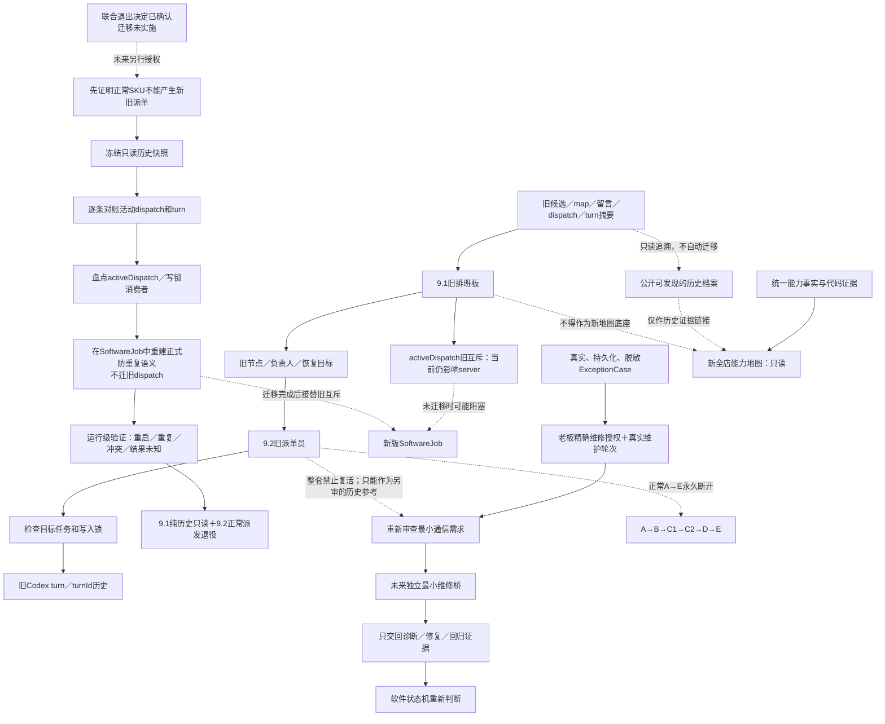
```mermaid
flowchart TD
    OldState["旧候选／map／留言／dispatch／turn摘要"] --> Board["9.1旧排班板"]
    Board --> Route["旧节点／负责人／恢复目标"]
    Board --> LegacyGuard["activeDispatch旧互斥：当前仍影响server"]
    Route --> Dispatcher["9.2旧派单员"]
    Dispatcher --> WriterCheck["检查目标任务和写入锁"]
    WriterCheck --> OldTurn["旧Codex turn／turnId历史"]

    Decision["联合退出决定已确认<br/>迁移未实施"] -. "未来另行授权" .-> StopWrites["先证明正常SKU不能产生新旧派单"]
    StopWrites --> Snapshot["冻结只读历史快照"]
    Snapshot --> Reconcile["逐条对账活动dispatch和turn"]
    Reconcile --> Consumers["盘点activeDispatch／写锁消费者"]
    Consumers --> FormalJob["在SoftwareJob中重建正式防重复语义<br/>不迁旧dispatch"]
    FormalJob --> RuntimeVerify["运行级验证：重启／重复／冲突／结果未知"]
    RuntimeVerify --> Retire["9.1纯历史只读＋9.2正常派发退役"]

    LegacyGuard -. "未迁移时可能阻塞" .-> NewJob["新版SoftwareJob"]
    FormalJob -. "迁移完成后接替旧互斥" .-> NewJob
    OldState -. "只读追溯，不自动迁移" .-> Archive["公开可发现的历史档案"]

    Exception["真实、持久化、脱敏ExceptionCase"] --> RepairAuth["老板精确维修授权＋真实维护轮次"]
    RepairAuth --> ReReview["重新审查最小通信需求"]
    ReReview --> NewBridge["未来独立最小维修桥"]
    Dispatcher -. "整套禁止复活；只能作为另审的历史参考" .-> ReReview
    NewBridge --> Return["只交回诊断／修复／回归证据"]
    Return --> SoftwareState["软件状态机重新判断"]

    Registry["统一能力事实与代码证据"] --> NewMap["新全店能力地图：只读"]
    Archive -. "仅作历史证据链接" .-> NewMap
    Board -. "不得作为新地图底座" .-> NewMap
    Dispatcher -. "正常A→E永久断开" .-> Main["A→B→C1→C2→D→E"]
```

### 全店能力地图显示边界

- 10.2显示为“历史高耦合联合退出组”，不是两个待选主实现；`currentPrimary=null`不得被解释为等待选择其中一个复活。
- 旧排班板到旧派单员的历史关系可以显示实线；它们到正常A→E必须显示永久断开。
- `activeDispatch`当前仍影响server的事实标为风险；防重复迁入SoftwareJob标为“未来待施工”，不得显示完成。
- 新地图只读取统一能力事实和证据，不调用旧地图、留言、恢复或dispatch接口，也不提供派单、恢复或评论按钮。
- 旧历史档案可以通过稳定编号9.1、9.2、10.2被发现，但只能只读追溯。
- 当前4317没有运行级不可派发证明；地图必须显示“决定已定、迁移未实施／运行状态未验证”，不能显示旧系统已经完全关闭。

### 来源、原位置与依赖线索

- 旧排班板：`selection-review-app/lib/workflow-map.mjs`、`selection-review-app/data/workflow-map.json`
- 旧派单员：`selection-review-app/lib/codex-dispatcher.mjs`
- 当前兼容调用、投递与恢复路由：`selection-review-app/server.mjs`
- 正常路径Codex门禁：`selection-review-app/lib/codex-independence.mjs`、`selection-review-app/lib/software-execution-state.mjs`
- 旧地图前端兼容名：`selection-review-app/src/components/WorkflowMap.jsx`；当前只重导出新地图组件
- 旧候选和派发显示：`selection-review-app/src/components/CandidateRail.jsx`、`selection-review-app/src/components/UserInspector.jsx`
- 能力登记：`selection-review-app/lib/capability-registry.mjs`中的稳定编号10.2；当前`currentPrimary=null`
- 调查依据：`14项待归位能力与8组疑似重复能力调查底稿-2026-08-28.md`的10.2章节；本轮没有修改调查底稿
- 相关测试文件：workflow-map、codex-dispatcher、Codex Independence及SoftwareJob相关测试；本轮没有运行

### 本轮变更声明

本轮只在现有决定记录末尾追加稳定编号10.2的老板决定。没有覆盖或改写9.1—9.14或10.1，没有修改调查底稿；没有修改投递开关、`activeDispatch`、写锁、dispatch／turn历史、两套源码、server、UI、能力注册表、测试、数据或运行副本，没有创建SoftwareJob、ExceptionCase或Codex任务，没有迁移互斥、启动服务、部署或访问外部平台。

## 2026-08-28｜10.3 旧C1、FireTrain与特殊SKU路径比较组

> 追加说明：本章节是稳定编号`10.3`的老板最终决定，只追加在9.1—9.14、10.1和10.2之后，不回头改写既有决定、调查底稿或能力注册表。它是对9.4“FireTrain与通用C1→C2函数必须拆开”以及9.12“特殊SKU脚本禁止运行”的组合关系复核，不新增产品方向。

### 决定状态

- 组别身份：跨C1、C2、历史兼容和禁止运行数据工具的比较组
- 四个事实身份：FireTrain专用历史实现、通用C1→C2领域函数候选、未来唯一C1应用服务中的冻结证据消费组件候选、DD-H1历史一次性数据修正单
- 最终目标：只保留一个正式C1入口、一个持久作业／状态推进责任点、一个C1→C2交接责任点
- 当前真实状态：新版C1有server代码接缝，通用函数仅部分可达，FireTrain专用路由隔离，DD-H1脚本无正式调用；没有普通SKU完整C1→C2真实运行回执
- 当前选主状态：`currentPrimary=null`；未来唯一C1应用服务由哪个文件承载尚未指定，通用领域函数只能在逐函数验收后被这条唯一路线最小复用
- 当前授权：**老板决定已确认、实施未授权。**本记录不授权修改、合并、删除、启用路由、运行脚本、接入持久队列或创建C2交接。

### 老板确认的完整决定

1. 四个成员不是四套等价C1／C2系统：`real-c1-preparation.mjs`是FireTrain特定商品的旧专用准备；`lifecycle-c-stage.mjs`是通用C1→C2领域函数集合；`c1-fact-keyword-runtime.mjs`是新版事实／关键词证据驱动的正式运行候选；`accept-dd-h1-wb-test-risk.mjs`是单SKU一次性历史数据补丁。

2. FireTrain专用实现继续归入历史隔离和退役路线，只保留来源与历史审计；不得接普通SKU，不得成为新版C1入口。当前两类FireTrain专用POST路由返回410，历史适配开关也固定关闭；这一隔离事实必须如实保留。

3. DD-H1脚本按9.12进入“禁止运行的历史数据变更档案”，不属于C1／C2能力；不得重跑、接UI或从它写入的旧WB测试风险决定中推导当前规则。

4. `c1-fact-keyword-runtime.mjs`作为未来唯一正式C1运行入口候选：只消费冻结且可追溯的A／B事实、正式Schema和关键词证据；证据不足时明确阻塞。这里的“入口候选”是对唯一新版证据驱动路线的产品决定，不表示要把队列、状态推进、AI和C2全塞进这个窄函数模块；未来唯一应用服务应负责消费持久C1 handoff、编排正式SoftwareJob、调用该证据组件、保存C1结果并原子交接C2，当前尚未指定由哪个文件承载。当前持久队列、完整生产续跑和普通SKU真实C1→C2回执仍缺失，不能称C1已完成。

5. `lifecycle-c-stage.mjs`不得成为第二条手工兼容主线。其`completeC1AndStartC2`、`completeC2AndCreateConfirmationCard`等纯领域函数先按最新版老板思路逐字段验收；前者中被证明正确的C1完成保护和C1→C2转换，只能最小复用到唯一C1应用服务或唯一交接责任点；后者属于C2最终素材与主人确认卡职责，必须在C2应用服务边界单独比较。不正确、重复或过时的退役；不得由窄职责的`c1-fact-keyword-runtime.mjs`直接依赖或吸收整套C1／C2编排。

6. 正式目标只有一个C1入口、一个持久作业／状态推进责任点和一个C1→C2交接责任点；禁止FireTrain专用路线、旧手工兼容路由和新版runtime形成三条平行路线。

7. 后续比较必须覆盖输入的candidate／SKU／revision身份、A／B冻结不可变性、Schema／关键词证据、缺口语义、持久化、幂等／重复续跑、C2启动和主人确认卡；不能因为函数名里有“通用”或某个测试通过，就直接并入正式路线。

8. 当前四层事实必须分开：四个文件都存在；新版runtime和部分通用函数有server调用；FireTrain专用路由已隔离；DD-H1脚本未发现正式调用方。但本轮没有普通SKU完整C1→C2真实运行回执，不得把“文件存在”、“有调用”或“测试文件存在”写成业务已验证。

9. “全店能力地图”必须分别显示FireTrain历史支路、DD-H1历史脚本、新版C1正式候选和通用领域函数候选复用关系；不得把历史专用代码、一次性脚本或函数存在画成C1／C2闭环。

10. **老板决定已确认、实施未授权。**本轮禁止修改、合并或删除四个成员；禁止开启旧路由、运行DD-H1脚本、接入持久队列、server或UI、创建C2交接；禁止修改能力注册表、测试或数据，禁止访问外部平台。

### 大白话说明：特定小火车说明书＋通用齿轮＋新版正式装配线＋DD-H1旧修正单

`real-c1-preparation.mjs`像一本专门为“豪华小火车”写的旧装配说明书。它只认`CX-20260803-010`和那套旧数据形状，能重建这一件历史商品的C1／C2准备材料，但不能拿给所有商品当通用流程。

`lifecycle-c-stage.mjs`像从旧机器里拆出的两组通用齿轮：一组验证C1事实、生成SEO草稿并建立等待最终素材的C2容器；另一组锁定主人确认的最终素材并形成生产前确认卡。齿轮看起来通用，但它们自己不取Schema、关键词或素材，也不自己持久化；其中第一组目前只在默认关闭的旧手工C1路由中有条件调用，第二组未找到server或其他正式服务调用。

`c1-fact-keyword-runtime.mjs`像未来唯一正式装配线中的来料检查工位，而不是整条装配线。它检查candidate、SKU包、revision、冻结关键词来源、SEO规则、有效期和提供器回执，按字段名拒绝明显的秘密形状并拒绝现场兜底，返回准备结果、明确缺口和本次运行回执。这不是内容扫描或安全证明，仍需严格DTO和上游脱敏。它自己不落库、不调AI草稿、不启动C2；这些责任目前分散在server和其他用例里。server已有内部helper和runner调用它处理新版C1证据并继续编排，但源码同时明确留下“付费关键词作业必须由后续通用SoftwareJobStore接缝执行”的断点；默认关闭的是server中调用真实Seerfar的软作业POST路由，不是runtime函数本身，UI也只有状态卡而没有启动动作。因此老板把它定为“未来唯一正式C1运行入口候选”，是对未来只保留这条证据驱动路线的决定；按当前代码事实，这个文件还只是唯一应用服务未来调用的冻结证据消费组件，不是已验收的完整入口。

`accept-dd-h1-wb-test-risk.mjs`像一张已作废的旧修正单。它只认DD-H1、旧revision 6和旧WB未验证状态，会备份后直接改写候选JSON、写入旧handoff和风险接受记录，再把revision改成7。它不会生成正式C1事实、C2素材或新版交接，也不能重跑。

### 四个成员的真实输入、处理、输出和连线

| 成员 | 输入 | 内部处理 | 输出 | 当前调用／隔离 | 不能冒充 |
|---|---|---|---|---|---|
| `real-c1-preparation.mjs` | 强绑`CX-20260803-010`、旧候选、主人事实及历史数据形状 | 重建旧C1事实、SEO和C2／确认卡准备，显式拒绝其他候选 | 这一件历史商品的旧C1／C2材料 | server仍导入，但新旧专用POST路由均被410隔离；单元测试存在 | 普通SKU入口、真实D／E或通用C1完成 |
| `lifecycle-c-stage.mjs` | 规范OpportunityPackage、SkuLifecyclePackage、Schema、竞品文字、关键词以及最终素材和主人决定 | 纯领域地保护A／B输入，但第一个函数在缺C1ProductPlan时会自行创建，再完成C1并建立C2空素材域；第二个确认finalUploads并生成确认卡 | 内存中的C1→C2结果或C2确认卡结果，明确零平台写入且不创建生产授权 | `completeC1AndStartC2`只被默认关闭的旧手工路由有条件调用；`completeC2AndCreateConfirmationCard`未找到正式调用 | 持久作业、证据采集、状态机推进或已接通C1／C2；“缺plan就在C1侧补建”不符合当前B→C1唯一原子交接边界，不能原样复用 |
| `c1-fact-keyword-runtime.mjs` | candidateId、C1阶段SKU包、当前revision、冻结关键词来源、SEO规则、有效期和提供器回执 | 检查身份和秘密边界，在单次函数调用内只读每类已冻结回执一次，组合C1事实／关键词准备结果并生成指纹回执 | 证据阶段结果或明确阻塞，再加本次运行回执；是server负责后续原子持久，runtime自己零外部请求、零AI草稿、零C2启动 | server新C1证据接缝和关键词软件runner可调用；默认关闭的是真实Seerfar软件作业POST路由，UI只显示状态；有单元及静态源码接缝测试 | 单次调用计数不是持久幂等、lease、重启续跑或重复扣费防护；它也不是完整SoftwareJob队列、唯一C1应用服务或已完成C1→C2 |
| `accept-dd-h1-wb-test-risk.mjs` | 旧`data/candidates.json`、DD-H1、revision 6、旧WB未验证状态 | fail-fast核对固定状态，创建备份，直接写风险接受、旧handoff和历史，原子改名替换JSON | 被改为revision 7的旧DD-H1记录和备份文件 | 技术形态是顶层一次性脚本，但按9.12当前禁止任何方式运行或动态导入；当前仓库未发现package、server、UI或调度器调用 | 当前WB规则、新版C1／C2能力或可重跑迁移 |

### 四层证据不得混在一起

| 证据层 | 当前可以确认的事 | 当前不能确认的事 |
|---|---|---|
| 文件存在 | 四个成员源文件都在主目录 | 不能因此说任何一套已进主线 |
| 存在调用 | server导入FireTrain和通用C1函数；新版runtime被server与runner调用 | FireTrain调用代码还在不等于路由可达；默认关闭的手工入口不是正式调用 |
| 运行副本 | 本章没有读取或启动4317，只能引用已冻结的能力事实中“未证明当前运行副本具备新能力”的边界 | 不能说主源码的路由、函数或测试已进入4317 |
| 真实业务验证 | 相关测试文件存在，调查底稿保留了它当时的验证记录；本轮没有重跑 | 没有普通SKU从冻结A／B证据经持久关键词作业、C1、C2到主人确认卡的当前真实回执；也不能把静态server源码断言测试叫作真实集成验收 |

当前能力注册表对`lifecycle-c-stage.mjs`的输出还写着“C1／C2／授权兼容结果”，这是一处已识别的事实层措辞漂移：源码明确要求`productionAuthorization === null`且`productionRecord === null`，它不会创建生产授权。本轮只在决定记录里标明这个偏差，不修改注册表；以后须在单独授权下纠正事实定义。

runtime中的`inputFingerprint`和`receiptFingerprint`只是确定性摘要，用于标识本次输入／回执并比较意外漂移；不是鉴权、数字签名、恶意防篡改或安全完整性保证。提供器“只读一次”也只是本次函数内的临时计数，新调用或进程重启会重建；不得把这两个机制当成中央持久幂等、Worker lease、重试门或重复扣费防护。

### 当前主源码实际接缝和断点

当前新路线并不是`c1-fact-keyword-runtime.mjs → lifecycle-c-stage.mjs → C2`。仓库中没有这条调用关系。实际的源码关系是：B通过后服务端原子创建`C1ProductPlan(inputs_ready)`和唯一C1 handoff；server的C1接续先保存确定性planning evidence，然后在“付费Seerfar作业还没接通通用SoftwareJobStore”处停下。

仓库另有一条默认关闭、没有UI启动按钮的候选内部路线：它在真实外部请求前会先把一次性局部作业意图写入候选记录，运行一次Seerfar，再由`c1-fact-keyword-runtime.mjs`消费冻结回执，server原子保存C1证据，然后直接调AI网关生成`draft_only`草稿，成功后由server调用另一个C2容器函数。服务重启时，未收口的这类局部作业会被标为`unknown_outcome`并禁止自动重发。这条路径不使用`lifecycle-c-stage.mjs`，真正缺失的是通用`software-job-v1`信封、Worker lease、中央作业队列和重启后续跑同一作业的能力；候选内局部意图不得被写成这些边界已经完成。

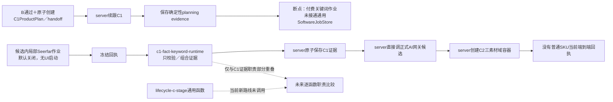
```mermaid
flowchart LR
    B["B通过＋原子创建C1ProductPlan／handoff"] --> Continue["server续跟C1"]
    Continue --> Planning["保存确定性planning evidence"]
    Planning --> Gap["断点：付费关键词作业<br/>未接通通用SoftwareJobStore"]

    LocalJob["候选内局部Seerfar作业<br/>默认关闭，无UI启动"] --> FrozenReceipt["冻结回执"]
    FrozenReceipt --> EvidenceRuntime["c1-fact-keyword-runtime<br/>只校验／组合证据"]
    EvidenceRuntime --> AtomicEvidence["server原子保存C1证据"]
    AtomicEvidence --> DirectAI["server直接调正式AI网关候选"]
    DirectAI --> ServerC2["server创建C2三素材域容器"]

    Generic["lifecycle-c-stage通用函数"] -. "当前新路线未调用" .-> CompareNow["未来逐函数职责比较"]
    EvidenceRuntime -. "仅与C1证据职责部分重叠" .-> CompareNow
    ServerC2 --> NoReceipt["没有普通SKU当前端到端回执"]
```

### 未来唯一路线的验收边界

未来另行授权后，不是简单地把`lifecycle-c-stage.mjs`整个接到新runtime，而是按导出函数和C1、C1→C2交接、C2各自责任逐项比较：

1. 唯一C1应用服务是否只消费正式B原子提交生成的持久`c1Handoff`和已有`C1ProductPlan(inputs_ready)`，并绑定同candidate、SKU、revision、handoffId、平台和店铺分支；C1侧不得在plan缺失时悄悄补建。
2. A／B冻结事实、主人确认供应SKU和ProfitModel是否只读且不被重建。
3. Schema、关键词、AI草稿、证据有效期和缺口分类是否符合当前正式合同。
4. 作业意图、尝试次数、费用调用、幂等、revision漂移、重启续跑、技术失败和结果不明是否持久化。
5. C1完成时是否由唯一责任点原子创建一次C2交接，而不是只返回内存对象。
6. C2是否严格保持`collected`、`aiDrafts`、`finalUploads`三域隔离，并只使用主人确认的最终素材形成一张确认卡。
7. Codex完全关闭后正常SKU是否仍可完成；任何正常路径依赖Codex必须明确失败。

只有上述验收完成，才能把被证明正确的领域齿轮分别最小复用到所属的唯一C1应用服务、C1→C2交接或C2最终素材／主人确认卡边界；其余只保留历史证据或退役。

### 大白话关系图

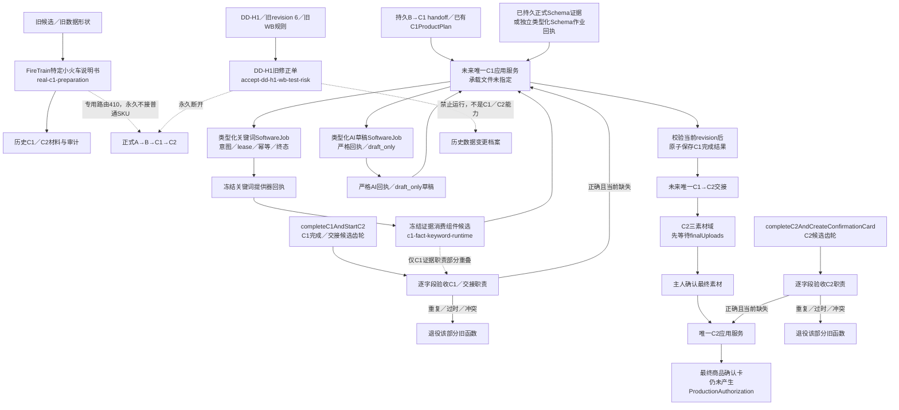
```mermaid
flowchart TD
    OldFire["旧候选／旧数据形状"] --> Fire["FireTrain特定小火车说明书<br/>real-c1-preparation"]
    Fire --> FireHistory["历史C1／C2材料与审计"]
    Fire -. "专用路由410，永久不接普通SKU" .-> Main["正式A→B→C1→C2"]

    Handoff["持久B→C1 handoff／已有C1ProductPlan"] --> App["未来唯一C1应用服务<br/>承载文件未指定"]
    Schema["已持久正式Schema证据<br/>或独立类型化Schema作业回执"] --> App
    App --> KeywordJob["类型化关键词SoftwareJob<br/>意图／lease／幂等／终态"]
    KeywordJob --> FrozenReceipt["冻结关键词提供器回执"]
    FrozenReceipt --> Runtime["冻结证据消费组件候选<br/>c1-fact-keyword-runtime"]
    Runtime --> App
    App --> AiJob["类型化AI草稿SoftwareJob<br/>严格回执／draft_only"]
    AiJob --> AiReceipt["严格AI回执／draft_only草稿"]
    AiReceipt --> App
    App --> AtomicC1["校验当前revision后<br/>原子保存C1完成结果"]

    GenericC1["completeC1AndStartC2<br/>C1完成／交接候选齿轮"] --> CompareC1["逐字段验收C1／交接职责"]
    Runtime -. "仅C1证据职责部分重叠" .-> CompareC1
    CompareC1 -->|"正确且当前缺失"| App
    CompareC1 -->|"重复／过时／冲突"| RetireC1["退役该部分旧函数"]
    AtomicC1 --> OneHandoff["未来唯一C1→C2交接"]
    OneHandoff --> C2Domains["C2三素材域<br/>先等待finalUploads"]
    C2Domains --> OwnerFinal["主人确认最终素材"]
    OwnerFinal --> C2App["唯一C2应用服务"]
    GenericC2["completeC2AndCreateConfirmationCard<br/>C2候选齿轮"] --> CompareC2["逐字段验收C2职责"]
    CompareC2 -->|"正确且当前缺失"| C2App
    CompareC2 -->|"重复／过时／冲突"| RetireC2["退役该部分旧函数"]
    C2App --> OwnerCard["最终商品确认卡<br/>仍未产生ProductionAuthorization"]

    DDInput["DD-H1／旧revision 6／旧WB规则"] --> Patch["DD-H1旧修正单<br/>accept-dd-h1-wb-test-risk"]
    Patch -. "禁止运行，不是C1／C2能力" .-> PatchArchive["历史数据变更档案"]
    Patch -. "永久断开" .-> Main
```

### 全店能力地图显示边界

- FireTrain必须显示为“历史专用／路由已隔离／退役路线”，与普通SKU正式C1用断开线连接。
- DD-H1必须显示为“历史数据修正工具／禁止运行”，不得显示为风险确认或C1／C2业务能力。
- 通用函数必须显示为“候选复用齿轮／未并入”，不得画成第二条C1主线。
- 冻结证据消费组件必须显示实际server／runner调用、测试文件、通用持久SoftwareJob断点和未取得普通SKU真实回执的事实；另一个“未来唯一C1应用服务”责任只能显示为待施工，不得因`c1-fact-keyword-runtime.mjs`名字接近正式就涂成已验证。
- 四个节点之间只能画历史、候选复用、永久断开或待交叉验收关系，不得画成已接通的三条平行生产线。

### 来源、原位置与依赖线索

- FireTrain专用实现：`selection-review-app/lib/real-c1-preparation.mjs`；固定范围检查及三个导出位于该文件第59、273、388、457和539行附近
- 通用C阶段函数：`selection-review-app/lib/lifecycle-c-stage.mjs`的`completeC1AndStartC2`与`completeC2AndCreateConfirmationCard`
- 新版C1运行候选：`selection-review-app/lib/c1-fact-keyword-runtime.mjs`的`prepareC1FactKeywordRuntime`；其调用还见`selection-review-app/lib/keyword-evidence-software-runner.mjs`
- 专用路由410、旧手工C1开关和新C1软件接缝：`selection-review-app/server.mjs`第219—220、2459—2905、4164—4255行附近
- DD-H1一次性数据脚本：`selection-review-app/scripts/accept-dd-h1-wb-test-risk.mjs`
- 相关测试文件：`selection-review-app/tests/real-c1-preparation.test.mjs`、`selection-review-app/tests/real-13c-final-assets.test.mjs`、`selection-review-app/tests/lifecycle-c-stage-generic-api.test.mjs`、`selection-review-app/tests/c1-fact-keyword-runtime.test.mjs`、`selection-review-app/tests/c1-fact-keyword-server-integration.test.mjs`、`selection-review-app/tests/keyword-evidence-software-runner.test.mjs`、`selection-review-app/tests/seerfar-software-api-guard.test.mjs`、`selection-review-app/tests/seerfar-software-server-integration.test.mjs`、`selection-review-app/tests/phase4-c1-software-boundary.test.mjs`、`selection-review-app/tests/keyword-software-runtime-view.test.mjs`；其中有单元测试、静态源码断言和会启动临时本地API的进程级测试，都不是真实业务验收；本轮没有运行
- 组别登记：`selection-review-app/lib/capability-registry.mjs`中稳定编号`10.3`；本轮没有修改注册表
- 调查依据：`14项待归位能力与8组疑似重复能力调查底稿-2026-08-28.md`的10.3章节；本轮没有修改调查底稿

### 本轮变更声明

本轮只在现有决定记录末尾追加稳定编号10.3的老板决定。没有覆盖或改写前文，没有修改调查底稿；没有修改、合并或删除四个成员，没有开启旧路由、运行脚本、接队列、改server／UI／能力注册表／测试／数据，没有创建C2交接、启动服务、部署或访问外部平台。

## 2026-08-28｜10.4 模拟验收与真实生命周期比较组

> 追加说明：本章节是稳定编号`10.4`的老板最终决定，只追加在10.3之后，不回头改写9.1—9.14、10.1—10.3、调查底稿或能力注册表。本章确认的是“模拟沙盘与真实业务必须永久隔离”的产品边界，不表示本轮已经补上隔离硬门、运行模拟、验证真实候选或修改任何实现。

### 决定状态

- 比较组身份：模拟／培训工具与正式业务候选流的证据等级复核，不是两个正式主线之间的二选一
- 模拟成员：`phase-2a-simulation.mjs`，使用固定基础资料和可编辑的模拟主人输入，在内存中演示局部A→B→C1
- 真实成员：`real-a-b-c1-flow.mjs`，绑定当前candidate、revision、主人确认和冻结证据的正式A→B→C1入口候选
- 当前接线事实：模拟UI／API与真实A确认入口分别存在；两者共用部分纯领域函数，但没有正式业务数据线
- 当前验证事实：相关测试文件存在，本轮没有运行；测试主要使用固定fixture、注入reader和临时本地数据，不能证明当前4317或真实商品A→C1闭环
- 当前重要缺口：模拟路由当前没有共享写入，但正式入口尚未形成统一的模拟来源fail-fast硬门，也没有“模拟产物注入正式入口必须零写入、零作业、零外部请求”的完整负向测试
- 当前授权：**老板决定已确认、实施未授权。**本记录不授权修改或合并入口、运行模拟或真实候选、写共享数据、启动服务、部署或访问平台。

### 老板确认的完整决定

1. `phase-2a-simulation.mjs`与`real-a-b-c1-flow.mjs`不是两套应当二选一的正式主线。前者是使用固定假数据、在内存中运行的模拟／培训／回归沙盘；后者是绑定真实candidate、当前revision、主人实际确认和冻结证据的正式业务候选流。

2. 两者可以复用或对照纯领域规则和缺口语义，但入口、身份、时间、`evidenceRef`、URL、持久化位置和“完成”含义必须永久隔离。禁止把两个入口合并，禁止共用正式业务记录，也禁止画出“模拟结果自动进入真实生命周期”的线路。

3. 模拟能力按照9.3继续归入“模拟、培训与验收工具区”并长期保留。它只用于讲解、培训和规则回归，不得触碰共享候选、正式生命周期、外部平台、付费服务或真实软件作业。

4. 模拟页面和API必须醒目标明“模拟／假数据／不代表业务完成”。任何带有`isSimulation`、模拟候选或SKU身份、`mock_only`采集模式、`simulation:*`证据、测试fixture来源或等价模拟标记的输入，一旦试图进入真实生命周期，正式用例必须在任何持久化、建作业或外部请求以前fail-fast。当前模拟界面已有“模拟SKU／模拟数据／不访问平台不写店”提示，模拟路由也未调用共享数据写入；但上述统一污染硬门和完整负向测试**当前尚未实现／尚未证明**，本决定不能把它写成已完成。

5. `real-a-b-c1-flow.mjs`保持唯一真实A→B→C1入口候选。它只能消费当前真实候选、当前revision、主人实际供应确认和冻结且可追溯的正式证据，并形成正式`SkuLifecyclePackage`、`ProfitModel`和唯一C1 handoff。函数本身是领域组合，真正持久化由server正式A确认用例负责；二者不能混为一个已经验收的闭环。

6. 文件、server路由和UI存在不等于真实链路已闭环。本轮没有取得当前运行副本中真实候选从A到C1的独立回执；当前费用证据、外部证据、条件测算与正式利润的边界，以及原子持久化仍须按照最新版老板规则后续验收。尤其现有路径对估算佣金与正式B通过的边界仍需交叉核对，因此全店能力地图不得把真实A、B、C1显示为已经完成。

7. 模拟测试通过只能证明沙盘规则、固定fixture和隔离合同在相应测试范围内成立，只能改变9.3模拟能力自身的验证状态。它不得替代真实证据采集、当前费用、主人确认、平台回执或正式业务验收，也绝不能因此把真实A、B、C1节点或连线涂成已验证蓝色。

8. 老板规则或正式领域规则变化时，模拟和真实流都必须更新共同的纯领域规则测试；模拟fixture仍必须保持明确的假数据和隔离身份，不能为了“更真实”而复制生产候选、真实秘密、Cookie、Token或其他安全资料。现有模拟fixture中出现外观像真实店铺名或商品URL的字符串，只是输入字面值，不能解释为平台证据或外部执行。

9. “全店能力地图”必须把模拟链画在工程／培训工具区，用虚线表示它与真实流之间只有“共同规则／回归参考”关系；两者的证据、状态和完成线路完全断开。真实A／B／C1另行展示自己的代码调用、测试层级、当前运行副本证据和真实业务回执，缺哪一层就明确写缺失。

10. **老板决定已确认、实施未授权。**本轮禁止修改、合并或运行两套入口，禁止补硬门、改server／UI／能力注册表／测试，禁止写共享候选或生命周期数据、创建SoftwareJob或dispatch、调用付费服务、访问任何平台，以及部署或替换运行副本。

### 大白话说明：驾驶模拟器与真实上路

9.3像培训室里的驾驶模拟器。它可以用固定路线、固定天气和假车辆，让人练习“什么时候踩刹车、什么时候看仪表、缺资料时停在哪里”。它的价值是真实规则容易讲、容易练、容易回归，但屏幕上跑完一圈，不等于任何真实车辆已经上路。

`real-a-b-c1-flow.mjs`则像真实车辆的驾驶规则候选。它需要认准当前商品、当前revision、主人实际确认的供应SKU，以及冻结的市场、费用和汇率证据，才可能形成正式利润和唯一C1交接。它在主源码中有调用和测试，也不等于今天的真实商品已经跑完；仍要分别取得当前规则验证、当前运行副本回执和真实业务证据。

两边可以共用同一套“交通规则”，但绝不能共用车牌、行驶证和里程表。模拟数据如果被人复制进真实入口，不能只靠页面提示或调用方自觉拦截；正式用例以后必须在写入以前明确拒绝。当前模拟路由自身的隔离已有源码和测试文件证据，但面向正式入口的统一硬门尚缺，所以地图只能显示“模拟沙盘当前路由隔离／真实污染门待施工”，不能显示永久隔离已经全部完成。

### 两套能力当前分别做到哪里

| 成员 | 输入→处理→输出 | 当前调用／UI | 当前不能据此声称 |
|---|---|---|---|
| `phase-2a-simulation.mjs` | 固定模拟商品、平台、店铺、费用、汇率、Schema和时间，加上可编辑的模拟供应输入→在内存调用A判断、供应推荐、确认、SKU包、B利润和C1计划等领域函数→模拟A／B／C1结果 | 独立模拟UI和GET／POST模拟API；当前路由没有`mutateData` | 不证明4317当前可用，不证明真实商品、真实费用、真实利润或真实C1完成；返回“零写入”计数不能单独代替全部隔离防线 |
| `real-a-b-c1-flow.mjs` | 当前候选、revision、主人A确认卡和冻结证据→校验身份与缺口，形成SKU包和正式利润；B通过才创建C1计划与handoff→生命周期候选结果或明确阻塞 | `real-a-b-evidence-orchestration.mjs`和server正式A确认路由调用；评审台显示派生状态 | 函数本身不持久化、不联网；测试多用fixture／注入证据；没有当前4317真实候选独立回执，不能称A→C1闭环 |

### 当前已经证明与尚未证明的隔离

#### 当前源码和既有测试文件能够支持的事实

- 模拟结果带`isSimulation`、`SIM-*`身份、`mock_only`和`simulation:*`等明显标记，模拟模块没有文件系统或平台客户端调用。
- 模拟server路由直接返回模拟结果，没有调用`mutateData`；模拟UI独立显示并提示不访问平台、不写店。
- 现有API守卫测试使用临时数据副本和临时本地服务，设计上检查调用前后测试数据字节未变，并断言零共享写入、零dispatch和零平台写入；本轮未运行，不能称当前通过。
- 真实入口按URL中的candidate ID读取共享候选，先后复核revision，并由server在一次本地数据事务中保存证据、生命周期和唯一C1交接；这仍是本机JSON接缝，不是中央多人运行证明。

#### 当前没有完成或没有证明的硬门

- 正式A入口尚未统一拒绝`mock_only` SalesSnapshot、`simulation:*`／`fixture:*`证据、`isolated_test`来源和模拟身份。
- 两套代码只共用部分领域函数；确认校验、对象装配、C1 handoff和总体编排仍各有实现，当前甚至存在模拟`queued`与真实`created`等字面漂移，不能说已经完全共用一套规则。
- 模拟结果的Opportunity、SKU、ProfitModel和C1对象与正式对象高度同形，没有一套贯穿到底、不可丢失的统一执行模式隔离；通用Schema可能接纳被人工复制后的部分对象。
- 当前没有覆盖每一类模拟身份注入正式API时“零业务写入、零SoftwareJob、零dispatch、零外部请求”的负向测试。
- fixture中的URL字符串不触发联网，但以后仍须防止秘密查询参数或fragment被保存和回显；不能把简单字符串检查宣传为凭据安全证明。

### 大白话关系图

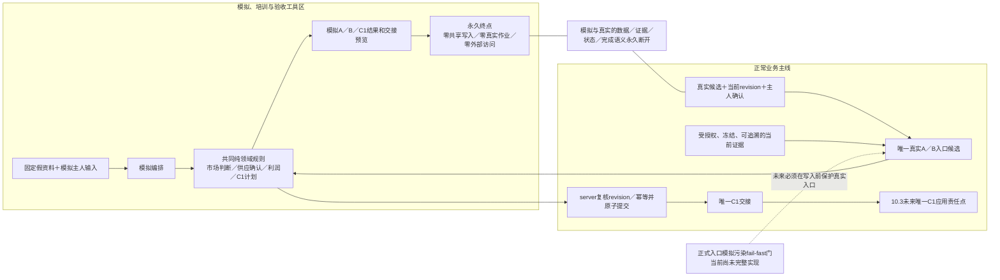
```mermaid
flowchart LR
    Core["共同纯领域规则<br/>市场判断／供应确认／利润／C1计划"]

    subgraph Simulation["模拟、培训与验收工具区"]
        Fixture["固定假资料＋模拟主人输入"] --> SimAdapter["模拟编排"]
        SimAdapter --> Core
        Core --> Preview["模拟A／B／C1结果和交接预览"]
        Preview --> SimStop["永久终点<br/>零共享写入／零真实作业／零外部访问"]
    end

    subgraph Production["正常业务主线"]
        Card["真实候选＋当前revision＋主人确认"] --> RealEntry["唯一真实A／B入口候选"]
        Evidence["受授权、冻结、可追溯的当前证据"] --> RealEntry
        RealEntry --> Core
        Core --> Commit["server复核revision／幂等并原子提交"]
        Commit --> Handoff["唯一C1交接"]
        Handoff --> C1["10.3未来唯一C1应用责任点"]
    end

    Guard["正式入口模拟污染fail-fast门<br/>当前尚未完整实现"] -. "未来必须在写入前保护真实入口" .-> RealEntry
    Separation["模拟与真实的数据／证据／状态／完成语义永久断开"]
    SimStop --- Separation
    Separation --- Card
```

### 全店能力地图显示边界

- 10.4不是“两个实现等待选主”的普通重复组；模拟按照9.3长期保留在工具区，真实流保持唯一正式入口候选。
- 模拟和真实流只能分别指向共同纯领域规则，不得画`模拟结果→真实主线`的数据或状态线。
- 模拟节点健康只根据模拟源码、隔离测试和模拟运行证据判断；即使全部通过，也不得提升真实A、B、C1的颜色。
- 真实流必须分别显示当前主源码调用、测试类型、运行副本状态和真实业务回执；当前没有真实独立回执时，不能标“已闭环”。
- 模拟污染fail-fast门显示“老板规则已确认／实现和负向测试待施工”，不得因为模拟页面有提示就写成硬隔离已经完成。

### 来源、原位置与依赖线索

- 模拟领域组合：`selection-review-app/lib/phase-2a-simulation.mjs`
- 模拟API：`selection-review-app/server.mjs`中的`/api/simulations/phase-2a` GET／POST路由
- 模拟UI：`selection-review-app/src/components/Phase2ASimulation.jsx`
- 真实领域组合：`selection-review-app/lib/real-a-b-c1-flow.mjs`
- 真实证据编排与server入口：`selection-review-app/lib/real-a-b-evidence-orchestration.mjs`、`selection-review-app/server.mjs`中的正式A确认路由
- 模拟测试：`selection-review-app/tests/phase-2a-simulation.test.mjs`、`selection-review-app/tests/phase-2a-api-guards.test.mjs`
- 真实流测试：`selection-review-app/tests/real-a-b-c1-flow.test.mjs`、`selection-review-app/tests/real-a-b-c1-api.test.mjs`、`selection-review-app/tests/real-a-b-evidence-orchestration.test.mjs`
- 组别登记：`selection-review-app/lib/capability-registry.mjs`中的稳定编号10.4；本轮没有修改注册表
- 调查依据：`14项待归位能力与8组疑似重复能力调查底稿-2026-08-28.md`的10.4章节；本轮没有修改调查底稿

### 本轮变更声明

本轮只在现有决定记录末尾追加稳定编号10.4的老板决定。没有覆盖或改写9.1—9.14、10.1—10.3，没有修改调查底稿；没有修改、合并或运行模拟与真实入口，没有补隔离硬门或测试，没有改server、UI、能力注册表、共享候选、生命周期数据或运行副本，没有创建任务、访问平台、启动服务或部署。

## 2026-08-28｜10.5 手工回读与正式独立回读比较组

> 追加说明：本章节是稳定编号`10.5`的老板最终决定，只追加在10.4之后，不改写前文、调查底稿或能力注册表。本章只把四类“看上去都像上架后结果”的能力按证据来源拆开，不表示本轮已经关闭旧入口、创建正式provider、运行测试或读取平台。

### 决定状态

- 所属模块：E为主，另含历史上架／回读记录支路和上架后经营分析候选；不是四套同等可信的E
- 历史支路：`workflow.mjs`的人工上架记录和调用方回读校验，只能证明当时收到并保存了这些输入
- 经营观察：`post-launch-observation.mjs`只按访客、加购、订单和时间做阈值判断，不是E
- E比较合同：`e-stage-readback.mjs`负责身份、字段、结果形状和E记录；它自己不访问平台
- Ozon只读provider候选：`ozon-seller-api-de-adapter.mjs`中有可注入请求器的五端点读取函数，但正式server入口、正式客户端／凭据身份绑定和provider回执持久化未接
- 当前正式E：**未闭环。**server仍接收调用方提交的`verifiedObservation`，不能据此声称平台由软件独立读取
- 当前授权：**老板决定已确认、实施未授权。**本章不授权关闭入口、创建provider、读取凭据、调用平台或修改任何实现与数据。

### 老板确认的完整决定

1. 四个成员不是同一可信度的E。`workflow.mjs`中的人工上架／调用方回读归入历史记录；`post-launch-observation.mjs`归入上架后经营分析候选；`e-stage-readback.mjs`是E领域比较合同；`ozon-seller-api-de-adapter.mjs`中的相关读取能力是正式Ozon只读provider候选。

2. 历史人工记录只能证明“当时有人这样填写或某个调用方这样提交”。它们按9.9只读保留，未来新写入口退役；人工或调用方在输入里写上`seller_api`、`seller_portal`或`sourceType=real`标签，不能因此升级为平台真实证据。

3. `post-launch-observation.mjs`只根据调用方提供的访客、加购、订单、上架时间和是否稳定在售做阈值判断，不采集平台，也不核对D写入结果，因此不属于E。当前UI会读取候选中的`postLaunchMetrics`并显示判断，这一调用事实如实登记；本项目是否长期承担经营分析继续后置。

4. `e-stage-readback.mjs`保留为严格身份／字段比较和生成`EVerificationRecord`的领域合同，但它自己不会向平台发请求。当前server的E路由直接接收调用方提交的`verifiedObservation`，再调用该合同并保存结果；这不等于正式provider已经接入。当前系统创建路径的实际字段比较范围仍须按最新版规则逐项验收，不能仅凭“合同存在”写成完整严格E已经完成。

5. 正式唯一链路固定为：D先保存真实`ProductionRecord`；新的、按店铺隔离的只读provider使用独立请求重新读取平台；形成绑定店铺、SKU、revision、平台商品和读取作业的可追溯Observation及provider回执；`e-stage-readback`严格比较；最后与当前revision和原D记录一起原子保存`EVerificationRecord`。

6. 正式provider缺失不只是“还没有真实运行证据”。当前还缺正式server／SoftwareJob入口、真正的只读平台客户端与凭据身份绑定、店铺隔离、读取授权绑定，以及provider请求终态和脱敏回执的保存接缝。`createStoreIsolatedOzonSellerApiDEAdapter`工厂、注入`requestJson`的测试、mock响应或closure候选调用都不能冒充正式provider已经接通。

7. “全店能力地图”必须把四种证据等级分开显示：历史人工记录、经营观察、E比较合同、正式只读provider。当前provider缺失、正式E未闭环必须显示灰色／尚未接通；人工历史和经营观察都不得连入正式E实线，也不得把它们的结果画成平台已验证。

8. **老板决定已确认、实施未授权。**本轮禁止修改或关闭旧入口，禁止创建provider或触发器，禁止调用平台、读取或验证凭据，禁止改server／UI／能力注册表／测试／数据，也禁止执行任何D／E动作。

### 大白话说明：四张看似“验收单”，可信度完全不同

这四项都可能在页面或数据里出现“已上架、已读取、已观察、已验证”一类字样，所以最容易混淆。实际可以把它们想成四种不同纸张：

- 旧人工记录像工作人员手写的便条，只能证明有人填过，不证明平台真的如此。
- 经营观察像店铺经营日报，根据别人提供的访客、加购和订单作判断，回答“商品表现怎样”，不回答“D写进去的字段是否真实存在”。
- E比较合同像验收清单，会核对身份和字段并生成正式结论，但它不会自己走到平台仓库取货。
- 正式provider才是验收员的眼睛和脚：它必须用独立只读请求亲自从准确店铺取回准确SKU的当前状态，并留下可追溯回执。

现在项目里前三种能力和第四种的候选函数都存在，但没有形成“正式作业→独立客户端→平台响应→保存provider回执→严格比较”的server主链。尤其server现在让调用方提交`verifiedObservation`；输入对象即使带有`source= seller_api`标签，也不能证明这个server请求真的访问了Ozon。因此正式E必须继续显示未接通。

### 四个成员当前事实对照

| 成员 | 输入→处理→输出 | 当前调用证据 | 证据等级与断点 |
|---|---|---|---|
| `workflow.mjs`人工上架／回读 | 人工或调用方提交商品ID、链接、审核／销售状态和来源标签→校验字段→本地listingRecord | server仍有`mark-listed`与`listing-readback`路由，前端API仍有对应调用 | 只证明输入被校验和保存；不证明软件向平台读取，未来新写入口按9.9退役 |
| `post-launch-observation.mjs` | 调用方提供上架时间、访客、加购、订单、稳定在售→阈值判断→学习／流量不足／有流量无加购／出单等结论 | `UserInspector.jsx`当前会读取候选的`postLaunchMetrics`并显示；纯规则测试文件存在 | 不访问平台、不核对D、不生成E记录；属于经营分析候选 |
| `e-stage-readback.mjs` | `ProductionRecord`或外部商品记录＋调用方传入观察值→身份／字段／价格等校验→`EVerificationRecord` | server E路由调用并把结果写入生命周期；相关领域测试存在 | 自己不访问平台；系统创建路径当前比较范围仍需验收；调用方输入不是独立回读 |
| `ozon-seller-api-de-adapter.mjs`读取半部 | 店铺隔离能力说明＋准确商品身份＋注入`requestJson`→依次读取属性、商品、价格、库存和失败状态→归一化Observation | 完整factory主要由adapter／closure测试调用；主server未创建它，也没有正式provider作业入口 | 是候选代码，不是正式接线；同一组合对象还混有D写入，正式E必须拆成独立只读客户端和责任点 |

### 正式E必须独立保存的证据

- 读取授权记录及其店铺、账号／凭据身份引用、SKU、revision、允许端点、次数与有效期；不保存秘密值。
- 独立E SoftwareJob、请求是否发出、明确失败／平台处理中／`unknown_outcome`／成功等终态。
- 由provider生成而不是调用方自报的店铺、平台商品ID、merchantSku、价格、库存、图片、审核、校验、销售状态及错误。
- provider版本、读取时间、脱敏请求／响应证据引用和原D ProductionRecord绑定。
- E比较结果、字段差异、失败语义和一次原子保存后的resultRevision。

### 大白话关系图

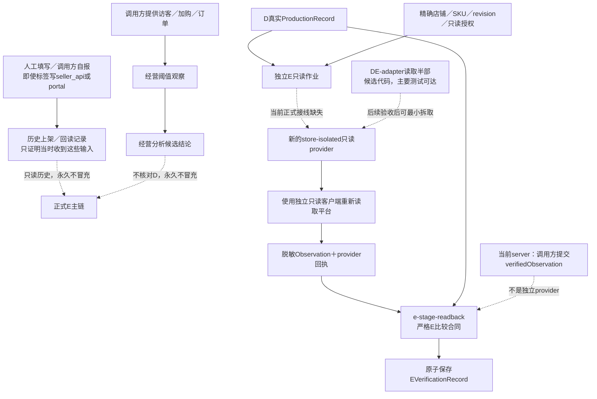
```mermaid
flowchart TD
    Manual["人工填写／调用方自报<br/>即使标签写seller_api或portal"] --> Legacy["历史上架／回读记录<br/>只证明当时收到这些输入"]
    Legacy -. "只读历史，永久不冒充" .-> FormalE["正式E主链"]

    Metrics["调用方提供访客／加购／订单"] --> PostLaunch["经营阈值观察"]
    PostLaunch --> Analysis["经营分析候选结论"]
    Analysis -. "不核对D，永久不冒充" .-> FormalE

    ProductionRecord["D真实ProductionRecord"] --> EJob["独立E只读作业"]
    ReadAuth["精确店铺／SKU／revision／只读授权"] --> EJob
    EJob -. "当前正式接线缺失" .-> Provider["新的store-isolated只读provider"]
    Candidate["DE-adapter读取半部<br/>候选代码，主要测试可达"] -. "后续验收后可最小拆取" .-> Provider
    Provider --> Platform["使用独立只读客户端重新读取平台"]
    Platform --> ProviderReceipt["脱敏Observation＋provider回执"]
    ProviderReceipt --> Compare["e-stage-readback<br/>严格E比较合同"]
    ProductionRecord --> Compare
    Compare --> Atomic["原子保存EVerificationRecord"]

    CallerRoute["当前server：调用方提交verifiedObservation"] -. "不是独立provider" .-> Compare
```

### 全店能力地图显示边界

- 历史人工记录放在历史支路，状态只反映“代码／入口／历史记录存在”，不能显示平台已验证。
- 经营观察放在经营分析候选区，不连D→E验收主线。
- E比较合同单独显示“领域合同／server可达／真实观察来源未接”，不能因它能生成记录就涂成完整E。
- Ozon读取候选显示“工厂函数与mock测试存在／正式server、客户端、授权、回执持久化未接”。
- 正式provider节点与`ProductionRecord→独立读取→比较→EVerificationRecord`各条线路必须分别有状态；当前正式provider和线路均不得标蓝。

### 来源、原位置与依赖线索

- 历史人工记录与回读校验：`selection-review-app/lib/workflow.mjs`中的`validateListingRecord`、`validateListingReadback`
- 历史server／前端入口：`selection-review-app/server.mjs`中的`mark-listed`、`listing-readback`路由；`selection-review-app/src/api.js`
- 经营观察：`selection-review-app/lib/post-launch-observation.mjs`、`selection-review-app/src/components/UserInspector.jsx`
- E领域合同与当前调用方输入路由：`selection-review-app/lib/e-stage-readback.mjs`、`selection-review-app/server.mjs`中的`lifecycle/e-readback`路由
- Ozon读取候选：`selection-review-app/lib/ozon-seller-api-de-adapter.mjs`中的`createStoreIsolatedOzonSellerApiDEAdapter`和`readbackSellerApi`
- 相关测试：`selection-review-app/tests/workflow.test.mjs`、`post-launch-observation.test.mjs`、`e-stage-readback.test.mjs`、`ozon-seller-api-de-adapter.test.mjs`、`d-e-software-closure.test.mjs`；本轮没有运行
- 组别登记：`selection-review-app/lib/capability-registry.mjs`中的稳定编号10.5；本轮没有修改注册表
- 调查依据：`14项待归位能力与8组疑似重复能力调查底稿-2026-08-28.md`的10.5章节；本轮没有修改调查底稿

### 本轮变更声明

本轮只在现有决定记录末尾追加稳定编号10.5的老板决定。没有覆盖前文，没有修改调查底稿；没有关闭历史入口、创建provider、修改代码／UI／注册表／测试／数据或运行副本，没有读取凭据、调用平台、运行测试、启动服务、部署或执行任何D／E动作。

## 2026-08-28｜10.6 多套阶段构建与部署边界比较组

> 追加说明：本章节是稳定编号`10.6`的老板最终决定，只追加在10.5之后，不改写前文、调查底稿或能力注册表。它收敛9.5“阶段装箱工具”和9.6“本机启动／覆盖部署”的关系，不表示本轮已经构建、部署、迁移消费者或实现统一发布流水线。

### 决定状态

- 所属区域：部署运行／工程辅助，不属于A→E业务阶段
- 历史阶段工具：Phase3、四套Phase4、Phase5和Phase5B，共七套边界定义与配套打包脚本
- 当前登记差距：能力注册表10.6只列了四个代表成员，不能当作七套历史工具的完整成员清单；本轮只记录这一覆盖缺口，不修改注册表
- 当前正式package命令：只有`dev`、`build`、`start`、`test`，不调用七套`build-phase*`脚本
- 当前本机覆盖部署：`deploy-local-runtime.sh`直接复制主项目依赖、server、lib、schema和dist到Application Support运行目录并重启LaunchAgent，不读取阶段包或阶段manifest
- 当前9.5→9.6关系：**未接通。**不能画成自动发布流水线
- 当前风险：旧脚本仍是可人工运行的源码；统一流水线、release ID、重复部署状态、备份和可靠回退尚未实现
- 当前授权：**老板决定已确认、实施未授权。**本章不授权运行构建／部署脚本、启动或重启4317、修改LaunchAgent或切换运行副本。

### 老板确认的完整决定

1. Phase3、多个Phase4、Phase5和Phase5B主要是历史阶段的“装箱检查表”。它们重复维护允许／禁止文件、固定摘要、server差异标记、构建脚本和manifest；它们不是多个当前自动部署器，更不能因为数量多就声称软件会自动重复部署。

2. 当前正式`package.json`命令不调用任何`build-phase*`脚本，`deploy-local-runtime.sh`也不消费这些阶段包或manifest。9.5→9.6继续使用“未接通”的虚线语义；不得声称已经形成发布流水线，也不得声称这些脚本正在自动串行或并行发布。

3. 按照9.5和9.6的既定决定，旧阶段工具全部冻结为工程历史部署档案，不进入未来新发布链。保留历史源码、manifest格式、固定摘要、文件清单和真实消费者证据；本轮不删除，也不手工运行它们。

4. 旧工具中仍有价值的“允许哪些文件进入发布、哪些跨阶段内容必须拒绝、如何留下清单和发现意外漂移”等语义，未来转成一份统一发布政策／范围配置。禁止为了兼容而把七套旧脚本串行调用，也禁止再造一条包裹旧脚本的兼容发布链。

5. 未来正式方向只有一条统一发布流水线：锁定唯一source revision或明确批准的变更集→通过相关测试和构建门→生成一个正式artifact和manifest→创建一个带唯一release ID的部署任务→只指向一个明确目标→部署前备份并准备可执行回退→执行一次部署→独立回读运行版本、health、UI和必要数据。

6. 同一个release ID和target已经部署或正在部署时，系统必须返回明确的`already_applied`或`in_progress`等状态并停止重复覆盖，不能伪装成一次新的成功，也不能自动无限重跑。部署后验收回读不是第二次部署；回退是另一项需要明确失败条件、目标快照和授权的受控动作。

7. 当前产品决定可以消除未来的架构冗余，但代码施工尚未发生。旧阶段脚本仍可被人工直接运行，现有覆盖部署也没有统一release身份和完整回退闭环，因此重复运行、目标漂移和误覆盖风险仍然存在，不能在地图中标为“已经解决”。

8. 固定摘要和SHA只属于Level 1的意外漂移／损坏检测：它们能提醒“文件和历史预期不同”，不能证明业务正确、部署成功或防止有意篡改。“全店能力地图”应显示历史边界工具组、与当前deploy未接、未来统一流水线待施工，不得把摘要通过画成A→E健康或已上线。

9. **老板决定已确认、实施未授权。**本轮禁止构建、打包、部署或运行旧脚本，禁止修改发布工具、4317、LaunchAgent、server、UI、数据或运行副本，也禁止切换任何服务。

### 大白话说明：七本旧装箱检查表，不是七辆自动送货车

这七套工具更像项目分阶段交付时留下的七本“装箱检查表”。每本表会规定这一阶段允许装哪些文件、不能夹带哪些后续能力，并用固定摘要检查当时认定的文件有没有变化；对应脚本还能把文件复制到一个新目录，生成一张manifest清单。

它们不会自己把包送到4317。当前`package.json`没有把这些脚本放进常规命令，`deploy-local-runtime.sh`也不接收阶段包，而是直接从主工作树和`dist`复制到运行目录后重启服务。所以9.5的“装箱员”和9.6-C的“搬运员”目前没有交接凭证，不能画成已经接通的物流线。

未来不应让七本旧表依次盖章，那会保留七套固定摘要、七套文件清单和七种历史假设。正确方向是提炼仍有用的边界规则，放进一条统一发布流程：一个明确版本、一个包、一个release ID、一个目标、一次部署、一次独立验收。相同release和目标如果已经处理，必须停住并说清楚，而不是再次覆盖后又报“成功”。

### 七套历史工具的共同形状

| 工具组 | 主要检查范围 | 产物 | 当前调用事实 | 不能据此声称 |
|---|---|---|---|---|
| Phase3 A／B | A／B相关server差异、前端文件和运行文件清单 | 阶段目录、dist、`phase3-ab-manifest.json` | 仅专用build脚本和边界测试引用 | 不证明已部署、启动或A／B业务通过 |
| Phase4 C1 | C1编排、AI草稿、事实关键词、自动触发、K3桥等多个历史小阶段 | 各自阶段目录和独立manifest | 四套专用build脚本／边界测试分别引用 | 不是四个发布环境，也不证明C1闭环 |
| Phase5／5B C2 | C2领域文件与最终素材UI历史边界 | C2阶段目录、manifest和部分dist | 两套专用build脚本／边界测试引用 | 不证明D授权、平台写入或当前UI已部署 |
| `deploy-local-runtime.sh` | 主项目依赖、server、lib、schema、dist | 覆盖Application Support运行副本并重启LaunchAgent | 人工受控部署候选；不在package命令中 | 不读取上述阶段包；脚本完成不等于版本／页面／业务验收成功 |

所有“固定摘要”都是过去某一基线的边界证据。源码后来变化导致摘要不符，应当明确报告漂移，而不是改摘要制造通过；摘要相符也只说明字节和当时预期一致，不说明业务正确。

### 当前未接关系与未来唯一发布关系图

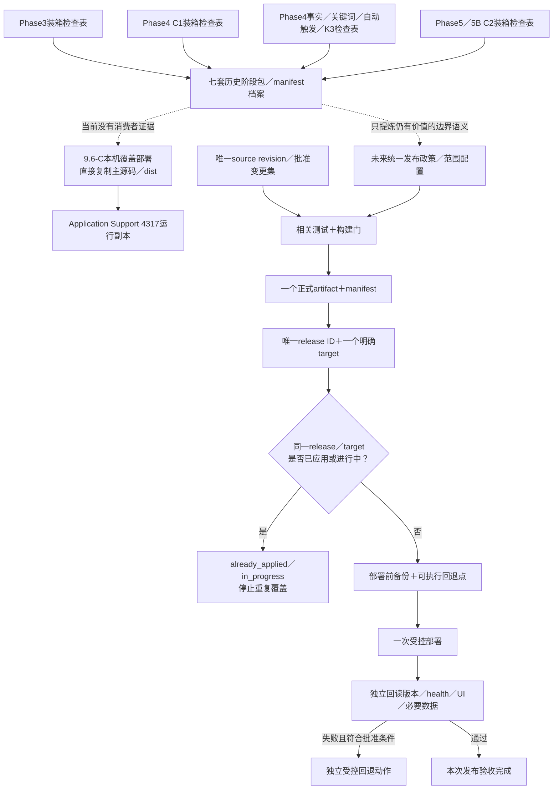
```mermaid
flowchart TD
    P3["Phase3装箱检查表"] --> Historical["七套历史阶段包／manifest档案"]
    P4A["Phase4 C1装箱检查表"] --> Historical
    P4B["Phase4事实／关键词／自动触发／K3检查表"] --> Historical
    P5["Phase5／5B C2装箱检查表"] --> Historical
    Historical -. "当前没有消费者证据" .-> Deploy["9.6-C本机覆盖部署<br/>直接复制主源码／dist"]
    Deploy --> Runtime["Application Support 4317运行副本"]

    Historical -. "只提炼仍有价值的边界语义" .-> Policy["未来统一发布政策／范围配置"]
    Source["唯一source revision／批准变更集"] --> Gates["相关测试＋构建门"]
    Policy --> Gates
    Gates --> Artifact["一个正式artifact＋manifest"]
    Artifact --> Release["唯一release ID＋一个明确target"]
    Release --> Duplicate{"同一release／target<br/>是否已应用或进行中？"}
    Duplicate -->|"是"| Stop["already_applied／in_progress<br/>停止重复覆盖"]
    Duplicate -->|"否"| Backup["部署前备份＋可执行回退点"]
    Backup --> Once["一次受控部署"]
    Once --> Readback["独立回读版本／health／UI／必要数据"]
    Readback -->|"失败且符合批准条件"| Rollback["独立受控回退动作"]
    Readback -->|"通过"| Accepted["本次发布验收完成"]
```

### 全店能力地图显示边界

- 七套旧边界工具合并显示在“部署运行／工程历史工具”区域，可以展开查看各自文件清单和历史摘要，不画成七条现役发布线。
- 9.5历史阶段包到9.6-C部署必须画“未证明消费／未接通”虚线。
- 9.6-C当前显示“高副作用受控工具／无统一release身份／回退与验收不完整”，不得显示常规发布完成。
- 未来统一流水线的每一步都标“待施工”，不能因老板决定已经确认就变蓝。
- 摘要检查的健康只属于文件边界，不得传播到运行副本、UI或A→E业务节点。

### 来源、原位置与依赖线索

- 七套边界定义：`selection-review-app/lib/phase3-ab-deployment-boundary.mjs`、四个`phase4-*-deployment-boundary.mjs`、`phase5-c2-deployment-boundary.mjs`、`phase5b-c2-ui-deployment-boundary.mjs`
- 七套打包入口：`selection-review-app/scripts/build-phase3-ab-deploy-package.mjs`、四个`build-phase4-*-deploy-package.mjs`、`build-phase5-c2-deploy-package.mjs`、`build-phase5b-c2-ui-deploy-package.mjs`
- 当前常规命令：`selection-review-app/package.json`
- 当前本机覆盖部署：`selection-review-app/scripts/deploy-local-runtime.sh`
- 相关边界测试：`selection-review-app/tests/phase3-ab-deployment-boundary.test.mjs`、四套Phase4边界测试、`phase5-c2-deployment-boundary.test.mjs`、`phase5b-c2-ui-deployment-boundary.test.mjs`、`aliyun-oss-runtime-deployment-boundary.test.mjs`；本轮没有运行
- 既定决策交叉引用：本文件9.5、9.6章节
- 组别登记：`selection-review-app/lib/capability-registry.mjs`中的稳定编号10.6；本轮没有修改注册表
- 调查依据：`14项待归位能力与8组疑似重复能力调查底稿-2026-08-28.md`的10.6章节；本轮没有修改调查底稿

### 本轮变更声明

本轮只在现有决定记录末尾追加稳定编号10.6的老板决定。没有覆盖前文，没有修改调查底稿；没有构建、打包、部署或运行旧脚本，没有修改发布工具、4317、LaunchAgent、server、UI、数据、能力注册表、测试或运行副本，也没有启动或切换服务。

## 2026-08-28｜10.7 历史候选适配与新版生命周期入口比较组

> 追加说明：本章节是稳定编号`10.7`的老板最终决定，只追加在10.6之后，不改写前文、调查底稿或能力注册表。它按9.8的最新决定，明确修正“把旧候选翻译好以后送入新版A”的旧暗示；本轮不迁移、不改写52条历史数据，也不创建任何新候选。

### 决定状态

- 所属模块：公共数据底座＋历史档案查看；只与A入口边界相邻，不是三套正式A入口
- 9.8-A历史查看：`legacy-candidate-adapter.mjs`把能确定的旧字段翻译成只读Opportunity外观，unknown保持unknown
- 历史缺口说明：`real-lifecycle-entry-preview.mjs`根据翻译结果说明旧资料缺什么，只读展示后停止
- 正式数据合同：`product-lifecycle-schema.mjs`定义新版A→E对象、状态和校验；它本身不采集、不确认、不持久化、不推进阶段
- 当前调用事实：adapter和preview仍由server／评审台调用；Ozon销售快照路径还会把兼容Opportunity写入`lifecycleV11`
- 当前产品边界：52条历史候选永久与新版A→E解耦，不是待施工队列，也没有批量迁移欠账
- 当前授权：**老板决定已确认、实施未授权。**本章不授权修改adapter／preview／schema／server／UI／数据或解除现有支路。

### 老板确认的完整决定

1. 三个成员不是三套入口。`legacy-candidate-adapter.mjs`是历史翻译员；`real-lifecycle-entry-preview.mjs`是历史资料和缺口说明员；`product-lifecycle-schema.mjs`是新版A→E唯一正式合同／规则书。

2. 根据9.8老板最新决定，明确修正原报告隐含的“旧候选翻译补齐后进入新版A”：52条历史候选永久与新版A→E解耦。翻译结果和preview只能进入历史档案查看，到展示结束，不能继续自动接线。

3. adapter输出、只读`OpportunityPackage`外观、`legacySource`和入口缺口都不得成为正式A输入、待迁移队列或A通过证据。旧价格、旧利润、旧费率、旧重量、旧SKU、旧授权和旧阶段不得自动继承；unknown必须保持unknown。

4. 已淘汰记录只读归档；历史未完成记录也不形成迁移欠账。如果老板以后重新看中一件旧商品，只保留“来源于哪条历史记录”的ID或证据引用，再按当前schema创建全新candidate和revision，从A重新采集、核实与确认。

5. `product-lifecycle-schema.mjs`继续作为新候选、`SkuLifecyclePackage`、`ProfitModel`和后续规范对象的唯一正式合同底座。它规定对象可以长什么样、哪些状态有效，但自己不会采集市场或供应信息，不会替主人确认，不会计算／持久化业务结果，也不会推动A→E。

6. 9.8-B现存“Ozon销售快照完成后，把兼容Opportunity写入`lifecycleV11`”的支路，未来必须先查清server、UI、历史展示和其他消费者，再从新版主线安全解除；本轮不改。adapter和preview当前确有server／UI调用，因此不能粗暴整文件删除，也不能把“永久与A解耦”误解为当前代码已经拆完。

7. 旧资料可以在历史页面旁观参考，但不能自动复制成可信字段。正式A只接收当前格式、当前candidate／revision和当前可追溯证据，从源头避免第二条兼容入口、兼容状态机以及52条历史迁移拖累第一条真实A→E施工。

8. “全店能力地图”必须把adapter和preview画在历史档案层，把schema画在正式数据底座层；两层之间只允许“历史展示按同一字段名解释”的辅助关系，不得画“历史翻译自动进入A”的线路，也不得把52条显示成待施工队列。

9. **老板决定已确认、实施未授权。**本轮禁止迁移、重写或重新分类52条数据，禁止修改adapter、preview、schema、server、UI、`lifecycleV11`、能力注册表或测试，禁止创建新候选、启动A→E或访问外部平台。

### 大白话说明：翻译员、体检说明员和新版规则书

旧候选像一批使用旧表格保存的历史档案。`legacy-candidate-adapter.mjs`是翻译员：它只把旧表格中能够确定的内容翻译成新版字段名，无法确定的地方老老实实写unknown。翻译后的纸仍贴着“历史只读”标签，不会因为排版像新版表格就变成一份新的正式申请。

`real-lifecycle-entry-preview.mjs`像体检说明员：它看这份历史翻译，告诉人“如果按新版要求看，现在缺销售可比性、具体SKU、货价分项、国内运费或主人确认”等。它的工作在说明缺口以后结束；旧文案“可以进入B”或“A类／B类”不能再被解释成迁移承诺或业务通行证。

`product-lifecycle-schema.mjs`则像新版统一表格和填写规则。所有真正的新候选都要符合它，但规则书不会自己找商品、不会确认供货，也不会让阶段前进。未来老板重新选中一件历史商品时，只是在新档案上写一行“参考历史ID”，然后从A重新开始；不是把旧档案洗成新档案。

### 三个成员当前事实对照

| 成员 | 输入→处理→输出 | 当前调用／UI | 当前边界 |
|---|---|---|---|
| `legacy-candidate-adapter.mjs` | 旧candidate→保守映射已知字段、保留原始快照、unknown不猜→只读Opportunity外观／历史利润快照 | `real-lifecycle-entry-preview`调用；server的Ozon销售快照支路也直接调用 | 只读翻译能力可保留；输出不得进入正式A或继承旧结论 |
| `real-lifecycle-entry-preview.mjs` | 旧候选＋适配结果→检查当前Schema下缺哪些资料→只读缺口视图 | server为符合旧条件的候选生成投影，`CandidateDetail`当前显示“新版流程接入体检” | 现有“接入／可以进入B”等产品措辞与9.8新决定存在漂移，未来应改成历史查看语义；本轮不改UI |
| `product-lifecycle-schema.mjs` | 规范对象→校验实体、阶段、结果、技术状态、主人动作及对象字段→校验结果／合法对象合同 | 多个A→E领域模块和测试引用，UI只显示其派生状态 | 是唯一正式合同底座，不是采集器、状态机、repository或业务完成证据；当前规则本身仍须按最新版老板思路交叉验收 |

### 当前9.8-B代码支路必须如实保留

当前Ozon销售快照回传路径在保存销售快照并增加revision以后，会调用`adaptLegacyCandidateToOpportunity(current)`，再把兼容包放进`current.lifecycleV11.opportunityPackage`。这证明9.8-B不是纸面风险，而是当前主源码里的真实持久化支路。

这份兼容包随后不只出现在历史预览里：当前生命周期状态卡会读取`lifecycleV11`显示派生状态，真实A确认卡也会从兼容`opportunityPackage.supplierOptions[0]`读取部分旧成本、重量和尺寸作回填。主人后续仍须提交确认，不能据此称旧结论已经继承；但这确实说明历史查看层与正式A卡之间还有当前数据耦合，未来解除9.8-B时必须一并盘点，不能只删除一行保存代码。

按照9.8和本次10.7决定，这条支路不再属于未来产品规则。但当前不能直接删除：需要先静态和运行级盘点谁读取这份`lifecycleV11`兼容包、历史页面会受什么影响、是否已经有后续记录引用。未来解除时也不能把历史内容改写成新候选，只能停止新的兼容写入，并把历史查看投影放回只读档案边界。

### 历史查看与正式入口关系图

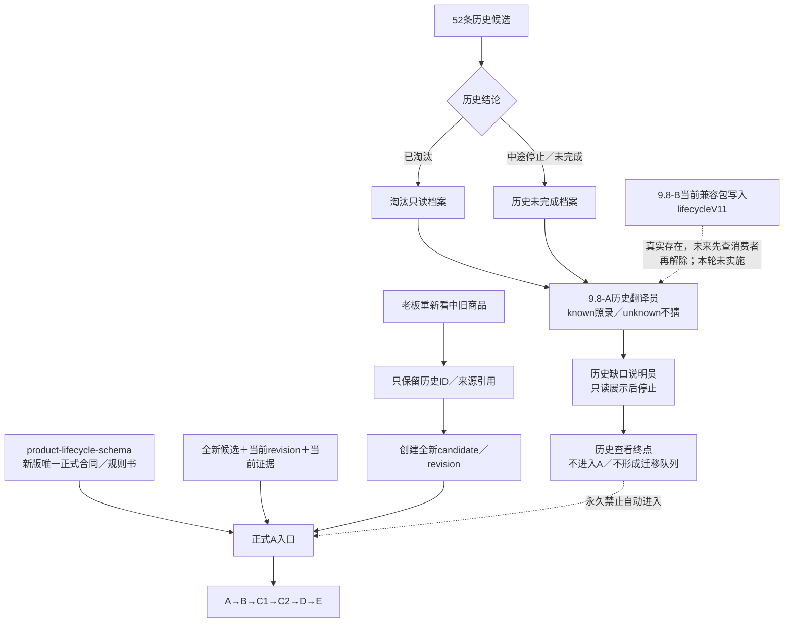
```mermaid
flowchart TD
    Old52["52条历史候选"] --> Split{"历史结论"}
    Split -->|"已淘汰"| Rejected["淘汰只读档案"]
    Split -->|"中途停止／未完成"| Unfinished["历史未完成档案"]

    Rejected --> Adapter["9.8-A历史翻译员<br/>known照录／unknown不猜"]
    Unfinished --> Adapter
    Adapter --> Preview["历史缺口说明员<br/>只读展示后停止"]
    Preview --> ArchiveEnd["历史查看终点<br/>不进入A／不形成迁移队列"]

    Schema["product-lifecycle-schema<br/>新版唯一正式合同／规则书"] --> NewA["正式A入口"]
    NewInput["全新候选＋当前revision＋当前证据"] --> NewA
    NewA --> Main["A→B→C1→C2→D→E"]

    Reselect["老板重新看中旧商品"] --> Trace["只保留历史ID／来源引用"]
    Trace --> Fresh["创建全新candidate／revision"]
    Fresh --> NewA

    ArchiveEnd -. "永久禁止自动进入" .-> NewA

    CurrentBranch["9.8-B当前兼容包写入lifecycleV11"] -. "真实存在，未来先查消费者再解除；本轮未实施" .-> Adapter
```

### 全店能力地图显示边界

- adapter和preview放在“历史档案／兼容查看”层，显示当前server／UI调用与未来解除断点。
- 52条历史候选分成淘汰档案和历史未完成档案，两类都不进入正式A，不显示为待迁移、待补齐或待施工队列。
- schema放在正式数据底座层，只显示它被哪些领域模块依赖；不能因Schema存在就显示A→E已完成。
- 历史层不得自动连到schema或正式A；共同出现相似字段名只属于展示解释，不构成数据关系。正式入口未来必须明确拒绝带`legacySource`／历史适配身份的投影。
- 9.8-B显示“当前持久化支路存在／未来待解除／消费者未审计完成”，不能误画成已经拆除。

### 来源、原位置与依赖线索

- 历史翻译：`selection-review-app/lib/legacy-candidate-adapter.mjs`中的`adaptLegacyCandidateToOpportunity`
- 历史缺口预览：`selection-review-app/lib/real-lifecycle-entry-preview.mjs`中的`buildRealLifecycleEntryPreview`
- 新版合同：`selection-review-app/lib/product-lifecycle-schema.mjs`
- 当前server投影：`selection-review-app/server.mjs`的`publicCandidate`中`lifecycleEntryPreview`
- 当前9.8-B持久化支路：`selection-review-app/server.mjs`的Ozon销售快照回传路径，其中调用adapter并写入`lifecycleV11.opportunityPackage`
- 当前UI：`selection-review-app/src/components/CandidateDetail.jsx`、`LifecycleEntryPreview.jsx`
- 相关测试：`selection-review-app/tests/legacy-candidate-adapter.test.mjs`、`real-lifecycle-entry-preview.test.mjs`、`product-lifecycle-schema.test.mjs`；本轮没有运行
- 既定决策交叉引用：本文件9.8章节
- 组别登记：`selection-review-app/lib/capability-registry.mjs`中的稳定编号10.7；本轮没有修改注册表
- 调查依据：`14项待归位能力与8组疑似重复能力调查底稿-2026-08-28.md`的10.7章节；本轮没有修改调查底稿

### 本轮变更声明

本轮只在现有决定记录末尾追加稳定编号10.7的老板决定。没有覆盖前文，没有修改调查底稿；没有迁移、改写、重新分类或读取外部数据，没有修改adapter、preview、schema、server、UI、`lifecycleV11`、能力注册表、测试、52条历史候选或运行副本，没有创建新候选、启动A→E、运行测试、启动服务、部署或访问平台。

## 2026-08-28｜10.8 两套B利润与C1交接组合比较组

> 追加说明：本章节是稳定编号`10.8`的老板最终决定，只追加在10.7之后，不改写前文、调查底稿或能力注册表。本章承接9.14已经纠正的事实：两套代码确有B职责重叠，但只有一套拥有C1交接；未来收敛的是“一个应用流程外壳＋一个唯一B领域核心”，不是粗暴整文件二选一。本轮不运行差异测试、不修改利润规则或实现。

### 决定状态

- 所属模块：B为主，跨B→C1应用交接边界
- 当前server可达候选：`real-a-b-c1-flow.mjs`及其证据编排／server事务接缝，覆盖A确认、SKU包、B利润和唯一C1交接
- 当前测试可达候选：`product-lifecycle-b-flow.mjs`，只覆盖规范SKU包与B利润，到`ProfitModel`结束
- 真实重复范围：SKU生命周期包创建和B利润计算
- 不重复范围：持久化、API／UI、重复提交控制及C1 handoff只在当前已连接流程一侧存在
- 当前规则冲突：server允许老板授权估算佣金后形成B通过并创建C1，与当前“估算只能条件测算、不得正式通过或推进C1”规则冲突；这是工程代码差距，不是新的老板问题
- 当前选主状态：两套候选暂时保留；尚未完成同输入差异验收，不能称任何一套已经成为最终B核心
- 当前授权：**老板决定已确认、实施未授权。**本章不授权运行差异测试、合并／删除代码、改变利润公式或修改任何业务状态。

### 老板确认的完整决定

1. 两套实现不是两套同等完整的流水线，也不是完全没有重复。`real-a-b-c1-flow.mjs`所在的当前应用流程负责A确认、SKU包、B利润、持久化／幂等结构及唯一C1交接；其中纯函数生成结果，server负责复核revision并原子保存。`product-lifecycle-b-flow.mjs`只负责规范SKU包和B利润候选，到`ProfitModel`结束，没有持久化、server、UI、C1或handoff。

2. 旧登记“二者都能产生C1交接”已经在9.14纠正，10.8继续保持：C1交接不重复，只有第一套实现；真实重复范围只在SKU生命周期包创建和B利润计算职责。禁止画`product-lifecycle-b-flow→C1`实线。

3. 当前只能确认两条代码路径重复承担B计算，不能提前声称公司已经存在两套不同利润业务口径。必须用完全相同、可追溯的输入做差异验收，才能区分它们是纯代码重复、规则冲突，还是有一部分适合分层复用。

4. 最终架构不是整文件二选一。`real-a-b-c1-flow`一侧保留应用流程／编排职责，包括主人确认、candidate／SKU／revision绑定、状态持久化、重复提交控制和唯一C1交接；再从两套实现中验收并收敛出一个唯一、纯粹、可测试的B领域计算核心，由应用流程层调用。最终负责持久化的仍是应用服务／repository边界，不把I／O塞进纯B核心。

5. 同输入比较必须使用同一`OpportunityPackage`、主人确认的同一供应SKU、采购／物流／佣金／包装／其他完整成本证据、同一汇率、销售价、利润门槛、政策版本和舍入规则；不得用不同fixture、不同旧候选或不同缺失字段制造结论。

6. 比较至少覆盖：SKU包字段、身份和revision；所有成本项及证据引用；佣金正式／估算状态；汇率、价格和包装证据；利润数值、精度和舍入；`passed`／`rejected`边界；`B_INPUT_GAP`与证据冲突的fail-fast；利润版本不可变与重复提交；上游对象不可变；持久化边界；唯一C1交接。

7. 新增并固定硬边界：关键费用证据没有达到正式要求，特别是佣金仍为估算时，必须明确停在B，只能保存条件测算和缺口，不能创建C1。当前server允许接受估算佣金后进入C1的已发现冲突，登记为后续必须修复并增加回归测试的代码差距；老板已经给出业务规则，不需要再次决定。

8. 如果两套使用相同输入得到完全一致的结果，就消除重复实现，只保留一个核心；如果结果不同，先用最新版老板思路和稳定规则编号裁决；如果两套各有正确部分，只在清晰领域边界内最小合并。只有老板思路确实没有答案时，才把具体业务差异提交老板。函数拆分、依赖方向和文件位置由工程证据决定，不拿技术细节反问老板。

9. 在唯一核心、消费者迁移和保护性测试完成以前，两套代码都保留为候选，不直接删除。完成以后，重复利润实现必须退役，禁止长期保留两套利润口径、两个生产入口或没有结束条件的兼容层。

10. “全店能力地图”必须分别显示“当前server可达流程候选”和“测试可达B实验台”，两者共同指向“未来唯一B领域核心”；只有流程层连接唯一C1 handoff。当前没有完成同输入验收，也没有当前真实业务回执，因此不得把任一候选或B→C1整体标成最终验收完成。

11. **老板决定已确认、实施未授权。**本轮禁止运行同输入差异测试，禁止修改、合并或删除两套实现，禁止改变利润公式、成本、门槛、舍入或佣金语义，禁止修改C1交接、server、UI、能力注册表、测试、数据或运行副本，也禁止访问外部平台。

### 大白话说明：完整流水线外壳＋实验室利润计算器→未来唯一B发动机

当前已连接的一侧像一辆装有驾驶室、车牌、记录仪和交接单的试装车：主人确认供应方案后，它会核对商品身份和revision，准备B证据，计算利润，再由server把结果保存；利润正式通过时还会生成唯一一张交给C1的交接单。这里既有“利润发动机”，也有很多发动机之外的应用流程职责。

另一侧更像实验室里的一台利润计算器：把已经准备好的规范Opportunity、确认SKU、费用和汇率放进去，它能创建SKU包并算出ProfitModel，也能在缺少国际物流等输入时立即报`B_INPUT_GAP`。但它没有页面、server、持久化或C1交接，不是一辆能直接开上业务道路的车。

未来不是把整辆车扔掉换实验室计算器，也不是永远在车里和实验室各养一台发动机。正确做法是让两台发动机吃完全相同的燃料做台架对比，按最新规则查清数值、证据和失败语义，再收敛出一个唯一B发动机。应用流程外壳继续负责身份、授权、revision、原子保存和唯一C1交接。

### 两套实现当前事实对照

| 维度 | 当前server可达流程候选 | 测试可达B实验台 |
|---|---|---|
| 主要文件 | `real-a-b-c1-flow.mjs`，外接`real-a-b-evidence-orchestration.mjs`和server正式A确认路由 | `product-lifecycle-b-flow.mjs` |
| 输入 | 当前candidate／revision、主人A确认提交、四类B证据包 | 已准备好的OpportunityPackage、供应确认、价格选择、费用证据、汇率证据 |
| SKU包 | 调用`createSkuLifecycleFromConfirmedSupply`建立并绑定当前候选／供应SKU | 自己导出`createSkuLifecyclePackage`建立规范SKU包 |
| B利润 | 调用`runSkuProfitModel`，生成ProfitModel或缺口 | 自己导出`runBProfitModel`，生成ProfitModel或`B_INPUT_GAP` |
| 持久化／幂等 | 纯函数支持已有生命周期重放；server再次核对revision和证据池后一次保存 | 不持久化；利润版本追加发生在返回的新对象中，没有server重复提交责任 |
| C1 | B通过时创建`C1ProductPlan`和唯一handoff，server随后尝试继续C1 | `c1ProductPlan`保持空；没有handoff、负责人切换或C1调用 |
| 当前调用 | 当前主源码UI／API／server可达 | 只找到`single-sku-b-flow.test.mjs`等测试调用，未接server／UI |
| 当前验证等级 | 源码与测试文件存在；没有本轮测试和当前真实SKU独立回执 | 源码与测试文件存在；本轮未运行；不能从测试fixture升级成生产能力 |

### 已确认的估算佣金冲突

当前server允许主人提交一份明确标注的估算佣金授权；证据编排可以把它包装成估算佣金包。后续利润如果达到门槛，server会保存`acceptedEstimatedCommission`，把生命周期标为`b_passed_auto_c1`，创建C1 handoff，并写“C阶段补取精确佣金”。

这与当前老板规则直接冲突：估算佣金只能形成条件测算，不得形成正式B通过，也不得推进C1。后续施工必须在统一B领域核心和应用服务两个边界都建立保护：

当前评审台的`RealAConfirmationCard`没有直接暴露估算佣金输入框，因此这不是一个已经证实的当前页面按钮路径；但server API、证据reader、利润领域函数和C1创建链均能走到这一分支，所以仍是主源码真实可达的规则冲突，不能因UI没有按钮而忽略。

- 利润结果明确区分正式结果与条件测算，不能只看数值是否达到门槛。
- 佣金证据模式不是`verified`或等价正式状态时，业务结果保持B待补证据。
- 不创建C1ProductPlan、不创建handoff、不切换负责人。
- 保存缺口和主人下一步，并允许未来取得正式佣金后用新证据版本重新计算。
- 增加server／领域回归测试，证明估算佣金即使利润数字很高也不能进入C1。

这是已确认规则对应的代码修复项，不是老板后置选择；但本轮只有记录，没有修复授权。

### 同输入差异验收矩阵

| 比较层 | 必须看什么 | 通过标准 |
|---|---|---|
| SKU身份 | candidate、Opportunity、供应SKU、店铺、平台、sourceRevision、resultRevision | 两边绑定同一对象；不能把旧适配或不同revision混入 |
| 成本与证据 | 商品价、国内运费、其他采购费、国际物流、佣金、包装、标签、广告／退货／损耗／提现等适用项及各自引用 | 项目齐全、无重复扣除、证据适用键一致，unknown不猜 |
| 价格与汇率 | 目标成交价、建议标价、币种、汇率、舍入步进和政策版本 | 同口径、同精度、同版本；任何差异能追到规则编号 |
| 结果语义 | 正式／估算、passed／rejected／待补证据、门槛边界 | 估算不正式通过；15%或20元任一满足的规则一致 |
| 不可变与幂等 | 上游对象、利润版本、重复提交、同输入指纹 | 不改上游；同输入不生成第二利润版本或第二C1交接 |
| 应用交接 | 原子保存、主人动作、负责人、C1ProductPlan与handoff | 只有应用流程层、且仅在正式B通过后创建一次 |

当前两套实现连输入对象形状也不完全相同：已连接流程使用供应选项下的`supplierSkus`和选中的`supplierSku`快照，实验台仍直接读取供应选项层的若干SKU／成本字段；ProfitModel的证据拆分和输出字段也不同。因此“同输入比较”首先要建立一个规范、冻结、只读的比较输入适配层，让两边消费同一事实，而不是直接拿现有两套fixture对跑并把结构差异误判成业务规则差异。

此外，当前已连接流程在B通过后直接创建`C1ProductPlan`和handoff，这是当前代码事实，不是最终B核心职责。按照10.3的既定边界，未来唯一B核心只返回正式B结果；应用层原子保存ProfitModel和唯一C1 handoff intent，再由唯一C1应用责任点消费交接并创建C1内容。

### 大白话关系图

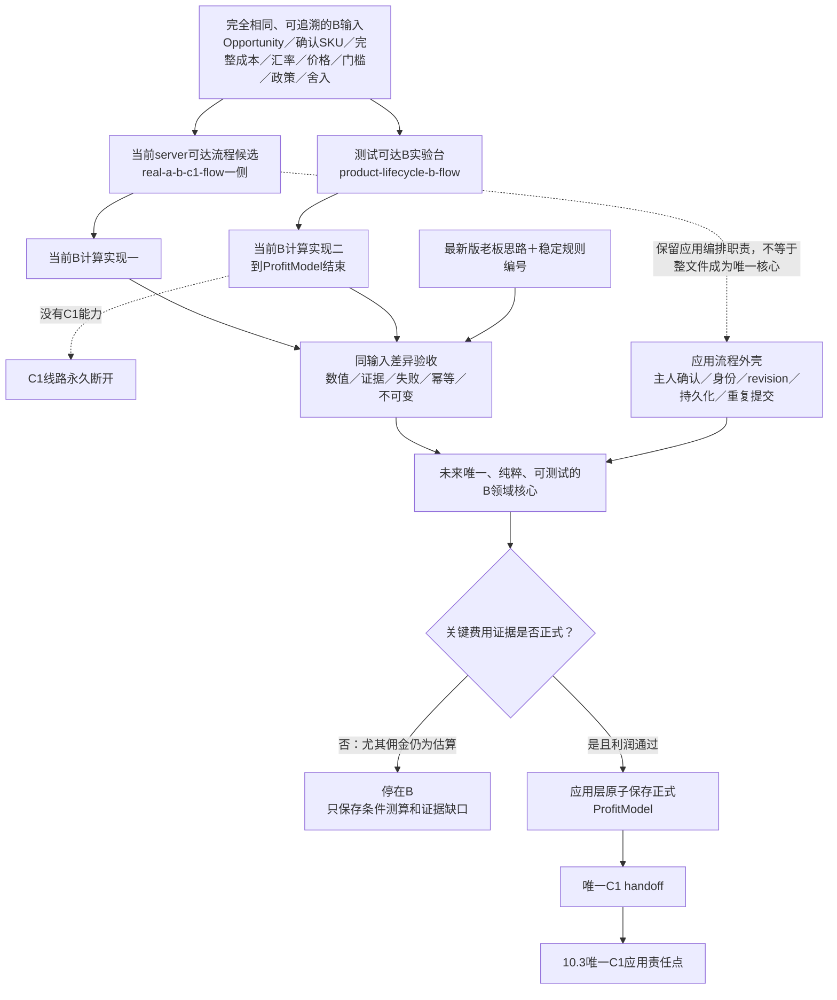
```mermaid
flowchart TD
    Common["完全相同、可追溯的B输入<br/>Opportunity／确认SKU／完整成本／汇率／价格／门槛／政策／舍入"]

    Common --> Current["当前server可达流程候选<br/>real-a-b-c1-flow一侧"]
    Common --> Lab["测试可达B实验台<br/>product-lifecycle-b-flow"]

    Current --> CurrentB["当前B计算实现一"]
    Lab --> LabB["当前B计算实现二<br/>到ProfitModel结束"]
    LabB -. "没有C1能力" .-> NoC1["C1线路永久断开"]

    CurrentB --> Compare["同输入差异验收<br/>数值／证据／失败／幂等／不可变"]
    LabB --> Compare
    Rules["最新版老板思路＋稳定规则编号"] --> Compare
    Compare --> OneCore["未来唯一、纯粹、可测试的B领域核心"]

    App["应用流程外壳<br/>主人确认／身份／revision／持久化／重复提交"] --> OneCore
    OneCore --> Formal{"关键费用证据是否正式？"}
    Formal -->|"否：尤其佣金仍为估算"| StopB["停在B<br/>只保存条件测算和证据缺口"]
    Formal -->|"是且利润通过"| Atomic["应用层原子保存正式ProfitModel"]
    Atomic --> OneHandoff["唯一C1 handoff"]
    OneHandoff --> C1["10.3唯一C1应用责任点"]

    Current -. "保留应用编排职责，不等于整文件成为唯一核心" .-> App
```

### 全店能力地图显示边界

- 当前流程候选显示“server／UI可达／本地事务接缝存在／当前规则仍有估算佣金冲突／未真实验收”。
- B实验台显示“纯领域测试候选／无server／无UI／无持久化／无C1”。
- 两者到未来唯一B核心都用“待同输入验收／待收敛”关系；不能提前标主实现。
- 只有应用流程外壳连到唯一C1 handoff；实验台到C1必须明确断开。
- 估算佣金→B正式通过／C1的当前线路标成真实规则冲突，后续修复前不能把该交接显示健康。

### 来源、原位置与依赖线索

- 当前应用流程候选：`selection-review-app/lib/real-a-b-c1-flow.mjs`
- 当前证据编排：`selection-review-app/lib/real-a-b-evidence-orchestration.mjs`
- 当前持久化／估算佣金／C1交接接缝：`selection-review-app/server.mjs`的正式A确认路由
- B实验台：`selection-review-app/lib/product-lifecycle-b-flow.mjs`中的`createSkuLifecyclePackage`、`runBProfitModel`
- 当前流程相关测试：`selection-review-app/tests/real-a-b-c1-flow.test.mjs`、`real-a-b-c1-api.test.mjs`、`real-a-b-evidence-orchestration.test.mjs`
- 实验台测试：`selection-review-app/tests/single-sku-b-flow.test.mjs`
- 既定决策交叉引用：本文件9.14章节
- 组别登记：`selection-review-app/lib/capability-registry.mjs`中的稳定编号10.8；本轮没有修改注册表
- 调查依据：`14项待归位能力与8组疑似重复能力调查底稿-2026-08-28.md`的10.8章节；本轮没有修改调查底稿

### 本轮变更声明

本轮只在现有决定记录末尾追加稳定编号10.8的老板决定。没有覆盖前文，没有修改调查底稿；没有运行同输入差异测试，没有修改、合并或删除两套实现，没有改变利润公式、成本、门槛、舍入、佣金语义或C1交接，没有修改server、UI、能力注册表、测试、数据或运行副本，没有启动服务、部署或访问外部平台。

---

## 2026-08-30｜9.10 补充决定：给主人看的项目逻辑与进度导航图

> 本章节补充稳定编号9.10的新地图产品决定，不新增第二个地图身份，也不改变9.1—10.8其他能力的去留和实施状态。它记录老板已经确认的产品语义，不证明当前代码、测试、运行副本、能力节点、业务状态或平台结果，也不授权地图施工、服务启动、部署或平台访问。

### 产品定位

新“小地图”是给非IT主人看的“项目逻辑与进度导航图”。它独立于“今日选品评审台”的具体商品评审界面，但仍属于同一个“全店经营工作台”，不另建第二个网站。

地图的第一目标是让不懂技术术语的人一眼看懂：

- 整个项目按什么顺序工作；
- 每一步现在走到哪里；
- 为什么卡住；
- 谁正在处理；
- 主人是否需要决定；需要时具体选什么，选完以后发生什么。

地图不是开发者面板，不保存第二套业务真相，不派工、不接线、不执行任何动作。具体商品、SKU、利润、授权、作业和平台结果仍以当前持久化状态和平台独立证据为准；地图只做只读投影。

### 默认两层信息结构

默认第一层只展示七块，不铺满全部能力：

1. 共享底座／接线：保存资料、串联流程、显示工作台；它不是额外业务步骤。
2. A｜选品与货源确认。
3. B｜成本与利润核算。
4. C1｜商品资料、合规与文案准备。
5. C2｜图片素材与最终上架卡确认。
6. D｜按授权正式上架。
7. E｜独立回读核验。

主人点击某一块后，第二层才展示该阶段的详细能力、输入、产出、证据、断点和历史。旧地图、旧派工和旧候选只能进入历史区，不得进入当前主线，也不得决定当前节点、负责人、线路或健康状态。

### C2到D的素材硬门

- 地图必须突出图片硬门：当前平台、店铺和类目要求的图片槽位已经满足，并且主人确认`finalUploads`、首图和顺序后，才可以产生`ProductionAuthorization`并进入D。
- 视频不是默认硬门。只有当前Schema或主人针对当前SKU明确要求时才阻塞C2；否则显示为“本次不要求视频”或“本次授权不含视频”，不得显示成成功、失败或结果未知。

### 两类状态必须分开

地图同时展示两类信息，但不得混成一个总颜色：

1. 施工状态：还没开始、正在做、卡住了、等你确认、已经核实。
2. 实际链路／证据状态：是否真实接上，以及测试、运行和真实业务证据是否存在。

第一版不承诺逐秒实时。它读取当前持久状态、当前测试结果和当前运行证据后更新；以后是否增加自动刷新，另按证据和产品需要决定。没有当前证据时，必须明确显示“还没核实”“无数据”或“未接线”，不得显示为正常。所有卡点都要用主人听得懂的因果关系说明，不能只显示错误码或技术名词。

### 默认语言和技术说明

默认界面只说大白话。每一块都必须回答：

- 这一步在做什么；
- 现在到哪了；
- 为什么卡住；
- 谁正在处理；
- 主人需不需要决定；
- 如果需要，具体要选什么，选完发生什么。

默认不暴露`SoftwareJob`、持久化、接口等专业术语。专业字段、代码位置、测试和技术证据只在主人主动展开“查看技术说明”后显示。隐藏术语只改变表达，不得隐藏失败、证据缺口、未接线或`unknown_outcome`的真实含义。

### 数据与证据责任

- 长期不变量来自`AGENTS.md`。
- 老板产品决定与撤销关系来自当前决定索引和本文件9.10及本补充章节。
- 能力身份、代码位置和调用关系必须在G0后按当前源码、Schema、能力登记和测试重新核准。
- 当前业务进度、负责人、主人动作、revision和授权来自当前持久状态；地图只引用，不复制保存。
- 测试、运行和真实业务证据必须分别展示；文件、按钮或测试存在不能替代真实接线和业务完成。
- D结果必须有真实回执；E结果必须有符合当前合同的独立证据。当前仍未裁决的`OPEN-MERGE-01`不得由地图静默改写。
- 历史档案只提供来源链接和“历史／已撤销”说明，不参与当前健康计算。

### 施工安排与职责

1. 现在不施工地图。
2. G0后核准真实节点、当前证据、工作树和运行副本边界。
3. G1后冻结只读投影合同、稳定编号、关系语义和状态来源。
4. 届时先开临时“地图设计与整理”专项，只负责图内容和信息架构；它不是永久第八工位，也不承担A→E领域施工。
5. 随后由“A到E接线员”，即七工位模型中的共享入口／持久化／工作台投影／A→E集成责任点，负责只读数据接线和工作台集成。
6. 总劳工只负责方向、文件所有权、跨阶段边界和独立证据验收，不亲自施工。
7. 地图不得阻塞第一件真实商品A→E闭环；共享文件发生冲突时，地图施工让路给A→E。

### 验收边界

地图只有同时满足以下条件，才可以提交主人验收：

- 默认第一层能让非IT主人看懂七块主线，共享底座不会被误解为第八个业务阶段；
- 展开后能追到输入、产出、证据、断点和历史来源；
- 施工状态与链路／证据状态明确分开；
- 无证据不会显示正常，卡点说明包含原因、负责人和主人下一步；
- 默认大白话，技术细节只在主动展开后出现；
- 地图无写入、派工、接线、部署、平台访问或生命周期推进能力；
- 地图不可用时，正常A→E软件流程仍能继续；
- 旧地图和历史能力不进入当前主线；新图通过测试、非作者复核、主人验收并另获替换授权前，不删除旧入口或旧代码。

### 本轮变更声明

本轮只把老板已经确认的小地图产品决定追加到现有9.10决定链。没有把启动包改成产品事实源，没有修改AGENTS、代码、Schema、能力注册表、测试、业务数据或运行副本，没有启动服务、部署或访问外部平台，也没有开始地图施工。
